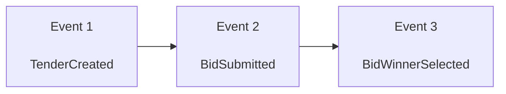
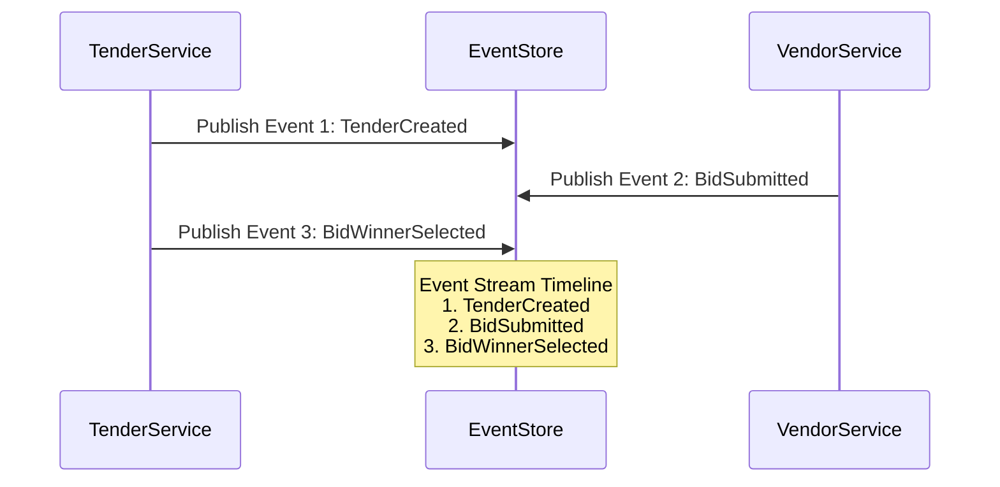
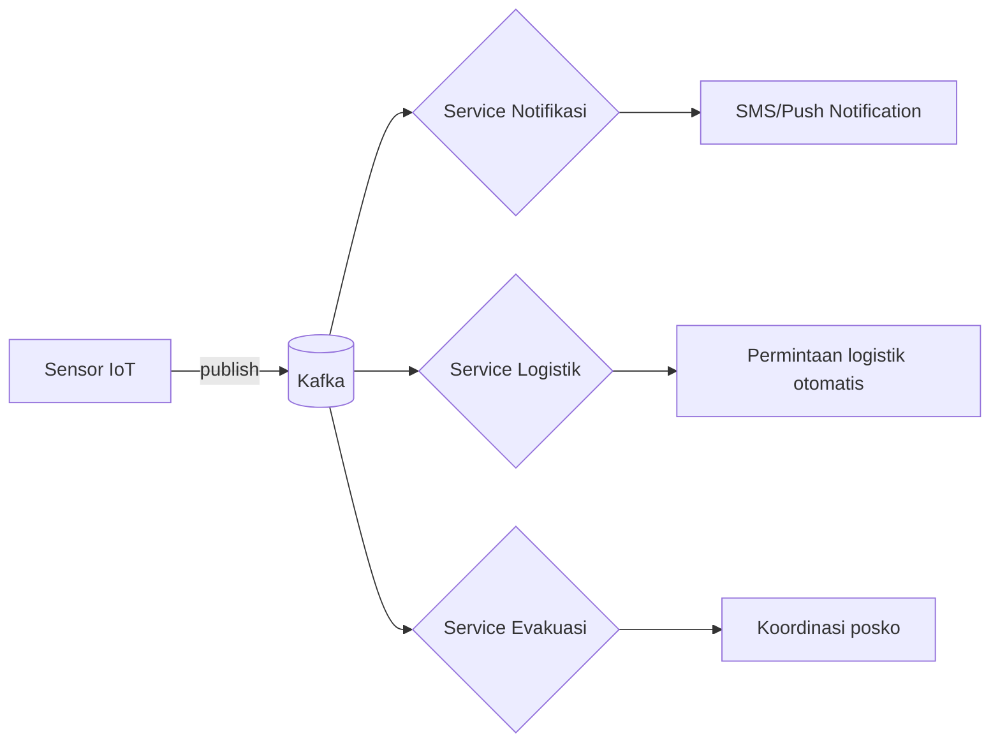

## **Arsitektur Microservices: Communication Patterns**  
**Fokus**: Synchronous (REST/gRPC) vs Asynchronous (Message Broker) & Event-Driven Architecture  

---

### **1. Synchronous Communication**  
#### **a. REST (Representational State Transfer)**  
- **Mekanisme**:  
  Klien mengirim request → menunggu respon langsung dari service.  
  ```mermaid  
  sequenceDiagram  
    Klien->>+Service A: GET /data-pajak  
    Service A-->>-Klien: 200 OK (JSON)  
  ```  
- **Karakteristik**:  
  - Stateless, HTTP/HTTPS-based.  
  - Format data: JSON/XML.  
- **Contoh Penerapan Pemerintah**:  
  - Layanan real-time **e-KTP Verifikasi**:  
    Aplikasi mobile → panggil REST API → Service Kemenkumham (respons <1 detik).  

#### **b. gRPC (Google Remote Procedure Call)**  
- **Mekanisme**:  
  Klien memanggil fungsi seolah-olah lokal via protobuf (Protocol Buffers).  
  ```mermaid  
  sequenceDiagram  
    Klien->>+Service B: getTaxData(TaxID)  
    Service B-->>-Klien: TaxObject (binary)  
  ```  
- **Karakteristik**:  
  - Protokol biner, HTTP/2 multiplexing.  
  - Performa tinggi & efisien untuk komunikasi service-to-service.  
- **Contoh Penerapan Pemerintah**:  
  - **Transfer Data Massal Dukcapil-Kemendag**:  
    Sync 1 juta data penduduk via gRPC streaming (throughput 5x REST).  

#### **Kapan Memilih Synchronous?**  
| Scenario | REST | gRPC |  
|----------|------|------|  
| Public API untuk 3rd party | ✅ Ideal | ❌ Tidak cocok |  
| Internal service high-throughput | ❌ Kurang efisien | ✅ Optimal |  
| Komunikasi mobile app | ✅ Mudah diimplement | ✅ (Jika butuh performa) |  

---

### **2. Asynchronous Communication (Message Broker)**  
#### **a. Konsep Dasar**  
- **Mekanisme**:  
  Service mengirim pesan ke broker → broker mendistribusikan ke consumer tanpa blocking.  
  ```mermaid  
  sequenceDiagram  
    Service A->>+Broker: Publish "event.pajak.updated"  
    Broker->>+Service B: Deliver event (async)  
    Broker->>+Service C: Deliver event (async)  
  ```  
- **Karakteristik**:  
  - Decoupling: Producer & consumer tidak saling kenal.  
  - Resiliency: Broker menyimpan pesan jika consumer down.  

#### **b. Pola Umum**  
| Pola | Contoh | Use Case Pemerintah |  
|------|--------|---------------------|  
| **Point-to-Point** | Antrian tunggal (1 producer → 1 consumer) | Laporan Bulanan Dinas → Sistem Arsip |  
| **Pub/Sub** | Topik (1 producer → N consumer) | Notifikasi perubahan UU → semua kementerian terkait |  
| **Request/Reply** | Konsumen mengirim balasan | Validasi NIK → respon async setelah proses selesai |  

#### **c. Teknologi**  
| Broker | Keunggulan | Contoh Implementasi |  
|--------|------------|----------------------|  
| **RabbitMQ** | Mudah setup, fitur lengkap | Antrian pengaduan masyarakat di Kemensos |  
| **Kafka** | Throughput tinggi, stream processing | Replikasi data real-time BPS → Bank Indonesia |  

---

### **3. Event-Driven Architecture (EDA)**  
#### **a. Prinsip Inti**  
- **Event sebagai Sumber Kebenaran**:  
  Setiap perubahan state dihasilkan dari event (e.g., `PajakDiperbaruiEvent`).  
- **Komponen Kunci**:  
  - **Event Producer**: Service yang mempublikasikan event.  
  - **Event Bus**: Message broker (e.g., Kafka).  
  - **Event Consumer**: Service bereaksi terhadap event.  

#### **b. Pola Desain**  
1. **Event Sourcing**:  
   - **Konsep**: State aplikasi direkonstruksi dari stream event.  
   - **Contoh Pemerintah**:  
     Audit trail sistem **e-Purchasing**:  
     ```  
     [Event 1] TenderCreated → [Event 2] BidSubmitted → [Event 3] BidWinnerSelected  
     ```
     Berikut diagram untuk alur event **Sistem e-Purchasing** menggunakan Mermaid:



#### Penjelasan Diagram:
1. ***Event 1: TenderCreated***  
   - Awal proses: Tender baru dibuat  
   - Contoh payload:  
     ```json
     {
       "event_id": "evt_001",
       "tender_id": "t2023-xyz",
       "created_at": "2023-11-05T08:30:00Z",
       "items": ["peralatan-medis", "logistik-darurat"]
     }
     ```

2. ***Event 2: BidSubmitted***  
   - Vendor mengajukan penawaran  
   - Trigger:  
     ```json
     {
       "event_id": "evt_002",
       "bid_id": "bid_789",
       "vendor_id": "vdr_456",
       "amount": 125000000,
       "currency": "IDR"
     }
     ```

3. ***Event 3: BidWinnerSelected***  
   - Pemenang tender ditetapkan  
   - Output akhir:  
     ```json
     {
       "event_id": "evt_003",
       "winner_vendor_id": "vdr_456",
       "contract_value": 120000000,
       "signing_deadline": "2023-12-01"
     }
     ```

#### Versi Alternatif (Sequence Diagram):


#### Karakteristik Event Sourcing:
1). **State Direkonstruksi**  
   ```mermaid
   flowchart LR
       D[Current State] -.->|Dibangun dari| E[Event 1 + Event 2 + Event 3]
   ```

2). **Audit Trail Otomatis**  
   Setiap perubahan terekam permanen dengan timestamp lengkap.

3). **Pola Reaktif**  
   Sistem lain dapat bereaksi terhadap event:
   ```mermaid
   flowchart LR
       C -->|Trigger| F[Service Notifikasi]
       C -->|Trigger| G[Service Kontrak]
       C -->|Trigger| H[Service Audit]
   ```
2. **CQRS (Command Query Responsibility Segregation)**:  
   - **Konsep**: Pisahkan operasi *write* (command) dan *read* (query).  
   - **Contoh Pemerintah**:  
     - **Command Service**: Input data pajak (high consistency).  
     - **Query Service**: Tampilkan dashboard real-time (high availability).  

#### **c. Manfaat untuk Instansi Pemerintah**  
- **Integrasi Sistem Heterogen**:  
  - Sistem legacy (COBOL) publish event → microservices konsumsi via adapter.  
- **Resiliensi Lintas Kementerian**:  
  - Contoh: Ketika service pajak down, event disimpan di broker → proses setelah pulih.  
- **Transparansi Operasional**:  
  - Semua event tercatat untuk audit (e.g., pelacakan aliran dansos).  

---

### **Studi Kasus: Sistem Darurat Bencana**  
**Skenario**:  
- Gempa terjadi → sensor IoT kirim event → trigger multi-layanan secara async.  

**Arsitektur**:  


**Komunikasi Hybrid**:  
- **Async (EDA)**: Sensor → Kafka → layanan darurat.  
- **Synchronous (gRPC)**: Koordinasi real-time antar posko evakuasi.  

---

### **Best Practices**  
1. **Hindari Distributed Monolith!**  
   - Jangan gunakan synchronous call berantai:  
     ❌ `ServiceA → ServiceB → ServiceC` (rantai rapuh!).  
2. **Pilih Pola Sesuai Kebutuhan**:  
   | Kebutuhan | Pola |  
   |-----------|------|  
   | Respons real-time (e-KTP) | REST/gRPC |  
   | Update massal (data sensus) | Async + Event Sourcing |  
3. **Monitoring Komunikasi**:  
   - Gunakan distributed tracing (Jaeger/Zipkin) untuk lacak latency antar service.  
4. **Error Handling Async**:  
   - Implementasi dead-letter queue (DLQ) untuk pesan gagal diproses.  

> 💡 **Tip untuk Pemerintah**:  
> - Untuk sistem kritis (e.g., peringatan dini bencana), kombinasikan:  
>   - **Synchronous**: Notifikasi real-time.  
>   - **Async/EDA**: Backup data & recovery.
