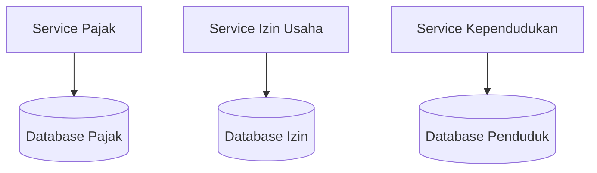
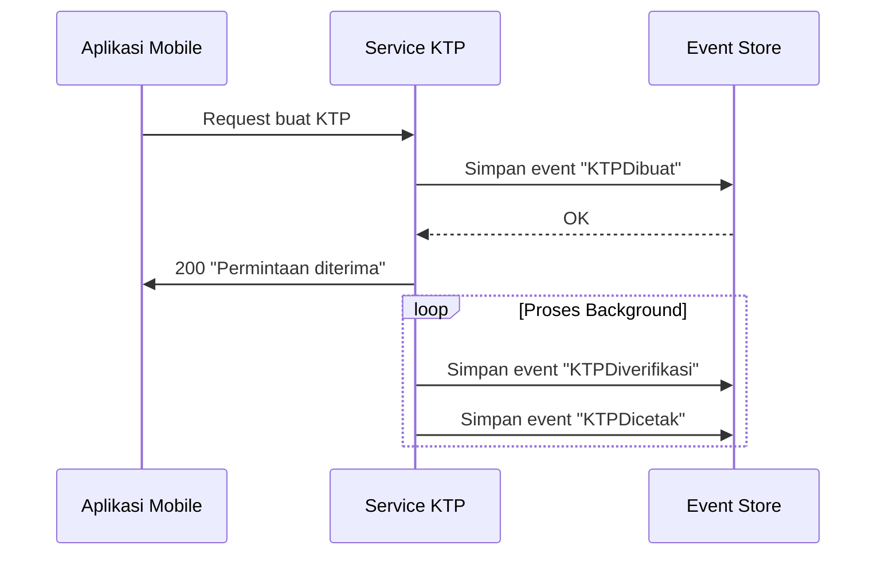
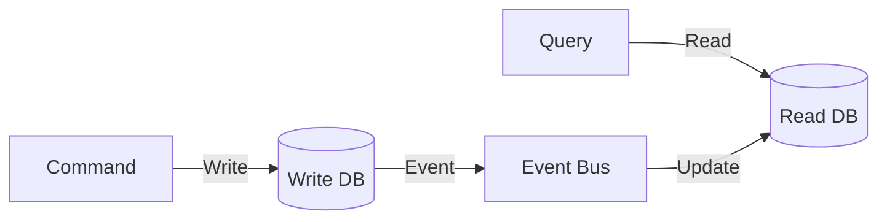
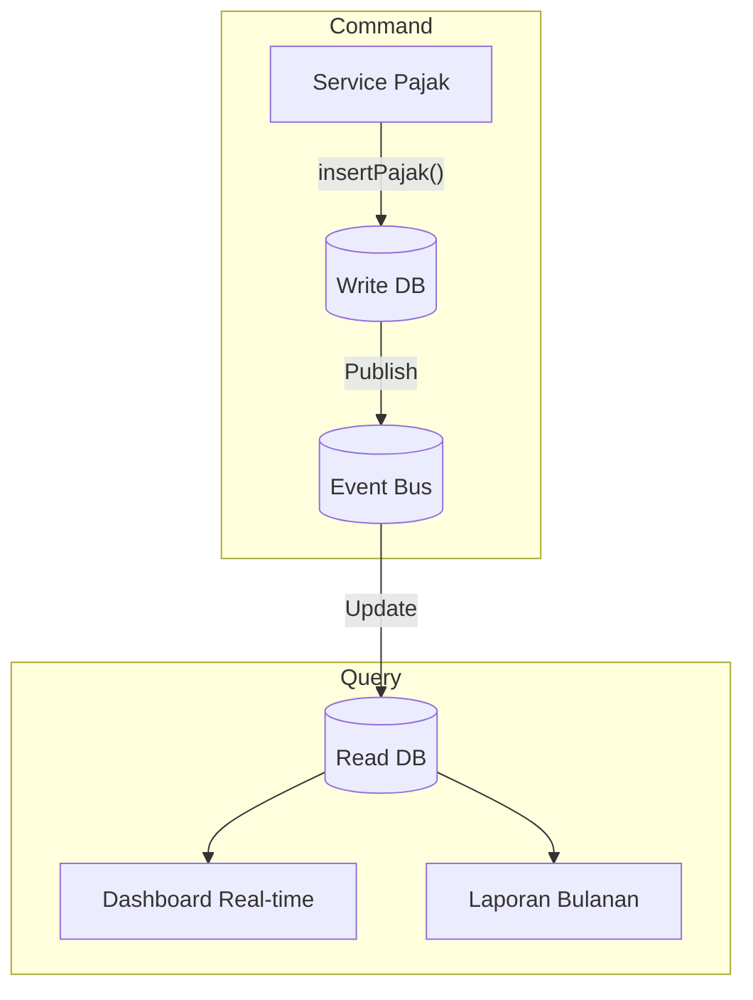
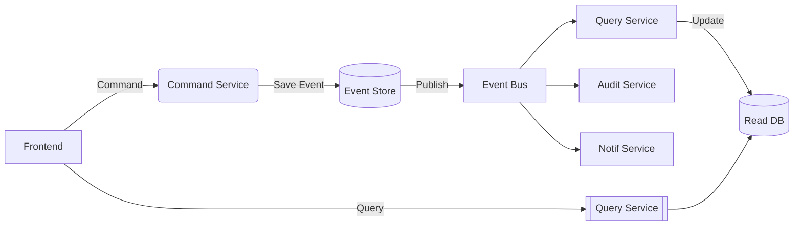

## **Arsitektur Microservices: Database per Service & Event Sourcing**  
**Fokus**: Bounded Context, Database Independen, Event Sourcing, dan CQRS  

---

### **1. Database per Service & Bounded Context**  
#### **a. Prinsip Dasar**  

- **Aturan Emas**:  
  Setiap microservice memiliki database privatnya sendiri → **tidak ada shared database**!  
- **Bounded Context (DDD)**:  
  Batasan domain di mana model bisnis berlaku konsisten (e.g., "penduduk" di konteks Dukcapil vs Kemendag).  

#### **b. Contoh Penerapan Pemerintah**  
| Service | Database | Bounded Context |  
|---------|----------|----------------|  
| `service-ktp` | PostgreSQL | Identitas Penduduk |  
| `service-pajak` | Oracle | Perpajakan Nasional |  
| `service-bansos` | MongoDB | Bantuan Sosial |  

**Manfaat**:  
- **Isolasi Kegagalan**: Kerusakan database bansos tidak pengaruhi layanan KTP.  
- **Teknologi Tepat Guna**: Gunakan SQL untuk transaksi pajak (ACID), NoSQL untuk data bansos fleksibel.  

---

### **2. Event Sourcing**  
#### **a. Konsep Inti**  
- **State sebagai Deretan Event**:  
  ```mermaid  
  flowchart LR  
      E1[Event 1: PendaftaranKTP] --> E2[Event 2: VerifikasiKTP] --> E3[Event 3: PencetakanKTP]  
  ```  
- **Event Store**: Database khusus menyimpan semua event secara immutable.  

#### **b. Implementasi e-KTP**  

**Payload Event**:  
```json  
// Event: KTPDiverifikasi  
{  
  "event_id": "evt_kpt_789",  
  "nik": "3273011234567890",  
  "status": "VERIFIED",  
  "timestamp": "2023-11-05T10:15:30Z",  
  "officer_id": "petugas_123"  
}  
```  

#### **c. Keuntungan untuk Sektor Publik**  
- **Audit Trail Otomatis**: Semua perubahan terekam lengkap → transparansi administrasi.  
- **Pemulihan Bencana**: Rekonstruksi state dari event history jika database rusak.  

---

### **3. CQRS (Command Query Responsibility Segregation)**  
#### **a. Pola Desain**  

- **Pemisahan Jalan**:  
  - **Command Side**: Handle operasi tulis (high consistency).  
  - **Query Side**: Handle operasi baca (high availability).  

#### **b. Studi Kasus: Sistem Perpajakan**  
**Arsitektur**:  


**Alur Kerja**:  
1. **Command**: Petugas input data pajak → tulis ke database transaksional (ACID).  
2. **Event**: Data baru dipublikasikan ke event bus (Kafka).  
3. **Query**:  
   - Service terpisah konsumsi event → update database baca (optimized for query).  
   - Dashboard real-time baca dari database query (tidak ganggu operasi tulis).  

**Manfaat**:  
- Performa: Beban tulis & baca terdistribusi.  
- Skalabilitas: Database query bisa di-replikasi untuk kebutuhan analitik.  

---

### **Integrasi Event Sourcing + CQRS**  
#### **Arsitektur Lengkap e-Gov**  


#### **Use Case: Permohonan Izin Usaha**  
1. **Command**:  
   - `POST /izin` → simpan event `PermohonanIzinDibuat`.  
2. **Event Sourcing**:  
   ```  
   [Event 1] PermohonanIzinDibuat  
   [Event 2] IzinDisetujui  
   [Event 3] IzinDikirim  
   ```  
3. **CQRS**:  
   - **Query Side**: Bangun view `izin_status` di database baca untuk tracking real-time.  

---

### **Best Practices untuk Pemerintah**  
1. **Pilih Teknologi Database Berdasarkan Kebutuhan**:  
   | Service | Jenis Database | Alasan |  
   |---------|----------------|--------|  
   | Transaksi Keuangan | SQL (PostgreSQL) | Butuh ACID compliance |  
   | Log Aktivitas | NoSQL (MongoDB) | Skema fleksibel untuk audit log |  
   | Cache Data | Redis | Akses cepat untuk data statis |  

2. **Implementasi Event-Driven untuk Integrasi Kementerian**:  
   - Contoh:  
     ```mermaid  
     flowchart LR  
         Kemdikbud --"Event: NISNDiverifikasi"--> Bus  
         Kemendagri --"Event: KKDiupdate"--> Bus  
         Dukcapil -->|Subscribe| Bus[(Event Bus Nasional)]  
     ```  

3. **Hindari Anti-Pattern**:  
   - ❌ Shared database antar kementerian → gunakan API/event.  
   - ❌ Query langsung ke database command → gunakan CQRS.  

> 💡 **Tip Transformasi Digital**:  
> Mulai penerapan Event Sourcing dari sistem yang:  
> - Memiliki regulasi ketat (e.g., perpajakan, perizinan)  
> - Butuh audit trail lengkap (e.g., pengadaan barang)  
> - Sering berkolaborasi lintas instansi (e.g., data kependudukan)
