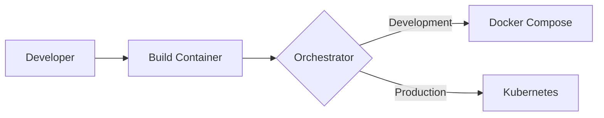
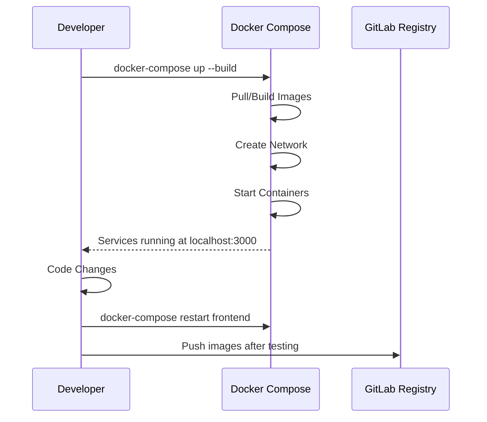
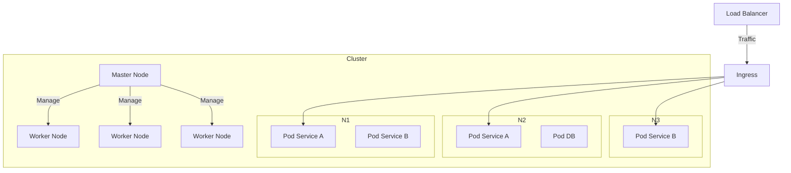
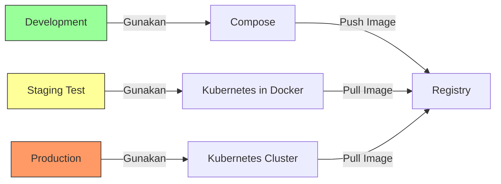
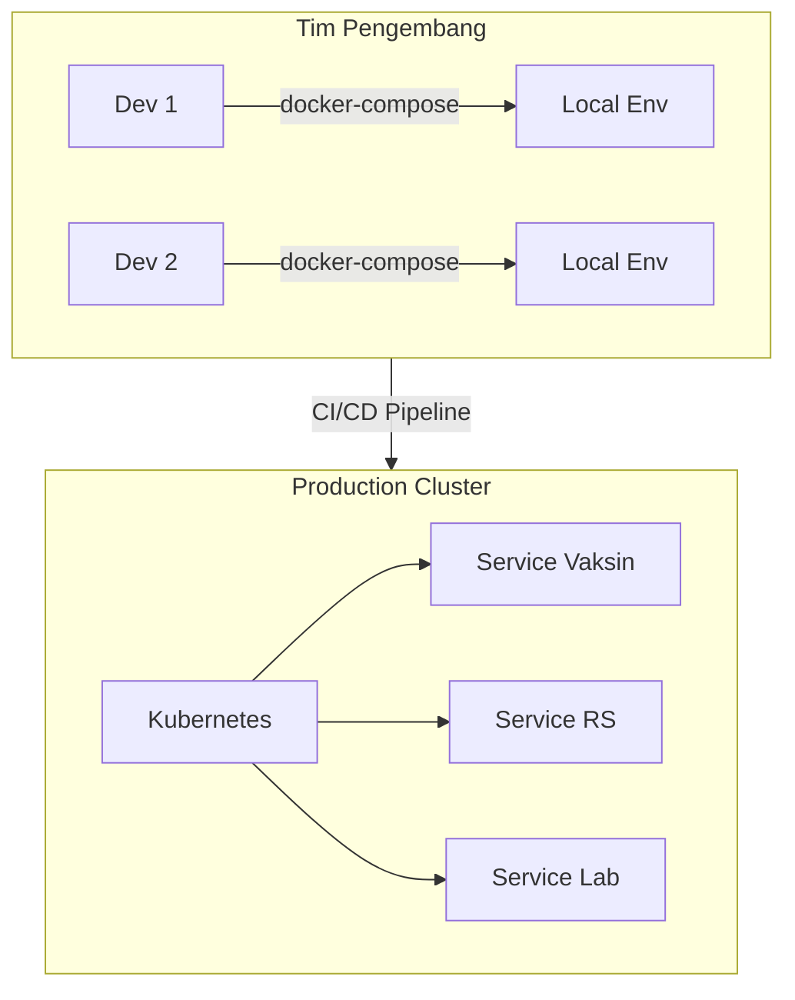

## **Orchestration: Docker Compose vs Kubernetes**  
**Fokus**: Penggunaan Docker Compose untuk Development/Lokal vs Kubernetes untuk Skala Production  

---

### **1. Konsep Dasar Container Orchestration**  
#### **Mengapa Diperlukan di Sektor Pemerintah?**  
- **Kompleksitas Aplikasi**: Sistem e-gov modern terdiri dari puluhan microservices (layanan pajak, kependudukan, perizinan).  
- **Kebutuhan Skalabilitas**: Lonjakan pengguna saat pelaporan pajak akhir tahun atau pemilu.  
- **High Availability**: Layanan publik harus tetap berjalan 24/7.  



---

### **2. Docker Compose: Development/Local Environment**  
#### **a. Karakteristik Utama**  
- **Single-Host**: Menjalankan multi-container pada 1 mesin (laptop/PC developer).  
- **Deklaratif**: Konfigurasi via file `docker-compose.yml`.  
- **Simplified Networking**: DNS otomatis antar service dalam 1 jaringan virtual.  

#### **b. Contoh Kasus Pemerintah**  
**docker-compose.yml untuk Sistem Pelaporan Masyarakat**:  
```yaml  
version: '3.8'  
services:  
  frontend:  
    image: kemensos-frontend:dev  
    ports:  
      - "3000:3000"  
    depends_on:  
      - backend  
  
  backend:  
    build: ./backend  
    environment:  
      DB_URL: postgres://db:5432/reports  
    ports:  
      - "8080:8080"  
  
  db:  
    image: postgres:14  
    volumes:  
      - pgdata:/var/lib/postgresql/data  
    environment:  
      POSTGRES_PASSWORD: securepass123  
  
volumes:  
  pgdata:  
```

#### **c. Workflow Pengembangan**  


**Keunggulan untuk Pengembangan**:  
- 🔧 Iterasi cepat tanpa infrastruktur kompleks  
- 💻 Replikasi lingkungan production di lokal  
- 🧪 Mudah diintegrasikan dengan CI pipeline  

---

### **3. Kubernetes: Production-Scale Orchestration**  
#### **a. Arsitektur Inti**  


#### **b. Komponen Kritis**  
| Komponen | Fungsi | Contoh Penerapan Pemerintah |  
|----------|--------|-----------------------------|  
| **Pod** | Unit deploymen terkecil | 1 Pod = 1 container service pajak + sidecar logger |  
| **Deployment** | Manage replika pod | Skalasi otomatis service bansos saat hari raya |  
| **Service** | Endpoint jaringan stabil | Service IP tetap meski pod ganti |  
| **Ingress** | Traffic routing HTTP/S | SSL termination untuk aplikasi kemenkeu.go.id |  
| **Persistent Volume** | Penyimpanan persisten | Database laporan masyarakat |  

#### **c. Contoh Manifest Kubernetes**  
**deployment.yaml untuk Layanan Kependudukan**:  
```yaml  
apiVersion: apps/v1  
kind: Deployment  
metadata:  
  name: dukcapil-service  
spec:  
  replicas: 5  
  selector:  
    matchLabels:  
      app: dukcapil  
  template:  
    metadata:  
      labels:  
        app: dukcapil  
    spec:  
      containers:  
      - name: dukcapil  
        image: registry.gov/dukcapil:v3.2  
        ports:  
        - containerPort: 8080  
        env:  
        - name: DB_HOST  
          value: postgres-cluster  
---  
apiVersion: v1  
kind: Service  
metadata:  
  name: dukcapil-service  
spec:  
  selector:  
    app: dukcapil  
  ports:  
    - protocol: TCP  
      port: 80  
      targetPort: 8080  
  type: LoadBalancer  
```

---

### **4. Perbandingan Mendalam: Compose vs Kubernetes**  
| Kriteria | Docker Compose | Kubernetes |  
|----------|----------------|------------|  
| **Skala** | Single node | Multi-node cluster (1000+ node) |  
| **High Availability** | ❌ Tidak mendukung | ✅ Auto-recovery pod/node mati |  
| **Skalabilitas** | Manual scale | Auto-scaling berbasis CPU/request |  
| **Networking** | Jaringan lokal sederhana | CNI (Calico/Flannel) multi-cluster |  
| **Storage** | Volume lokal | Persistent Volume (cloud/local) |  
| **Rolling Update** | Manual restart | Zero-downtime deployment otomatis |  
| **Ideal Untuk** | Development, testing | Production, mission-critical systems |  

---

### **5. Strategi Hybrid untuk Transformasi Digital Pemerintah**  


#### **Best Practices**:  
1. **Development**:  
   - Docker Compose untuk iterasi cepat  
   - File kompose sama di semua developer  
2. **Staging**:  
   - Kubernetes lokal (Kind/K3s) untuk simulasi cluster  
   - Validasi manifest YAML  
3. **Production**:  
   - Cluster Kubernetes multi-AZ  
   - GitOps (ArgoCD) untuk deployment otomatis  

---

### **6. Studi Kasus: Migrasi Sistem Kesehatan Nasional**  
**Latar Belakang**:  
- Aplikasi monolitik → 15 microservices  
- Butuh skalabilitas selama pandemi  

**Arsitektur Hybrid**:  


**Alur Migrasi**:  
1. Developer bangun service baru dengan Docker Compose lokal  
2. CI pipeline build image → push ke registry  
3. ArgoCD otomatis deploy ke Kubernetes staging  
4. UAT oleh tim QA  
5. Rollout ke production dengan canary deployment  

**Hasil**:  
- ⏱️ Waktu deploy berkurang dari 4 jam → 15 menit  
- 📈 Skalasi otomatis selama vaksinasi massal  

---

### **7. Checklist Migrasi ke Production Kubernetes**  
1. [ ] **Keamanan**:  
   - Pod Security Policies  
   - Network Policies (isolasi namespace)  
2. [ ] **Observability**:  
   - Central logging (ELK)  
   - Monitoring (Prometheus/Grafana)  
3. [ ] **Backup**:  
   - Velero untuk backup cluster state  
   - RPO/RTO disesuaikan SLA  
4. [ ] **Pelatihan**:  
   - Sertifikasi tim ops di Kubernetes (CKA/CKAD)  
   - Workshop untuk developer  

> 🚨 **Peringatan untuk Instansi Pemerintah**:  
> Jangan langsung migrasi sistem kritis ke Kubernetes tanpa:  
> - Proof of Concept di lingkungan staging  
> - Tim yang terlatih  
> - Disaster recovery plan
