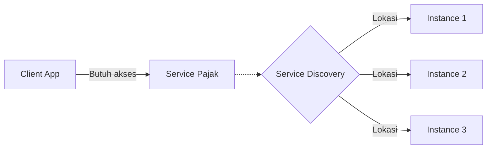
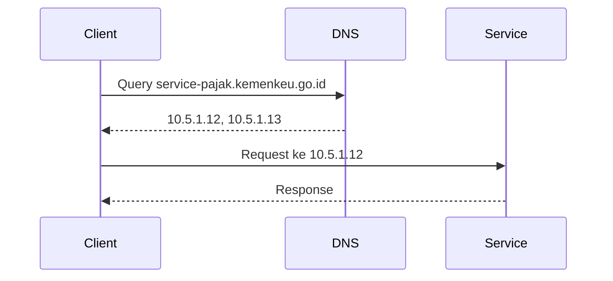
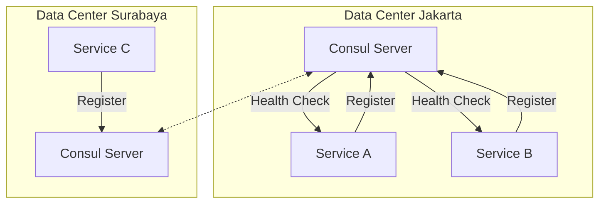
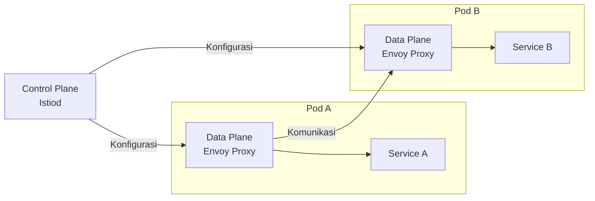
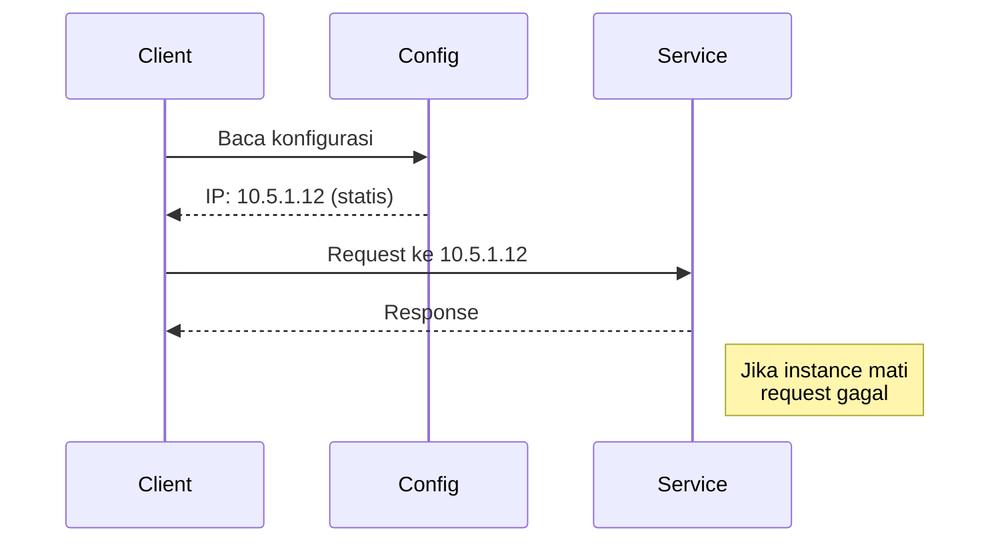
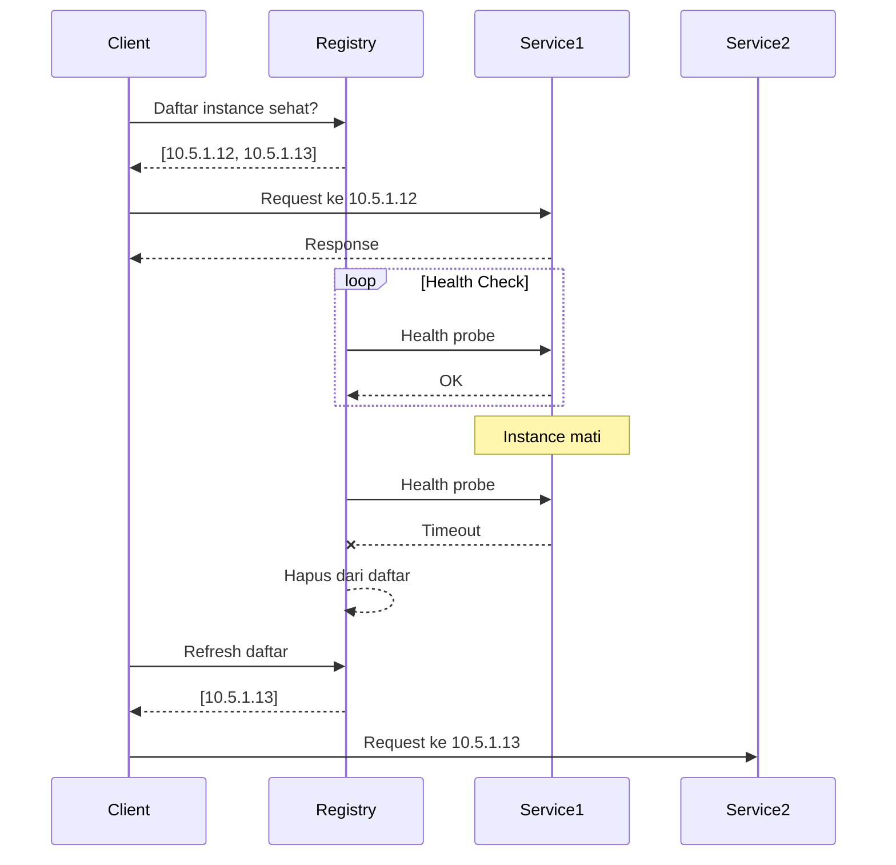
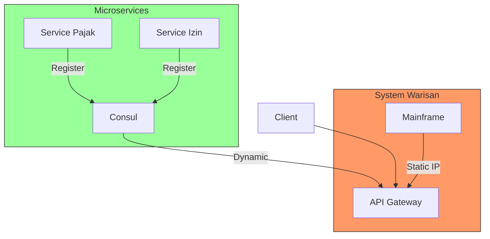
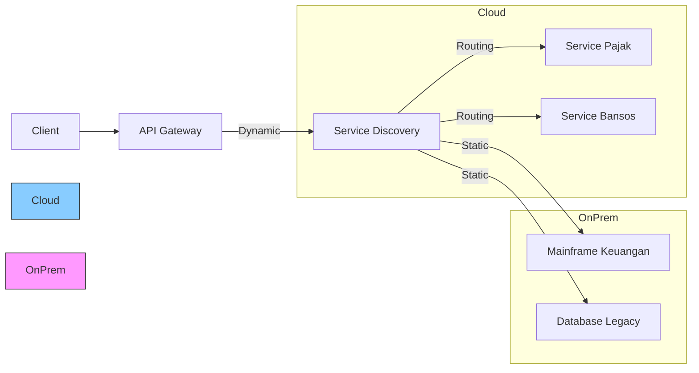
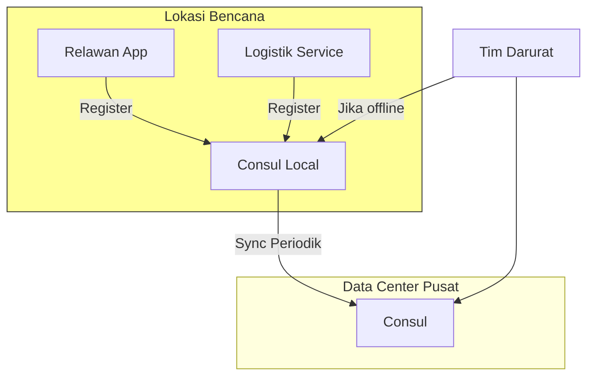

## **Implementasi Service Discovery dalam Arsitektur Microservices**  
**Fokus**: DNS-based, Consul, Service Mesh, Static vs Dynamic Discovery  

---

### **1. Konsep Dasar Service Discovery**  
#### **Mengapa Diperlukan?**  
- Dalam lingkungan microservices yang dinamis, instance service terus muncul/hilang (scaling, failure).  
- Contoh kasus pemerintah:  
  - Layanan pajak online harus tetap tersedia selama *peak season* (akhir tahun) dengan auto-scaling.  
  - Integrasi antar kementerian memerlukan mekanisme penemuan layanan yang handal.  



---

### **2. Pola Implementasi**  
#### **a. DNS-Based Discovery**  
**Mekanisme**:  
- Gunakan DNS untuk me-resolve nama service ke alamat IP  
- Contoh: `service-pajak.kemenkeu.go.id` → `10.5.1.12, 10.5.1.13`  

**Diagram Arsitektur**:  


**Kelemahan**:  
- DNS caching menyebabkan update lambat saat service scaling  
- Tidak mendukung health checking otomatis  

---

#### **b. Consul (Centralized Registry)**  
**Fitur Utama**:  
- Service registry + health checking  
- Multi-datacenter support  

**Arsitektur di Lingkungan Pemerintah**:  


**Alur Kerja**:  
1. Service register diri ke Consul saat startup  
2. Consul melakukan health check berkala  
3. Client query Consul untuk dapatkan instance sehat  
4. Consul return daftar instance + metadata  

**Contoh Implementasi**:  
```bash  
# Registrasi service  
curl -X PUT -d '{"name": "service-pajak", "address": "10.5.1.12"}' \  
http://consul-server:8500/v1/agent/service/register  

# Query service  
curl http://consul-server:8500/v1/catalog/service/service-pajak
```

---

#### **c. Service Mesh (Istio/Linkerd)**  
**Konsep Modern**:  
- Infrastruktur khusus yang menangani komunikasi service-to-service  
- Fitur: Load balancing, service discovery, security, observability  

**Arsitektur dengan Istio**:  


**Keunggulan untuk Pemerintah**:  
- **Keamanan**: Enkripsi TLS otomatis antar service  
- **Observability**: Tracing lengkap (Jaeger/Kiali)  
- **Traffic Management**: Canary deployment untuk update sistem kritis  

---

### **3. Static vs Dynamic Discovery**  
#### **Perbandingan Mendalam**  
| Kriteria          | Static Discovery                 | Dynamic Discovery                |  
|-------------------|----------------------------------|----------------------------------|  
| **Mekanisme**     | Konfigurasi manual (IP/hostname) | Registri otomatis (real-time)    |  
| **Contoh**        | Hardcode di config, Nginx upstream | Consul, Eureka, Kubernetes DNS   |  
| **Skalabilitas**  | Tidak mendukung auto-scaling     | Mendukung auto-scaling penuh     |  
| **Resiliensi**    | Gagal jika instance mati         | Otomatis reroute ke instance sehat |  
| **Maintenance**   | Manual update                    | Otomatis                         |  
| **Cocok Untuk**   | Lingkungan stabil (VM/legacy)    | Cloud-native, containerized      |  

---

#### **Diagram Perilaku**  
**Static Discovery**:  


**Dynamic Discovery**:  


---

### **4. Best Practices untuk Instansi Pemerintah**  
#### **Pola Hybrid untuk Transformasi Digital**  


**Rekomendasi Implementasi**:  
1. **Sistem Baru**: Gunakan dynamic discovery (Consul/Kubernetes Service)  
2. **Integrasi Legacy**:  
   - API Gateway sebagai adapter (static discovery ke sistem lama)  
   - Service mesh untuk modernisasi bertahap  
3. **Multi-Cluster**:  
   - Consul Enterprise untuk discovery lintas data center  
   - Istio multi-cluster untuk lingkungan hybrid  

**Contoh Arsitektur Kementerian**:  


---

### **5. Studi Kasus: Layanan Darurat Bencana Nasional**  
**Requirement**:  
- Auto-discovery relawan/logistik saat bencana  
- Integrasi lintas kementerian (Kemensos, Basarnas, Kemenkes)  
- Tetap bekerja saat jaringan terbatas  

**Solusi dengan Hybrid Discovery**:  


**Mekanisme**:  
1. **Online**: Semua service register ke Consul pusat  
2. **Offline**: Gunakan local Consul agent di lokasi bencana  
3. **Sync**: Data digabungkan saat koneksi pulih  

> 💡 **Tip Penting**: Untuk lingkungan pemerintah yang terdistribusi, selalu implementasi **fallback ke static config** sebagai mekanisme darurat!
