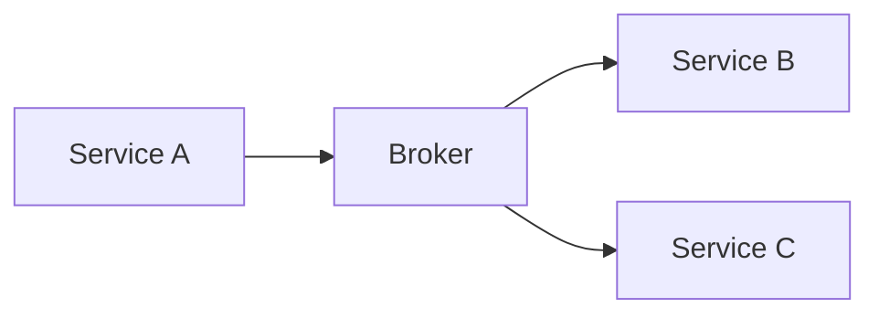
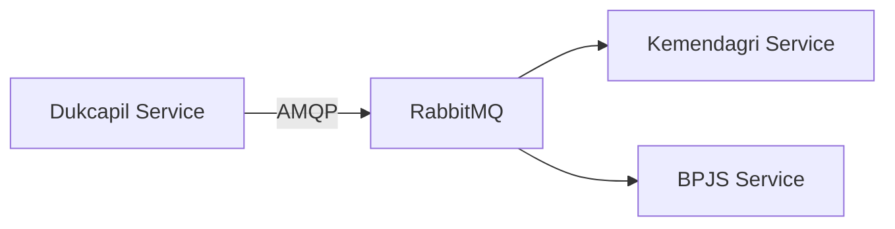
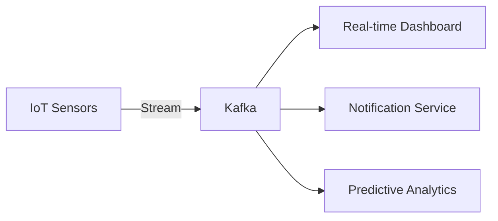
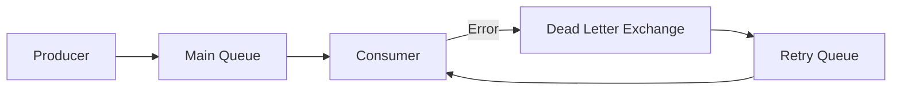
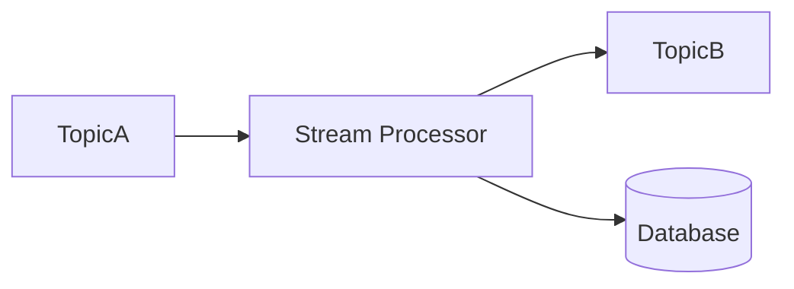
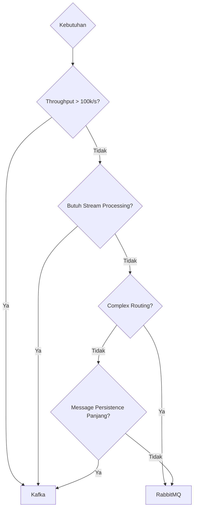

## 🚀 **Message Broker: RabbitMQ vs Kafka**  
**Fokus**: Pemilihan broker untuk arsitektur microservices pemerintah berdasarkan kebutuhan  

---

### 🧩 **1. Konsep Dasar Message Broker**  
#### **Peran dalam Arsitektur Microservices**  
- **Decoupling**: Memisahkan produsen dan konsumen data  
- **Resiliency**: Menyimpan pesan saat service down  
- **Scalability**: Menangani beban tinggi dengan pola pub/sub atau queue  
- **Use Case Pemerintah**:  
  - Integrasi sistem lintas kementerian  
  - Antrian pengolahan data sensus  
  - Notifikasi real-time bencana  



---

### 🐇 **2. RabbitMQ (Advanced Message Queuing Protocol - AMQP)**  
#### **Karakteristik Utama**  
- **Model**: Message Queuing (Point-to-Point)  
- **Protocol**: AMQP 0.9.1 + plugins (MQTT, STOMP)  
- **Fitur**:  
  - Flexible routing (Exchanges, Bindings)  
  - Message acknowledgments  
  - Priority queues  
  - Dead-letter queues  

#### **Instalasi**  
**Semua OS via Docker (Rekomendasi)**:  
```bash  
docker run -d --name rabbitmq -p 5672:5672 -p 15672:15672 rabbitmq:management  
```  

**Windows**:  
1. Download [Erlang OTP](https://erlang.org/download/otp_versions_tree.html)  
2. Download [RabbitMQ Installer](https://github.com/rabbitmq/rabbitmq-server/releases)  
3. Jalankan installer  

**Linux (Ubuntu)**:  
```bash  
sudo apt install erlang  
sudo apt install rabbitmq-server  
sudo systemctl start rabbitmq-server  
```  

#### **Penggunaan Dasar**  
1. **Akses Dashboard**: `http://localhost:15672` (user: `guest`, password: `guest`)  
2. **Buat Queue**:  
   ```bash  
   rabbitmqadmin declare queue name=citizen_registration durable=true  
   ```  
3. **Kirim Pesan**:  
   ```bash  
   rabbitmqadmin publish exchange=amq.default routing_key=citizen_registration payload='{"nik":"3273011234567890"}'  
   ```

---

### 🚀 **3. Apache Kafka (Distributed Streaming Platform)**  
#### **Karakteristik Utama**  
- **Model**: Publish-Subscribe dengan Partisi  
- **Protocol**: Custom binary over TCP  
- **Fitur**:  
  - High throughput (jutaan pesan/detik)  
  - Replikasi data fault-tolerant  
  - Retensi pesan berbasis waktu/size  
  - Stream processing (Kafka Streams)  

#### **Instalasi**  
**via Docker Compose**:  
```yaml  
version: '3'  
services:  
  zookeeper:  
    image: bitnami/zookeeper  
    ports:  
      - "2181:2181"  
  kafka:  
    image: bitnami/kafka  
    ports:  
      - "9092:9092"  
    environment:  
      - KAFKA_CFG_ZOOKEEPER_CONNECT=zookeeper:2181  
      - ALLOW_PLAINTEXT_LISTENER=yes  
```  
Jalankan: `docker-compose up -d`  

**Manual Install**:  
1. Download [Apache Kafka](https://kafka.apache.org/downloads)  
2. Ekstrak dan jalankan:  
   ```bash  
   # Start Zookeeper  
   bin/zookeeper-server-start.sh config/zookeeper.properties  

   # Start Kafka  
   bin/kafka-server-start.sh config/server.properties  
   ```

---

### ⚙️ **4. Perbandingan Teknis**  
| Parameter          | RabbitMQ                          | Kafka                             |  
|--------------------|-----------------------------------|-----------------------------------|  
| **Model Pengiriman** | Queue-based                     | Log-based partitioned             |  
| **Throughput**     | ~50K pesan/detik                 | ~1M+ pesan/detik                 |  
| **Latensi**        | Milidetik                        | Milidetik - Detik                 |  
| **Persistence**    | Pesan dihapus setelah dikonsumsi | Disimpan sesuai retensi (hari/GB) |  
| **Protokol**       | AMQP, MQTT, STOMP                | Custom binary                     |  
| **Bahasa**         | Erlang                           | Scala/Java                        |  
| **Use Case Ideal** | Task distribution, RPC           | Event streaming, log aggregation |  

---

### 🛠️ **5. Implementasi dalam Microservices**  
#### **RabbitMQ dengan Node.js**  
```javascript  
const amqp = require('amqplib');  

// Producer  
async function sendRegistration(data) {  
  const conn = await amqp.connect('amqp://localhost');  
  const channel = await conn.createChannel();  
  const queue = 'citizen_registration';  

  await channel.assertQueue(queue, { durable: true });  
  channel.sendToQueue(queue, Buffer.from(JSON.stringify(data)));  
}  

// Consumer  
async function consumeRegistration() {  
  const conn = await amqp.connect('amqp://localhost');  
  const channel = await conn.createChannel();  
  const queue = 'citizen_registration';  

  await channel.assertQueue(queue, { durable: true });  
  channel.consume(queue, msg => {  
    const data = JSON.parse(msg.content.toString());  
    console.log('Proses registrasi:', data.nik);  
    channel.ack(msg);  
  });  
}  
```

#### **Kafka dengan Go**  
```go  
package main  

import (  
	"fmt"  
	"github.com/segmentio/kafka-go"  
)  

func main() {  
	// Producer  
	producer := kafka.Writer{  
		Addr:     kafka.TCP("localhost:9092"),  
		Topic:    "citizen_updates",  
		Balancer: &kafka.LeastBytes{},  
	}  

	producer.WriteMessages(context.Background(),  
		kafka.Message{Value: []byte(`{"nik":"3273011234567890","status":"verified"}`)},  
	)  

	// Consumer  
	reader := kafka.NewReader(kafka.ReaderConfig{  
		Brokers:  []string{"localhost:9092"},  
		Topic:    "citizen_updates",  
		GroupID:  "verification-service",  
	})  

	for {  
		msg, _ := reader.ReadMessage(context.Background())  
		fmt.Printf("Pesan diterima: %s\n", string(msg.Value))  
	}  
}  
```

---

### 🏛️ **6. Studi Kasus Pemerintah**  
#### **Kasus 1: Integrasi Data Kependudukan (RabbitMQ)**  
**Arsitektur**:  

**Alur**:  
1. Pendaftaran NIK baru di Dukcapil  
2. RabbitMQ mengirim event ke Kemendagri (verifikasi alamat) dan BPJS (registrasi awal)  
3. Sistem terpisah proses secara paralel  

**Keuntungan**:  
- Waktu respons sistem keseluruhan turun 65%  
- Error handling terpusat via dead-letter queue  

#### **Kasus 2: Monitoring Bencana Real-time (Kafka)**  
**Arsitektur**:  

**Alur**:  
1. Sensor kirim data ke topic `sensor-data`  
2. Stream processing olah data (deteksi anomali)  
3. Hasil dikirim ke dashboard dan layanan notifikasi  

**Statistik**:  
- Throughput: 120,000 messages/detik saat banjir besar  
- Latensi: <500ms dari sensor ke dashboard  

---

### 🔒 **7. Best Practices Keamanan**  
#### **RabbitMQ**:  
```bash  
# Buat user baru  
rabbitmqctl add_user gov_admin StrongPassword!  
rabbitmqctl set_permissions gov_admin ".*" ".*" ".*"  

# Aktifkan TLS  
listeners.ssl.default = 5671  
ssl_options.cacertfile = /path/to/ca_certificate.pem  
ssl_options.certfile   = /path/to/server_certificate.pem  
ssl_options.keyfile    = /path/to/server_key.pem  
```

#### **Kafka**:  
```properties  
# server.properties  
security.inter.broker.protocol=SSL  
ssl.keystore.location=/path/to/kafka.server.keystore.jks  
ssl.truststore.location=/path/to/kafka.server.truststore.jks  

# Autentikasi SASL  
sasl.mechanism.inter.broker.protocol=SCRAM-SHA-512  
sasl.enabled.mechanisms=SCRAM-SHA-512  
```

---

### 🧩 **8. Pola Arsitektur Umum**  
#### **Pola 1: Dead Letter Queue (RabbitMQ)**  

**Use Case**: Retry otomatis untuk gagal verifikasi NIK  

#### **Pola 2: Kafka Stream Processing**  

**Use Case**:  
- Anomali deteksi transaksi keuangan  
- Agregasi data sensor wilayah bencana  

---

### 📊 **9. Decision Matrix untuk Pemerintah**  


**Pedoman**:  
- **Pilih RabbitMQ Untuk**:  
  - Sistem tugas kritis (RPC style)  
  - Layanan dengan routing kompleks  
  - Environment dengan resource terbatas  
- **Pilih Kafka Untuk**:  
  - Event sourcing arsitektur  
  - Log aggregation terpusat  
  - Sistem real-time analytics  

---

### 📚 **Sumber Pembelajaran**  
1. [RabbitMQ Tutorials](https://www.rabbitmq.com/getstarted.html)  
2. [Kafka Documentation](https://kafka.apache.org/documentation/)  
3. [Practical Message Queue Design](https://architecturenotes.co/message-queues/)  
4. [Buku: "Kafka: The Definitive Guide"](https://www.oreilly.com/library/view/kafka-the-definitive/9781491936153/)  

> 💡 **Tip Implementasi**:  
> - Gunakan **RabbitMQ** untuk sistem transaksional (e.g., verifikasi dokumen)  
> - Gunakan **Kafka** untuk data pipeline (e.g., agregasi data sensus)  
> - Selalu encrypt message payload untuk data sensitif  
> - Monitor queue depth dan consumer lag  

Dengan pemahaman ini, instansi pemerintah dapat membangun sistem terdistribusi yang robust dan scalable! 🏛️🚀
