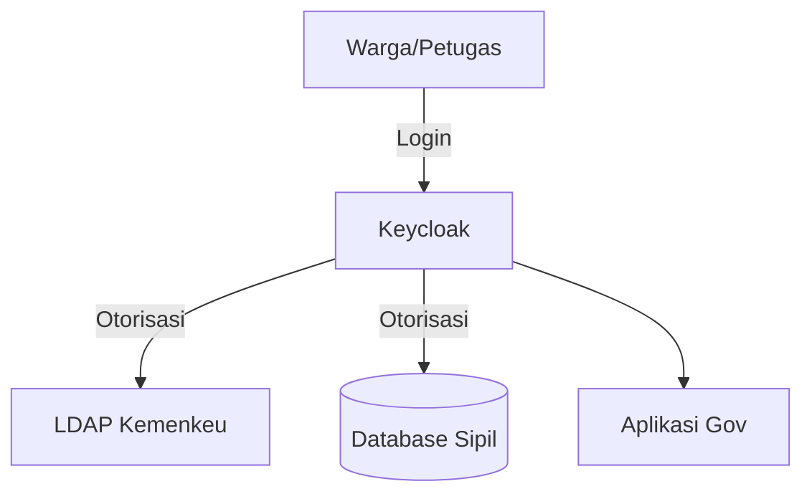
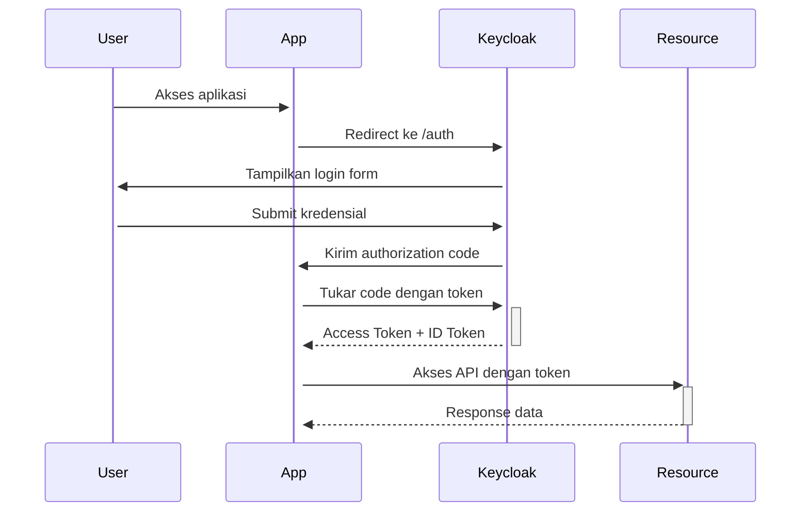
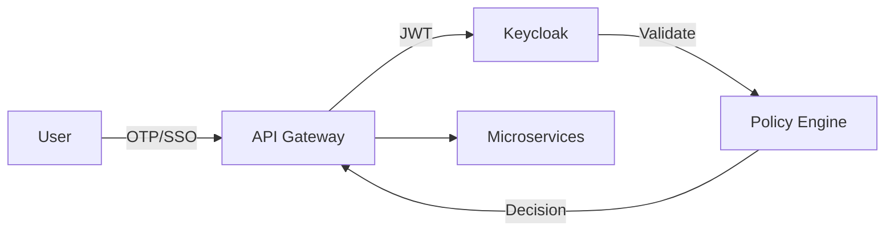
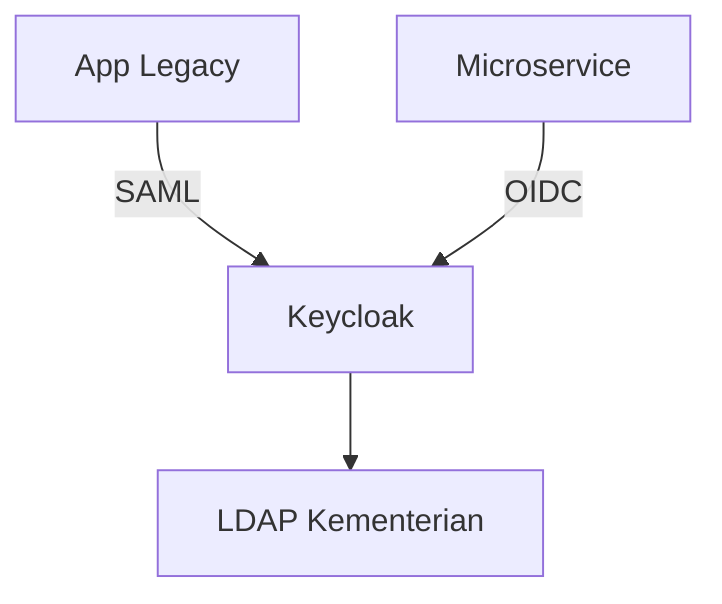
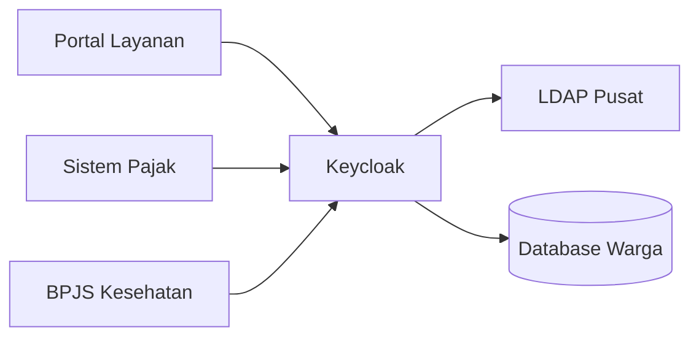

## 🔐 **Keamanan Microservices: Keycloak, OAuth 2.0, dan JWT**  
**Fokus**: Implementasi otentikasi dan otorisasi terpusat untuk sistem pemerintah  

---

### 🏛️ **1. Keycloak: Identity & Access Management (IAM)**  
#### **Konsep Utama**  
- **Single Sign-On (SSO)**: Satu login untuk semua aplikasi pemerintah  
- **Federated Identity**: Integrasi dengan LDAP/Active Directory  
- **Centralized Authorization**: Kelola izin dari satu tempat  
- **Audit Logging**: Lacak semua aktivitas otentikasi  

#### **Instalasi Keycloak**  
**Semua OS via Docker**:  
```bash  
docker run -d \  
  --name keycloak \  
  -p 8080:8080 \  
  -e KEYCLOAK_ADMIN=admin \  
  -e KEYCLOAK_ADMIN_PASSWORD=change_me \  
  quay.io/keycloak/keycloak:24.0.4 \  
  start-dev  
```  

**Manual Install (Linux)**:  
```bash  
wget https://github.com/keycloak/keycloak/releases/download/24.0.4/keycloak-24.0.4.tar.gz  
tar -xvzf keycloak-24.0.4.tar.gz  
cd keycloak-24.0.4/bin  
./kc.sh start-dev  
```  

**Akses Admin Console**:  
`http://localhost:8080/admin` (user: `admin`, password: `change_me`)  

---

### 🔑 **2. Konfigurasi Keycloak untuk Instansi Pemerintah**  
#### **Langkah Setup**:  
1. **Buat Realm**:  
   - `Gov-Realm` (misal: Kemendagri-Realm)  
2. **Buat Client**:  
   - Client ID: `citizen-app`  
   - Protocol: `openid-connect`  
3. **Definisikan Roles**:  
   - `citizen`, `admin`, `officer`  
4. **Buat User**:  
   - Username: `user001`  
   - Atribut: `nik=3273011234567890`  
   - Role: `citizen`  
5. **Konfigurasi Identity Provider**:  
   - Integrasi dengan LDAP Kementerian  
   - SAML untuk aplikasi legacy  



---

### ⚙️ **3. OAuth 2.0 & OpenID Connect**  
#### **Protokol Alur**:  


#### **Grant Types untuk Pemerintah**:  
| Tipe | Use Case |  
|------|----------|  
| **Authorization Code** | Aplikasi web (portal layanan) |  
| **Client Credentials** | Komunikasi service-to-service |  
| **Password** | Migrasi aplikasi legacy |  

---

### 🪙 **4. JSON Web Tokens (JWT)**  
#### **Struktur Token**:  
```json  
{  
  "alg": "RS256",  
  "typ": "JWT"  
}  
{  
  "sub": "user001",  
  "name": "Budi Santoso",  
  "nik": "3273011234567890",  
  "realm_access": {  
    "roles": ["citizen", "tax-payer"]  
  },  
  "iat": 1715000000,  
  "exp": 1715003600  
}  
<signature>  
```  

#### **Best Practices**:  
1. **Signature**: Gunakan RSA-256 (asymmetric)  
2. **Expiration**: Maks 1 jam untuk access token  
3. **Storage**:  
   - Web: HttpOnly cookies  
   - Mobile: Secure storage  
4. **Claims Custom**:  
   - Tambahkan `org_unit: "Kemendagri"`  
   - `security_level: "confidential"`  

---

### 💻 **5. Implementasi di Microservices**  
#### **Node.js (Express + keycloak-connect)**  
```javascript  
const Keycloak = require('keycloak-connect');  
const express = require('express');  

const app = express();  
const keycloak = new Keycloak({}, {  
  realm: 'Gov-Realm',  
  authServerUrl: 'http://localhost:8080',  
  clientId: 'citizen-app',  
  secret: 'client-secret'  
});  

app.use(keycloak.middleware());  

// Route terlindungi  
app.get('/tax-data', keycloak.protect('tax-payer'), (req, res) => {  
  const nik = req.kauth.grant.access_token.content.nik;  
  res.json({ taxData: fetchTaxData(nik) });  
});  

// Verifikasi role  
app.get('/admin', keycloak.protect('admin'), (req, res) => {  
  res.send('Admin dashboard');  
});  
```

#### **Go (gin + gokeycloak)**  
```go  
package main  

import (  
	"github.com/Nerzal/gocloak/v13"  
	"github.com/gin-gonic/gin"  
)  

func main() {  
	r := gin.Default()  

	// Middleware otentikasi  
	r.Use(func(c *gin.Context) {  
		token := c.GetHeader("Authorization")  
		client := gocloak.NewClient("http://localhost:8080")  
		result, err := client.RetrospectToken(c, token, "citizen-app", "client-secret", "Gov-Realm")  
		if !*result.Active {  
			c.AbortWithStatus(401)  
		}  
	})  

	// Route dengan verifikasi role  
	r.GET("/citizen/:nik", func(c *gin.Context) {  
		token := c.GetHeader("Authorization")  
		claims, _ := client.DecodeAccessToken(c, token, "Gov-Realm")  
		if !contains(claims.RealmAccess.Roles, "officer") {  
			c.JSON(403, gin.H{"error": "Forbidden"})  
			return  
		}  
		nik := c.Param("nik")  
		c.JSON(200, fetchCitizenData(nik))  
	})  
}  
```

---

### 🛡️ **6. Pola Keamanan untuk Pemerintah**  
#### **Zero-Trust Architecture**:  


#### **Fitur Kritis**:  
1. **Multi-Factor Authentication**:  
   - Wajib untuk akses data sensitif  
   - Integrasi dengan aplikasi pemerintah (e.g., PeduliLindungi)  
2. **Attribute-Based Access Control**:  
   ```json  
   "resource_access": {  
     "tax-service": {  
       "roles": ["viewer"],  
       "attributes": {  
         "province": ["DKI Jakarta", "Jawa Barat"]  
       }  
     }  
   }  
   ```  
3. **Token Exchange**:  
   - Tukar token antar layanan tanpa ekspos kredensial  

---

### 🚨 **7. Disaster Recovery & Audit**  
#### **Strategi Keycloak**:  
1. **Replikasi Cluster**:  
   ```bash  
   docker run -d --name keycloak-node2 \  
     -e KEYCLOAK_ADMIN=admin \  
     -e KEYCLOAK_ADMIN_PASSWORD=change_me \  
     -e KC_DB=postgres \  
     -e KC_DB_URL=jdbc:postgresql://db-host/gov_keycloak \  
     quay.io/keycloak/keycloak start  
   ```  
2. **Backup Rutin**:  
   - Export realm config tiap hari  
   - Backup database PostgreSQL  
3. **Audit Log**:  
   - Simpan log otentikasi 7 tahun (sesuai UU Kearsipan)  

---

### 📜 **8. Compliance Regulasi Pemerintah**  
1. **Perlindungan Data Pribadi**:  
   - Token tidak boleh menyimpan data sensitif (nomor HP, alamat lengkap)  
2. **Standar Kriptografi**:  
   - Gunakan minimal RSA-2048 atau ECDSA-256  
   - Wajib HTTPS semua komunikasi  
3. **Inspeksi Berkala**:  
   - Penetration test kuartalan  
   - Sertifikasi BSSN  

---

### 🧩 **9. Integrasi dengan Sistem Legacy**  
#### **Pola Hybrid**:  


**Konfigurasi SAML di Keycloak**:  
1. Tambah identity provider tipe SAML v2.0  
2. Upload metadata.xml dari aplikasi legacy  
3. Atur attribute mapping:  
   ```  
   username -> ${ATTRIBUTE.uid}  
   nik -> ${ATTRIBUTE.employeeNumber}  
   ```

---

### 📊 **10. Studi Kasus: SSO Nasional**  
**Arsitektur**:  


**Statistik Implementasi**:  
- 45+ aplikasi pemerintah terintegrasi  
- 98% reduksi password-related issues  
- Waktu akses aplikasi berkurang 70%  

---

### ✅ **11. Checklist Implementasi**  
1. [ ] Setup cluster Keycloak HA  
2. [ ] Integrasi dengan LDAP/Active Directory  
3. [ ] Implementasi OAuth 2.0 untuk microservices  
4. [ ] Atur token expiration (access: 1 jam, refresh: 30 hari)  
5. [ ] Tambah mandatory MFA untuk role admin  
6. [ ] Enkripsi JWT payload untuk data sensitif  
7. [ ] Setup audit log terpusat  

> 🔒 **Tip Keamanan Kritis**:  
> - Selalu validasi `aud` claim di JWT  
> - Gunakan PKCE untuk public clients  
> - Rotasi secret key tiap 90 hari  
> - Monitor suspicious login attempts  

**Sumber Resmi**:  
- [Keycloak Documentation](https://www.keycloak.org/documentation)  
- [OAuth 2.0 Specification](https://oauth.net/2/)  
- [JWT Best Practices](https://datatracker.ietf.org/doc/html/rfc8725)  

Dengan arsitektur ini, instansi pemerintah dapat membangun sistem otentikasi yang aman, terpusat, dan sesuai regulasi! 🏛️🔐
