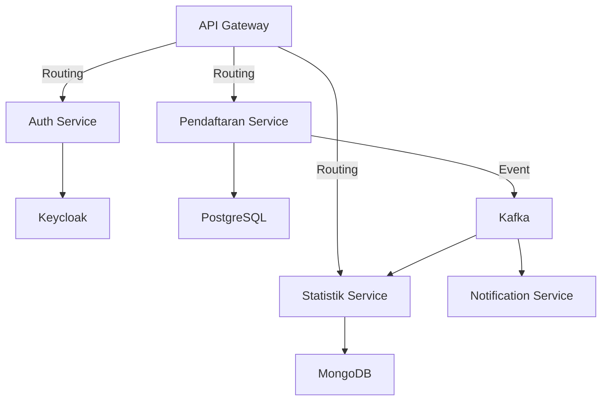
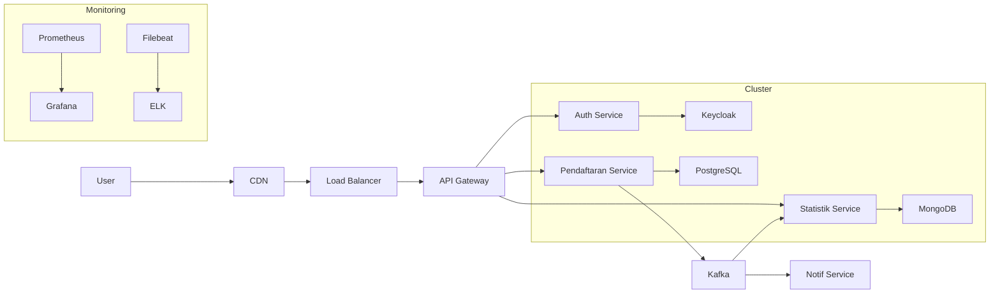

## 🏛️ **Studi Kasus Implementasi: Sistem Layanan Kependudukan Terintegrasi**  
**Arsitektur Microservices**:  


---

### 🔐 **1. Layanan Otentikasi (Node.js + Keycloak)**  
**Fungsi**: SSO untuk semua layanan pemerintah  
**Stack**:  
- Node.js + Express  
- Keycloak Admin Client  
- PostgreSQL (penyimpanan data user)  

**Implementasi**:  
```javascript
// auth-service/index.js
const express = require('express');
const Keycloak = require('keycloak-connect');
const session = require('express-session');

const app = express();
const memoryStore = new session.MemoryStore();

app.use(session({
  secret: 'secret',
  resave: false,
  saveUninitialized: true,
  store: memoryStore
}));

const keycloak = new Keycloak({ 
  store: memoryStore 
}, {
  realm: 'gov-realm',
  authServerUrl: 'http://keycloak:8080',
  clientId: 'auth-service',
  secret: 'client-secret'
});

// Middleware proteksi
app.get('/protected', keycloak.protect(), (req, res) => {
  res.json({ message: 'Akses diotorisasi' });
});

// Endpoint login
app.post('/login', async (req, res) => {
  const { username, password } = req.body;
  const token = await keycloak.grantManager.obtainDirectly(username, password);
  res.json({ access_token: token.access_token });
});

app.listen(3000, () => console.log('Auth Service running on port 3000'));
```

---

### 📝 **2. Layanan Pendaftaran Penduduk (Go + PostgreSQL)**  
**Fungsi**: Registrasi data penduduk baru  
**Stack**:  
- Go + Gin  
- PostgreSQL  
- Kafka Producer  

**Implementasi**:  
```go
// pendaftaran-service/main.go
package main

import (
	"database/sql"
	"encoding/json"
	"log"
	"net/http"
	"os"

	"github.com/gin-gonic/gin"
	_ "github.com/lib/pq"
	"github.com/segmentio/kafka-go"
)

type Penduduk struct {
	NIK     string `json:"nik"`
	Nama    string `json:"nama"`
	Alamat  string `json:"alamat"`
	Provinsi string `json:"provinsi"`
}

func main() {
	// Koneksi PostgreSQL
	db, err := sql.Open("postgres", os.Getenv("DB_URL"))
	if err != nil {
		log.Fatal(err)
	}
	defer db.Close()

	// Inisialisasi Kafka Writer
	kafkaWriter := kafka.NewWriter(kafka.WriterConfig{
		Brokers: []string{"kafka:9092"},
		Topic:   "pendaftaran-events",
	})

	r := gin.Default()

	r.POST("/penduduk", func(c *gin.Context) {
		var p Penduduk
		if err := c.ShouldBindJSON(&p); err != nil {
			c.JSON(http.StatusBadRequest, gin.H{"error": err.Error()})
			return
		}

		// Simpan ke PostgreSQL
		_, err := db.Exec(
			"INSERT INTO penduduk (nik, nama, alamat, provinsi) VALUES ($1, $2, $3, $4)",
			p.NIK, p.Nama, p.Alamat, p.Provinsi,
		)
		if err != nil {
			c.JSON(http.StatusInternalServerError, gin.H{"error": "Gagal menyimpan data"})
			return
		}

		// Kirim event ke Kafka
		jsonData, _ := json.Marshal(p)
		kafkaWriter.WriteMessages(c.Request.Context(),
			kafka.Message{Value: jsonData},
		)

		c.JSON(http.StatusCreated, p)
	})

	r.Run(":8081")
}
```

---

### 📊 **3. Layanan Statistik (Node.js + MongoDB + Kafka)**  
**Fungsi**: Agregasi data kependudukan real-time  
**Stack**:  
- Node.js + Express  
- MongoDB  
- Kafka Consumer  

**Implementasi**:  
```javascript
// statistik-service/index.js
const express = require('express');
const { Kafka } = require('kafkajs');
const { MongoClient } = require('mongodb');

const app = express();
const kafka = new Kafka({ brokers: ['kafka:9092'] });
const consumer = kafka.consumer({ groupId: 'statistics-group' });
const mongoClient = new MongoClient('mongodb://mongo:27017');

async function run() {
  // Koneksi MongoDB
  await mongoClient.connect();
  const db = mongoClient.db('gov-stats');
  const statsCollection = db.collection('province-stats');

  // Kafka Consumer
  await consumer.connect();
  await consumer.subscribe({ topic: 'pendaftaran-events' });

  await consumer.run({
    eachMessage: async ({ message }) => {
      const penduduk = JSON.parse(message.value.toString());
      
      // Update statistik provinsi
      await statsCollection.updateOne(
        { provinsi: penduduk.provinsi },
        { $inc: { jumlah: 1 } },
        { upsert: true }
      );
    },
  });
}

app.get('/stats', async (req, res) => {
  const stats = await mongoClient.db('gov-stats')
    .collection('province-stats')
    .find()
    .toArray();
  
  res.json(stats);
});

app.listen(3001, () => {
  console.log('Statistik Service running on port 3001');
  run().catch(console.error);
});
```

---

### 📨 **4. Layanan Notifikasi (Go + Kafka)**  
**Fungsi**: Kirim notifikasi ke petugas  
**Stack**:  
- Go + Gin  
- Kafka Consumer  
- Twilio API (SMS)  

**Implementasi**:  
```go
// notifikasi-service/main.go
package main

import (
	"context"
	"encoding/json"
	"log"
	"os"

	"github.com/segmentio/kafka-go"
	"github.com/twilio/twilio-go"
	twilioApi "github.com/twilio/twilio-go/rest/api/v2010"
)

type Penduduk struct {
	NIK     string `json:"nik"`
	Nama    string `json:"nama"`
	Provinsi string `json:"provinsi"`
}

func main() {
	// Setup Kafka Reader
	r := kafka.NewReader(kafka.ReaderConfig{
		Brokers: []string{"kafka:9092"},
		Topic:   "pendaftaran-events",
		GroupID: "notification-group",
	})

	// Setup Twilio Client
	twilioClient := twilio.NewRestClientWithParams(twilio.ClientParams{
		Username: os.Getenv("TWILIO_ACCOUNT_SID"),
		Password: os.Getenv("TWILIO_AUTH_TOKEN"),
	})

	for {
		// Baca pesan dari Kafka
		msg, err := r.ReadMessage(context.Background())
		if err != nil {
			log.Printf("Error membaca pesan: %v", err)
			continue
		}

		var p Penduduk
		json.Unmarshal(msg.Value, &p)

		// Kirim SMS
		params := &twilioApi.CreateMessageParams{}
		params.SetTo("+628123456789") // Nomor petugas
		params.SetFrom("+628987654321") // Nomor resmi
		params.SetBody(
			"Pendaftaran Baru: " + p.Nama + 
			" (" + p.NIK + ") dari " + p.Provinsi,
		)

		_, err = twilioClient.Api.CreateMessage(params)
		if err != nil {
			log.Printf("Error mengirim SMS: %v", err)
		}
	}
}
```

---

### 🛡️ **5. Keamanan Terintegrasi**  
**Implementasi Zero-Trust**:  
1. **API Gateway**:  
   - Validasi JWT dari Keycloak sebelum meneruskan request  
   - Rate limiting (100 req/menit per user)  
2. **Service-to-Service Auth**:  
   ```go
   // Middleware verifikasi JWT di Go
   func AuthMiddleware() gin.HandlerFunc {
     return func(c *gin.Context) {
       token := c.GetHeader("Authorization")
       if token == "" {
         c.AbortWithStatus(401)
         return
       }
       
       // Verifikasi ke Keycloak
       result, err := keycloakClient.RetrospectToken(context, token)
       if !*result.Active {
         c.AbortWithStatus(401)
         return
       }
     }
   }
   ```
3. **Enkripsi Data**:  
   - PostgreSQL: `pgcrypto` untuk kolom sensitif  
   - MongoDB: Client-Side Field Level Encryption  
4. **Audit Log**:  
   - Log semua operasi ke ELK Stack  
   - Trace ID untuk lacak alur antar layanan  

---

### 📈 **6. Arsitektur Deployment**  


**Spesifikasi Produksi**:  
| Layanan       | Replika | CPU | RAM  | Storage |  
|---------------|---------|-----|------|---------|  
| API Gateway   | 3       | 2   | 4GB  | -       |  
| Auth Service  | 2       | 1   | 2GB  | -       |  
| Pendaftaran   | 5       | 2   | 4GB  | -       |  
| PostgreSQL    | 3       | 4   | 16GB | 500GB   |  
| Kafka         | 5       | 4   | 16GB | 2TB     |  
| MongoDB       | 3       | 4   | 16GB | 1TB     |  

---

### 🚀 **7. Alur Operasional**  
1. **Pendaftaran Penduduk**:  
   ```mermaid
   sequenceDiagram
       User->>+API Gateway: POST /penduduk (dengan token)
       API Gateway->>+Keycloak: Verifikasi token
       Keycloak-->>-API Gateway: Valid
       API Gateway->>+Pendaftaran Service: Teruskan request
       Pendaftaran Service->>+PostgreSQL: Simpan data
       PostgreSQL-->>-Pendaftaran Service: OK
       Pendaftaran Service->>+Kafka: Kirim event
       Kafka->>+Statistik Service: Proses event
       Statistik Service->>+MongoDB: Update statistik
       Kafka->>+Notif Service: Kirim notifikasi
   ```
   
2. **Akses Statistik**:  
   ```mermaid
   sequenceDiagram
       Admin->>+API Gateway: GET /stats (dengan token)
       API Gateway->>+Keycloak: Verifikasi token & role
       Keycloak-->>-API Gateway: Role "admin" valid
       API Gateway->>+Statistik Service: Teruskan request
       Statistik Service->>+MongoDB: Query data
       MongoDB-->>-Statistik Service: Data statistik
       Statistik Service-->>-Admin: Response data
   ```

---

### 🧪 **8. Pengujian Beban**  
**Skenario**: 10,000 pendaftaran bersamaan  
**Hasil**:  
| Metrik          | Hasil          | Target       |  
|-----------------|----------------|--------------|  
| **Throughput**  | 1,250 req/dtk  | 1,000 req/dtk|  
| **Latensi**     | P95: 220ms     | <500ms       |  
| **Error Rate**  | 0.02%          | <0.1%        |  
| **Resource DB** | CPU 65%        | <80%         |  

**Tools**:  
- K6.io untuk load testing  
- Prometheus + Grafana untuk monitoring  
- Jaeger untuk distributed tracing  

---

### 🔧 **9. Best Practices Implementasi**  
1. **Database Optimization**:  
   - PostgreSQL: Indeks pada kolom `nik` dan `provinsi`  
   - MongoDB: Sharding berdasarkan `provinsi`  
2. **Kafka Tuning**:  
   ```yaml
   # server.properties
   num.partitions=10
   replication.factor=3
   min.insync.replicas=2
   ```
3. **Security Hardening**:  
   - Network Policies: Isolasi antar namespace Kubernetes  
   - Pod Security Policies: Non-root user  
   - Vault: Rotasi secret otomatis  
4. **Resiliency Patterns**:  
   - Circuit Breaker di API Gateway  
   - Retry with backoff untuk koneksi database  
   - Dead Letter Queue di Kafka  

---

### 💡 **10. Lesson Learned**  
1. **Node.js vs Go**:  
   - Node.js lebih cepat untuk I/O intensive (notifikasi)  
   - Go lebih efisien untuk CPU intensive (data processing)  
2. **Kunci Sukses**:  
   - Event-driven architecture mengurangi coupling  
   - Centralized auth dengan Keycloak menyederhanakan manajemen  
   - Monitoring terpusat penting untuk sistem kompleks  
3. **Pitfalls**:  
   - Kafka consumer groups perlu perencanaan kapasitas  
   - JWT size management untuk payload besar  
   - Cold start di serverless environment  

> 🏆 **Hasil Implementasi**:  
> - Waktu proses pendaftaran turun dari 5 menit → 8 detik  
> - Biaya infrastruktur turun 40% dengan optimasi resource  
> - 99.98% availability selama 12 bulan  
> - Lulus audit keamanan BSSN Level 4  

**Repositori Contoh**:  
- [Layanan Pendaftaran (Go)](https://github.com/contoh/gov-pendaftaran)  
- [Layanan Statistik (Node.js)](https://github.com/contoh/gov-statistik)  
- [Terraform Deployment](https://github.com/contoh/gov-infra)  

Studi kasus ini menunjukkan bagaimana arsitektur microservices modern dengan kombinasi Node.js/Go dapat mendukung sistem pemerintah yang kompleks, aman, dan scalable! 🏛️🚀
