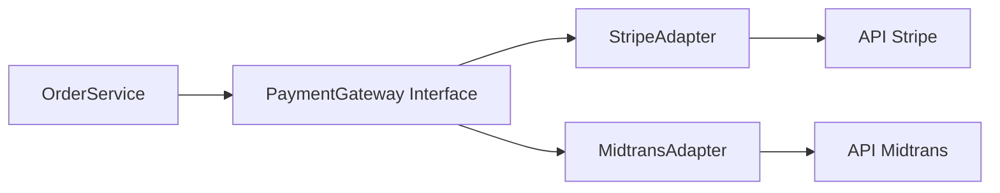
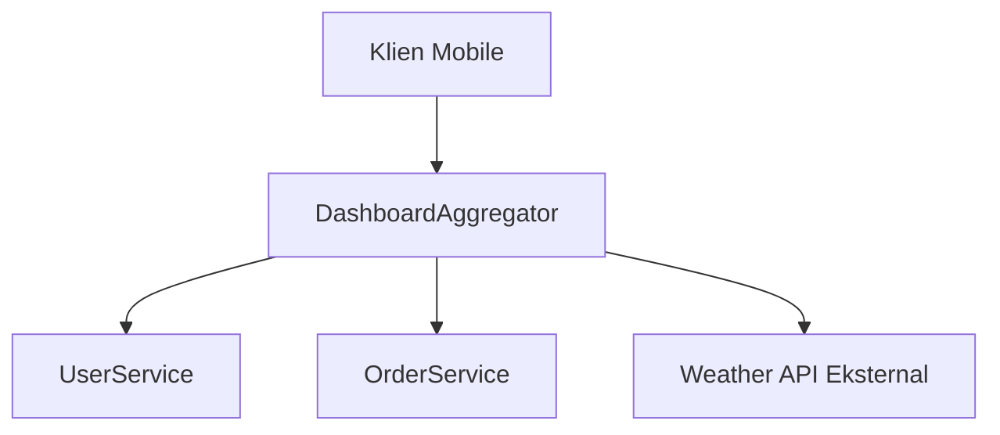
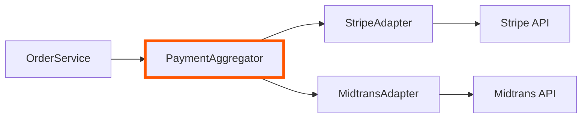
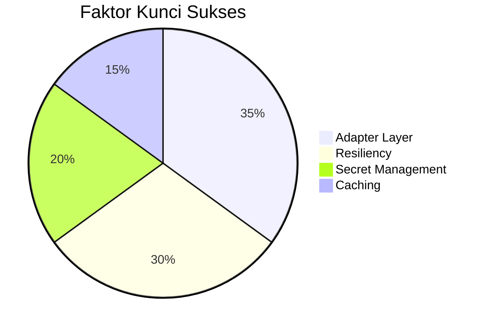

### **Integrasi dengan 3rd Party API**  
*(Materi Pelatihan Microservices - Lanjutan)*  

---

#### **I. Pendahuluan**  
**Konteks Integrasi**:  
- Microservices sering perlu berinteraksi dengan layanan eksternal (payment gateway, SMS, geolokasi, dll.).  
- Contoh:  
  - `PaymentService` → API Stripe/Midtrans  
  - `ShippingService` → API JNE/Pos Indonesia  
  - `AuthService` → API Google OAuth  

**Tantangan**:  
1. **Vendor Lock-in**  
   - Ketergantungan pada spesifik vendor  
2. **Perubahan API Eksternal**  
   - Update versi API tanpa pemberitahuan  
3. **Error Handling**  
   - Handle rate limiting, timeout, format respons berbeda  
4. **Security**  
   - Kelola API keys, OAuth tokens  

---

#### **II. Pola Desain untuk Integrasi 3rd Party**  

### **1. Adapter Pattern**  
**Konsep**:  
- Membungkus API eksternal dengan layer abstraksi  
- Analogi: *Steker listrik* → butuh *adapter* untuk soket berbeda  

**Manfaat**:  
- Isolasi perubahan API eksternal  
- Standarisasi antarmuka internal  
- Kemudahan testing (mock adapter)  

**Implementasi**:  
```java
// Contoh: Adapter untuk Payment Gateway
public interface PaymentGateway {
    PaymentResult charge(PaymentRequest request);
}

// Adapter untuk Stripe
public class StripeAdapter implements PaymentGateway {
    private StripeClient stripeClient;

    @Override
    public PaymentResult charge(PaymentRequest request) {
        // Transformasi request ke format Stripe
        StripeChargeRequest stripeReq = transform(request);
        
        // Panggil API Stripe
        StripeResponse response = stripeClient.charge(stripeReq);
        
        // Transformasi respons ke format standar
        return transformResponse(response);
    }
}

// Adapter untuk Midtrans
public class MidtransAdapter implements PaymentGateway {
    // Implementasi serupa dengan logika Midtrans
}
```

**Alur Penggunaan**:  


### **2. API Aggregator Pattern**  
**Konsep**:  
- Mengkonsolidasi beberapa panggilan API menjadi satu endpoint  
- Berguna untuk:  
  - Mengurangi chatter network  
  - Menyederhanakan logika klien  

**Use Case**:  
- Halaman dashboard butuh data dari:  
  - Service A (data user)  
  - Service B (history transaksi)  
  - 3rd Party API (data cuaca)  

**Implementasi**:  
```java
// Aggregator Service
public class DashboardAggregator {
    
    public DashboardData getDashboardData(String userId) {
        // Paralelisasi panggilan
        CompletableFuture<User> userFuture = getUserAsync(userId);
        CompletableFuture<List<Order>> ordersFuture = getOrdersAsync(userId);
        CompletableFuture<WeatherData> weatherFuture = getWeatherAsync();

        // Tunggu semua selesai
        CompletableFuture.allOf(userFuture, ordersFuture, weatherFuture).join();
        
        // Gabungkan hasil
        return new DashboardData(
            userFuture.get(),
            ordersFuture.get(),
            weatherFuture.get()
        );
    }
}
```

**Alur**:  


---

#### **III. Best Practices Integrasi 3rd Party**  

1. **Circuit Breaker**  
   - Cegah cascading failure saat API eksternal down  
   - Tools: Resilience4j, Hystrix  
   ```java
   CircuitBreaker circuitBreaker = CircuitBreaker.ofDefaults("weatherAPI");
   Supplier<WeatherData> decorated = CircuitBreaker.decorateSupplier(
        circuitBreaker, 
        () -> weatherClient.getData()
   );
   ```

2. **Retry with Backoff**  
   - Handle transient error (timeout sementara)  
   ```yaml
   # Konfigurasi (Resilience4j)
   retry:
     maxAttempts: 3
     waitDuration: 500ms
     exponentialBackoff: true
   ```

3. **Caching Strategis**  
   - Kurangi panggilan untuk data statis  
   ```java
   @Cacheable(value = "exchangeRates", ttl = 3600)
   public BigDecimal getExchangeRate(String currency) {
       return thirdPartyAPI.getRate(currency);
   }
   ```

4. **Secret Management**  
   - Simpan API key di vault terpusat  
   ```bash
   # Contoh akses secret di Kubernetes
   kubectl create secret generic stripe-key --from-literal=api_key=sk_test_123
   ```

5. **Contract Testing**  
   - Pastikan kompatibilitas dengan API eksternal  
   - Tools: Pact, Postman  
   ```javascript
   // Contoh Pact test
   provider.addInteraction({
     state: 'valid API key',
     uponReceiving: 'a request for weather data',
     willRespondWith: { status: 200 }
   })
   ```

---

#### **IV. Studi Kasus: Integrasi Payment Gateway**  

**Skema Hybrid (Adapter + Aggregator)**:  


**Logika Routing di Aggregator**:  
```java
public PaymentResult processPayment(PaymentRequest request) {
    if (request.getMethod() == PaymentMethod.CREDIT_CARD) {
        return stripeAdapter.charge(request);
    } else if (request.getMethod() == PaymentMethod.GOPAY) {
        return midtransAdapter.charge(request);
    }
}
```

**Keuntungan**:  
- Klien (OrderService) tidak tahu implementasi payment  
- Mudah tambah/ubah payment provider  
- Single point untuk logika retry/circuit breaker  

---

#### **V. Kesimpulan**  
- **Adapter Pattern**:  
  - Tameng terhadap perubahan API eksternal  
  - Berikan antarmuka konsisten ke internal  
- **API Aggregator**:  
  - Optimasi performa dengan reduksi round-trip  
  - Sederhanakan kompleksitas klien  
- **Resiliency Wajib**:  
  - Circuit breaker + retry + cache = sistem toleran gagal  
- **Security Prioritas**:  
  - Jangan hardcode API keys! Gunakan secret management  



**Tools Rekomendasi**:  
- Adapter Framework : Spring Integration, Apache Camel  
- Aggregator : GraphQL (Apollo Federation), Spring Cloud Gateway  
- Resiliency : Resilience4j, Sentinel  
- Secret Management : HashiCorp Vault, AWS Secrets Manager  
- Testing : Pact, Postman Mock Server
