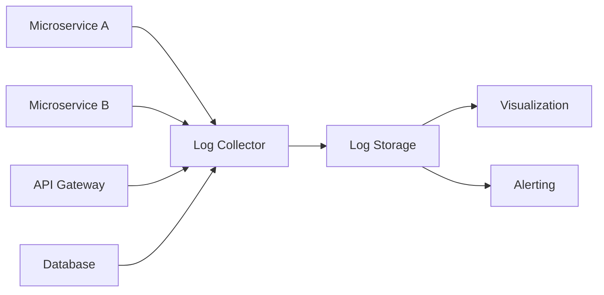
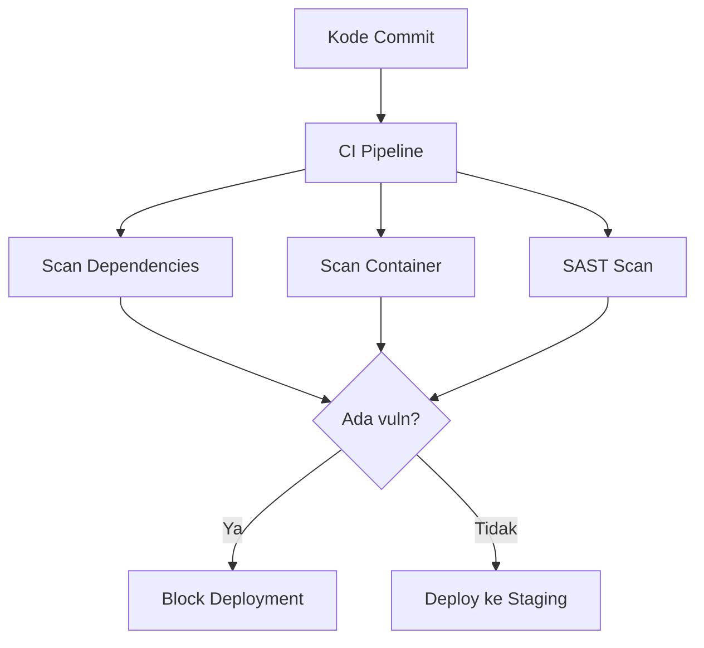
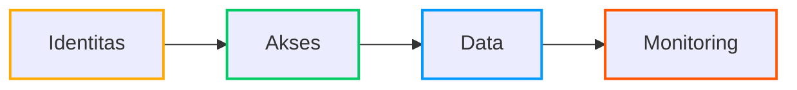

### **Security Best Practices dalam Microservices**  

---

#### **I. Prinsip Dasar Keamanan Microservices**  
**Tantangan Utama**:  
- **Permukaan Serangan Lebih Luas** (setiap service adalah entry point potensial)  
- **Komunikasi Antar-Service** yang rentan  
- **Manajemen Identitas Terdistribusi**  

**Pilar Keamanan**:  
1. **Authentication** (Verifikasi identitas)  
2. **Authorization** (Hak akses resource)  
3. **Confidentiality** (Enkripsi data)  
4. **Integrity** (Jaminan data tidak diubah)  
5. **Auditability** (Pelacakan aktivitas)  

---

#### **II. Security Best Practices**  

### **1. Service-to-Service Authentication**  
- **Mutual TLS (mTLS)**  
  - Setiap service punya sertifikat digital  
  - Two-way verification sebelum komunikasi  
  ```mermaid
  sequenceDiagram
    Service A->>Service B: Permintaan akses + cert
    Service B->>Service A: Verifikasi cert + kirim cert sendiri
    Service A->>Service B: Verifikasi cert B
    Service B->>Service A: Akses diberikan
  ```  
  Tools: Istio, Linkerd, cert-manager  

### **2. Centralized Authorization**  
- **Pola Desain**:  
  - **API Gateway** sebagai choke point  
  - **Policy Decision Point (PDP)** terpusat  
- **Framework**:  
  - Open Policy Agent (OPA) dengan Rego language  
  ```rego
  # Contoh policy OPA
  default allow = false
  allow {
    input.method == "GET"
    input.path == "/orders"
    input.user.role == "customer"
  }
  ```  

### **3. Secret Management**  
- **Jangan Simpan di Code/Config File!**  
- **Solusi**:  
  - HashiCorp Vault  
  - AWS Secrets Manager  
  - Kubernetes Secrets (base64 encoded)  
  ```bash
  # Akses secret dari Vault
  vault kv get -field=api_key secret/stripe
  ```  

### **4. Data Protection**  
- **Enkripsi Data**:  
  - **In Transit**: TLS 1.3+ (gunakan mTLS untuk internal)  
  - **At Rest**: AES-256 (LUKS untuk disk, MongoDB Encryption)  
- **Tokenisasi Data Sensitif**  
  ```python
  # Contoh tokenisasi kartu kredit
  original: "4111-1111-1111-1111" 
  token: "tok_9s7dFg34eH2k"  # Disimpan di database
  ```  

---

#### **III. Throttling & Rate Limiting**  
**Tujuan**:  
- Cegah DDoS & abuse API  
- Lindungi resource backend  
- Enforce business rules (e.g., free vs premium user)  

**Implementasi**:  

### **1. Token Bucket Algorithm**  
- **Konsep**:  
  - Setiap klien punya "ember" berisi token  
  - Setiap request pakai 1 token  
  - Token diisi ulang tiap interval  
  ```mermaid
  graph LR
    A[Request] --> B{Token tersedia?}
    B -->|Ya| C[Proses request]
    B -->|Tidak| D[Tolak request]
    C --> E[Kurangi token]
    F[Timer] --> G[Isi ulang token]
  ```  

### **2. Implementasi di Arsitektur**  
- **Lapisan API Gateway**:  
  - Kong, Apigee, AWS API Gateway  
  ```yaml
  # Konfigurasi Kong
  plugins:
  - name: rate-limiting
    config:
      minute: 30
      policy: redis
  ```  
- **Service Mesh Level**:  
  - Istio:  
    ```yaml
    apiVersion: networking.istio.io/v1alpha3
    kind: EnvoyFilter
    spec:
      filters:
      - name: envoy.filters.http.ratelimit
        config:
          domain: apikey
          rate_limit_service: rate_limit_service
    ```  

### **3. Strategi Rate Limiting**  
| **Tipe**           | **Use Case**                     | **Contoh**                     |
|---------------------|----------------------------------|--------------------------------|
| Global              | Proteksi shared resource         | 1000 req/detik ke DB           |
| Per-User            | Batasi akses user                | 5 req/menit/user               |
| Concurrency         | Batasi parallel request          | Max 10 request bersamaan       |
| Dynamic             | Adaptif berdasarkan beban sistem | Auto-scaling threshold         |

---

#### **IV. Audit Log & Centralized Logging**  

### **1. Arsitektur Logging Terpusat**  

- **Tools**:  
  - Collector: Fluentd, Logstash  
  - Storage: Elasticsearch, Loki  
  - Visualization: Grafana, Kibana  

### **2. Audit Log Best Practices**  
- **Wajib Dicatat**:  
  ```json
  {
    "timestamp": "2023-10-05T14:23:45Z",
    "service": "PaymentService",
    "user": "user_123",
    "action": "charge",
    "resource": "/payments/ord_987",
    "status": "success",
    "ip": "203.0.113.42",
    "metadata": { "amount": 150000, "currency": "IDR" }
  }
  ```  
- **Retensi**:  
  - Minimal 90 hari (sesuai PCI DSS/ISO 27001)  
  - Immutable storage (cegah tampering)  

### **3. Real-time Monitoring**  
- Setup alert untuk:  
  - Kegagalan otentikasi berulang  
  - Akses resource sensitif  
  - Perilaku tidak biasa (e.g., user akses 1000 data dalam 1 menit)  
  ```bash
  # Contoh alert rule di Prometheus
  - alert: SuspiciousLogin
    expr: rate(login_failed_total{job="auth-service"}[5m]) > 10
    for: 2m
  ```  

---

#### **V. Dependency & Vulnerability Scanning**  

### **1. Ancaman Umum**  
- **Known Vulnerabilities**:  
  - Log4Shell (CVE-2021-44228)  
  - Heartbleed (CVE-2014-0160)  
- **Supply Chain Attacks**:  
  - Dependency jahat di package publik (npm, PyPI)  

### **2. Tools Scanning**  
| **Tipe**               | **Tools**                     | **Integrasi**              |  
|-------------------------|-------------------------------|----------------------------|  
| **Dependencies**        | Snyk, Dependabot, Renovate    | GitHub Actions, GitLab CI  |  
| **Container Images**    | Trivy, Clair, Anchore         | CI/CD pipeline             |  
| **Infrastructure**      | Terrascan, Checkov            | Sebelum `terraform apply`  |  
| **SAST**                | SonarQube, Semgrep            | Pre-commit hook            |  

### **3. Workflow Otomatis**  


### **4. Kebijakan Patch Management**  
- **Prioritas Berdasarkan Severity**:  
  ```mermaid
  pie
    title Distribusi Patch
    "Critical" : 40
    "High" : 30
    "Medium" : 20
    "Low" : 10
  ```  
- **SLA Patching**:  
  - Critical: < 24 jam  
  - High: < 72 jam  
  - Medium: < 2 minggu  

---

#### **VI. Kesimpulan & Checklist**  

**Security Posture Checklist**:  
- [ ] mTLS diimplementasi antar service  
- [ ] Rate limiting di API Gateway  
- [ ] Audit log dikirim ke centralized storage  
- [ ] Dependency scanning otomatis di CI/CD  
- [ ] Secret management dengan Vault  
- [ ] Enkripsi data at-rest & in-transit  

**Tools Rekomendasi**:  
- **Service Mesh**: Istio, Linkerd  
- **AuthZ**: Open Policy Agent, Keycloak  
- **Logging**: ELK Stack, Grafana Loki  
- **Scanning**: Snyk + Trivy + Terrascan  
- **Rate Limiting**: Kong, Envoy  



> **Pesan Kunci**: Keamanan microservices bukan fitur tambahan, tapi arsitektur dasar yang harus didesain dari awal!
