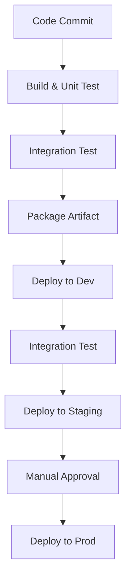
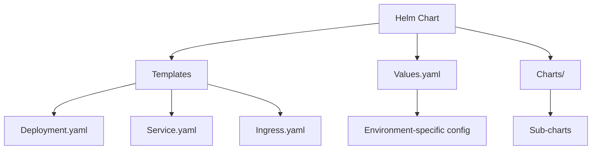
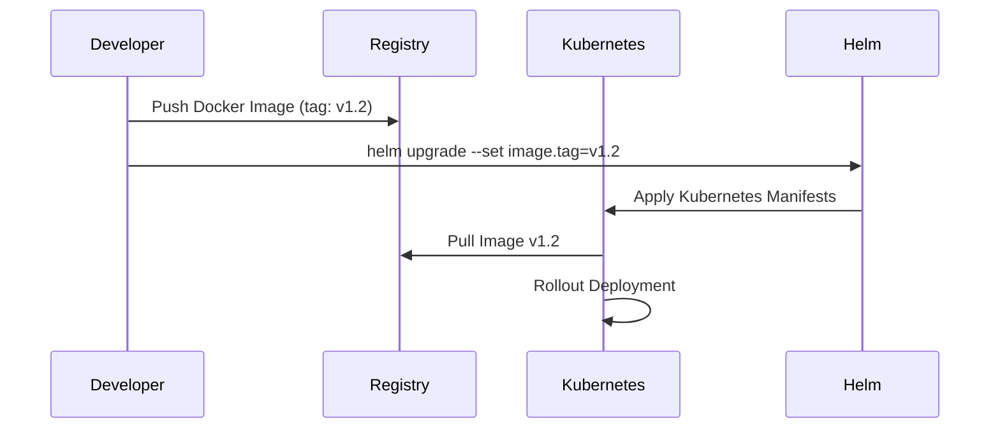
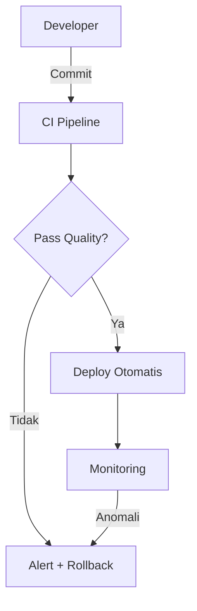

### **Deployment Pipeline untuk Microservices**  

---

#### **I. Arsitektur Pipeline CI/CD**  
**Workflow Modern**:  


**Tantangan Spesifik Microservices**:  
- Multi-repository vs mono-repo  
- Koordinasi deploy service dependen  
- Rollback cepat tanpa downtime  

---

#### **II. Implementasi CI/CD dengan Tools Populer**  

### **1. GitHub Actions**  
**Keunggulan**:  
- Terintegrasi langsung dengan GitHub  
- Marketplace action kaya  
- YAML configuration  

**Contoh Workflow (.github/workflows/deploy.yml)**:
```yaml
name: Deploy Order Service

on:
  push:
    branches: [ main ]
  pull_request:
    branches: [ main ]

jobs:
  build-and-test:
    runs-on: ubuntu-latest
    steps:
    - name: Checkout code
      uses: actions/checkout@v4
      
    - name: Build and Test
      run: |
        mvn clean package
        
    - name: Build Docker Image
      run: |
        docker build -t ghcr.io/org/order-service:${{ github.sha }} .
        
    - name: Push to Container Registry
      run: |
        docker push ghcr.io/org/order-service:${{ github.sha }}
        
  deploy-staging:
    needs: build-and-test
    runs-on: ubuntu-latest
    environment: staging
    steps:
    - name: Deploy to Kubernetes
      uses: helm/action@v2.1.0
      with:
        command: upgrade
        chart: ./helm/order-service
        release: order-service
        values: env/staging/values.yaml
        set: image.tag=${{ github.sha }}
```

### **2. GitLab CI**  
**Keunggulan**:  
- Built-in container registry  
- Auto DevOps capability  
- Pipeline visualization  

**Contoh (.gitlab-ci.yml)**:
```yaml
stages:
  - build
  - test
  - deploy

variables:
  IMAGE_TAG: $CI_REGISTRY_IMAGE:$CI_COMMIT_SHA

build:
  stage: build
  script:
    - mvn package -DskipTests
    - docker build -t $IMAGE_TAG .
    - docker push $IMAGE_TAG

integration-test:
  stage: test
  services:
    - postgres:14
    - redis:7
  script:
    - mvn verify -Pintegration-tests

deploy-staging:
  stage: deploy
  environment:
    name: staging
    url: https://staging.example.com
  rules:
    - if: $CI_COMMIT_BRANCH == "main"
  script:
    - helm upgrade --install order-service ./helm 
      --set image.tag=$CI_COMMIT_SHA
      -f env/staging/values.yaml
```

### **3. Jenkins**  
**Keunggulan**:  
- Fleksibilitas tinggi dengan Groovy scripting  
- Plugin ekosistem luas  
- Cocok untuk on-premise  

**Contoh Jenkinsfile**:
```groovy
pipeline {
  agent any
  stages {
    stage('Build') {
      steps {
        sh 'mvn clean package'
      }
    }
    stage('Docker Build') {
      steps {
        script {
          docker.build("order-service:${env.BUILD_ID}")
        }
      }
    }
    stage('Deploy to Dev') {
      steps {
        sh 'kubectl apply -f k8s/dev/'
      }
    }
    stage('Integration Test') {
      steps {
        sh 'mvn verify -Pintegration-tests'
      }
    }
    stage('Promote to Prod') {
      when {
        branch 'main'
      }
      steps {
        sh 'helm upgrade order-service ./helm -f env/prod/values.yaml'
      }
    }
  }
  post {
    failure {
      slackSend channel: '#alerts', message: "Build ${env.BUILD_ID} failed!"
    }
  }
}
```

**Perbandingan Tools**:  
| **Fitur**          | GitHub Actions       | GitLab CI            | Jenkins             |  
|--------------------|----------------------|----------------------|---------------------|  
| **Harga**          | Free for public      | Free tier            | Open-source         |  
| **Integrasi**      | GitHub native        | GitLab native        | Multi-platform      |  
| **Learning Curve** | Rendah               | Menengah             | Tinggi              |  
| **Scaling**        | Runner otomatis      | Runner fleksibel     | Master-slave manual |  

---

#### **III. Deployment Strategies**  

### **1. Docker Compose (Lingkungan Dev/Lokal)**  
**Use Case**:  
- Development cepat  
- Testing integrasi lokal  

**Contoh docker-compose.yml**:
```yaml
version: '3.8'
services:
  order-service:
    build: ./order-service
    ports:
      - "8080:8080"
    depends_on:
      - postgres
      - redis

  payment-service:
    build: ./payment-service
    ports:
      - "8081:8080"

  postgres:
    image: postgres:14
    environment:
      POSTGRES_PASSWORD: password

  redis:
    image: redis:7
```

**Kelemahan**:  
- Tidak cocok untuk production  
- Skalabilitas terbatas  

### **2. Helm di Kubernetes (Staging/Production)**  

**Arsitektur Helm**:  


**Workflow Deployment**:  


**Contoh Helm Chart Struktur**:
```
order-service/
  Chart.yaml
  values.yaml
  charts/
  templates/
    deployment.yaml
    service.yaml
    ingress.yaml
    configmap.yaml
```

**Contoh templates/deployment.yaml**:
```yaml
apiVersion: apps/v1
kind: Deployment
metadata:
  name: {{ .Release.Name }}-order
spec:
  replicas: {{ .Values.replicaCount }}
  selector:
    matchLabels:
      app: order-service
  template:
    metadata:
      labels:
        app: order-service
    spec:
      containers:
      - name: order-service
        image: "{{ .Values.image.repository }}:{{ .Values.image.tag }}"
        ports:
        - containerPort: 8080
        envFrom:
        - configMapRef:
            name: {{ .Release.Name }}-config
```

**Strategi Deployment Lanjutan**:  
- **Blue-Green**:  
  ```bash
  kubectl apply -f green-deployment.yaml
  kubectl switch service to green
  ```
- **Canary Release**:  
  ```yaml
  # Istio VirtualService
  spec:
    http:
    - route:
      - destination:
          host: order-service
          subset: v1
        weight: 90
      - destination:
          host: order-service
          subset: v2
        weight: 10
  ```

---

#### **IV. Best Practices Deployment Pipeline**  

1. **Immutable Infrastructure**:  
   - Jangan modifikasi lingkungan setelah deploy  
   - Rebuild image untuk perubahan apapun  

2. **Environment Parity**:  
   - Dev/Staging/Prod harus mirror  
   - Gunakan same container runtime & config management  

3. **Secret Management**:  
   ```bash
   # Helm dengan Vault integration
   helm install --set-secret=db.password=vault:secret/data/db#password
   ```

4. **Rollback Otomatis**:  
   - Monitor health check  
   - Otomatis rollback jika:  
     - Startup probe gagal  
     - Error rate > 5% dalam 2 menit  
   ```yaml
   # Argo Rollouts
   analysis:
     templates:
     - templateName: rollback-on-failure
     args:
     - name: error-rate
       value: 5%
   ```

5. **Pipeline sebagai Code**:  
   - Simpan konfigurasi CI/CD di repo  
   - Versioning bersama aplikasi  

6. **Security Scanning**:  
   - Scan image di pipeline (Trivy, Clair)  
   - Validasi manifest Kubernetes (kube-linter)  

---

#### **V. Disaster Recovery**  

**Strategi Rollback**:  
1. **Helm Rollback**:  
   ```bash
   helm history order-service
   helm rollback order-service 3 # Revisi ke-3
   ```
   
2. **Git Revert**:  
   ```bash
   git revert <commit-hash>
   git push
   # Trigger pipeline deploy versi sebelumnya
   ```

**Backup Database**:  
```bash
# CronJob di Kubernetes
apiVersion: batch/v1
kind: CronJob
metadata:
  name: db-backup
spec:
  schedule: "0 2 * * *"
  jobTemplate:
    spec:
      template:
        spec:
          containers:
          - name: pgdump
            image: postgres:14
            command: ["pg_dump", "-h", "$(DB_HOST)", "-U", "user", "dbname"]
```

---

#### **VI. Tools Ecosystem**  
| **Kategori**        | **Tools**                                                                 |  
|----------------------|---------------------------------------------------------------------------|  
| **CI/CD Platforms**  | GitHub Actions, GitLab CI, Jenkins, Argo CD, Tekton                      |  
| **Container Build**  | Docker Buildx, Kaniko, Buildpacks                                         |  
| **K8s Deployment**   | Helm, Kustomize, Kapp                                                     |  
| **Progressive**      | Argo Rollouts, Flagger, Istio                                             |  
| **Monitoring**       | Prometheus, Grafana, Datadog                                              |  

---

#### **VII. Kesimpulan**  
- **Pipeline CI/CD harus**:  
  - Otomatis penuh dari commit hingga produksi  
  - Memiliki quality gates (test, scan)  
  - Support rollback 1-klik  
- **Pilih Tools Sesuai Kebutuhan**:  
  ```mermaid
  pie
    title Tool Preference
    "GitHub Actions" : 45
    "GitLab CI" : 30
    "Jenkins" : 15
    "Lainnya" : 10
  ```  
- **Deployment Strategis**:  
  - Docker Compose untuk lokal/dev  
  - Helm + Kubernetes untuk staging/prod  
- **Prinsip Kunci**:  
  > "If it hurts, do it more often - automate everything!"  


