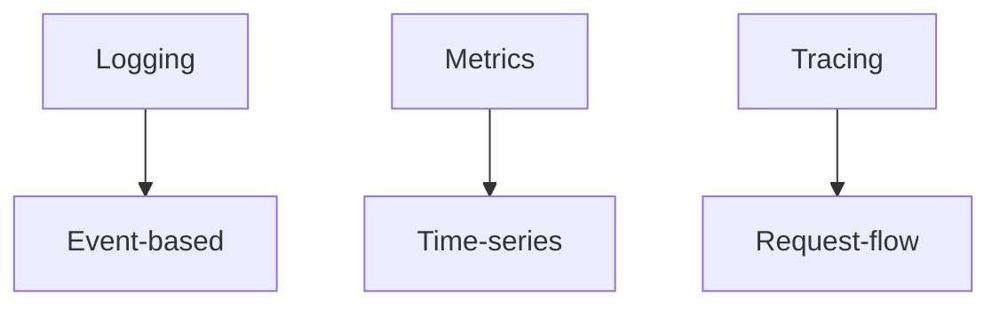
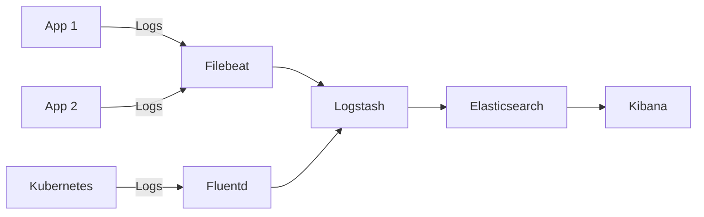
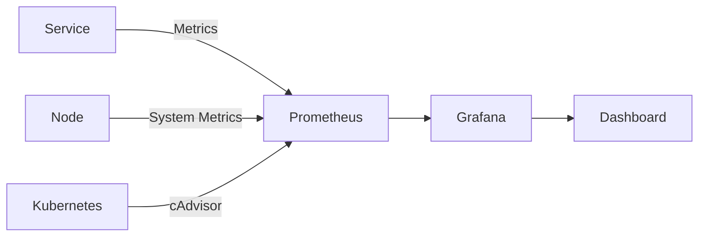
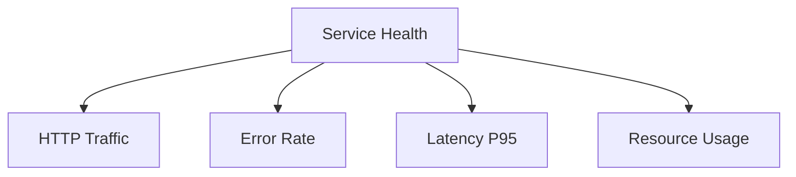
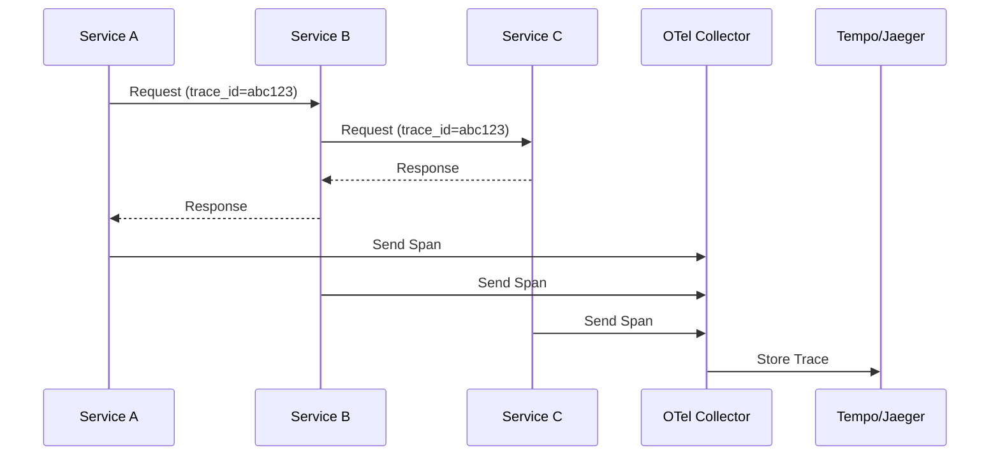
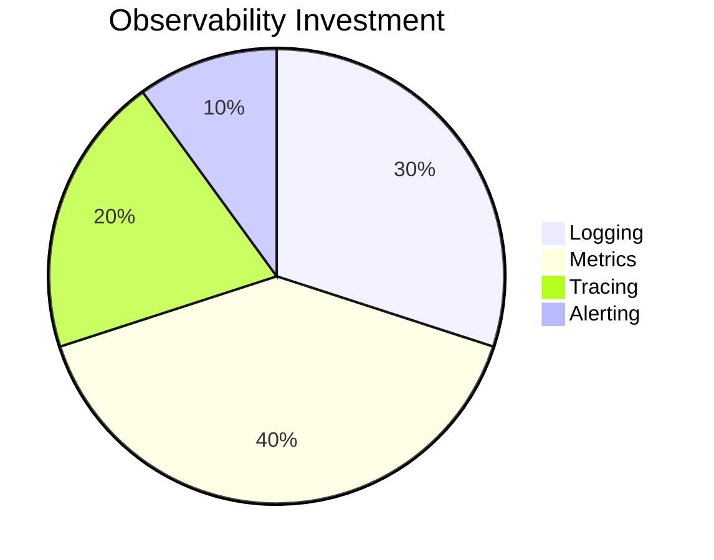
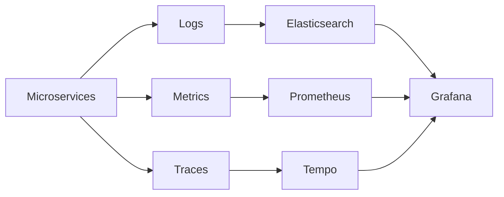

### **Monitoring & Logging dalam Arsitektur Microservices**  


---

#### **I. Pentingnya Observability**  
**Tantangan di Microservices**:  
- **Distributed Tracing**: Melacak request di 5+ service  
- **Noise Reduction**: Memfilter log & metrik yang relevan  
- **Correlation ID**: Menghubungkan log dari berbagai service  

**Pilar Observability**:  


---

#### **II. ELK Stack untuk Logging Terpusat**  

### **Arsitektur ELK**:  


### **1. Komponen Utama**  
| **Komponen**      | **Peran**                              | **Konfigurasi Kunci**                     |  
|--------------------|----------------------------------------|------------------------------------------|  
| **Filebeat**       | Log collector dari file/app            | `filebeat.inputs: paths: [/var/log/*.log]` |  
| **Fluentd**        | Log collector di Kubernetes            | `@type kubernetes_metadata`              |  
| **Logstash**       | Log processing pipeline                | Filter grok, mutate, enrich              |  
| **Elasticsearch**  | Penyimpanan & pencarian terdistribusi  | Sharding, replication, index lifecycle  |  
| **Kibana**         | Visualisasi & analisis log             | Lens, Discover, Dashboard               |  

### **2. Log Processing dengan Logstash**  
**Contoh Pipeline**:  
```ruby
input {
  beats { port => 5044 }
}

filter {
  grok {
    match => { "message" => "%{TIMESTAMP_ISO8601:timestamp} %{LOGLEVEL:level} %{GREEDYDATA:message}" }
  }
  mutate {
    add_field => { "service" => "%{[kubernetes][labels][app]}" }
    remove_field => [ "beat" ]
  }
}

output {
  elasticsearch {
    hosts => ["https://elasticsearch:9200"]
    index => "microservices-%{+YYYY.MM.dd}"
  }
}
```

**Best Practices Logging**:  
- **Struktur Log (JSON)**:  
  ```json
  {
    "timestamp": "2023-10-10T08:45:31Z",
    "level": "INFO",
    "service": "order-service",
    "trace_id": "abc123-xzy",
    "message": "Order created",
    "context": { "order_id": "ord_789", "amount": 250000 }
  }
  ```  
- **Field Wajib**:  
  - `trace_id` (W3C Trace Context)  
  - `service_name`  
  - `environment` (dev/staging/prod)  
- **Retensi**:  
  - 7 hari untuk debug logs (hot storage)  
  - 30 hari untuk audit logs (warm storage)  
  - 1+ tahun untuk compliance (cold storage)  

---

#### **III. Grafana + Prometheus untuk Metrics**  

### **Arsitektur Monitoring**:  


### **1. Prometheus (Time-Series DB)**  
**Komponen**:  
- **Prometheus Server**: Scrape & store metrics  
- **Exporters**: Node Exporter, cAdvisor, Blackbox Exporter  
- **Alertmanager**: Notifikasi alert  

**Contoh Scrape Config**:  
```yaml
scrape_configs:
  - job_name: 'order-service'
    metrics_path: '/actuator/prometheus'
    static_configs:
      - targets: ['order-service:8080']
  - job_name: 'kubernetes-pods'
    kubernetes_sd_configs:
      - role: pod
    relabel_configs:
      - source_labels: [__meta_kubernetes_pod_annotation_prometheus_io_scrape]
        action: keep
        regex: true
```

**Metric Types**:  
| **Tipe**         | **Contoh**                          | **Use Case**                     |  
|-------------------|-------------------------------------|----------------------------------|  
| Counter           | `http_requests_total`               | Hitungan kumulatif              |  
| Gauge             | `memory_usage_bytes`                | Nilai sesaat                    |  
| Histogram         | `http_request_duration_seconds`     | Distribusi latency              |  
| Summary           | `response_size_bytes`               | Percentil latency               |  

### **2. Grafana (Visualisasi)**  
**Fitur Kunci**:  
- Multi-datasource (Prometheus, Elasticsearch, Loki)  
- Alerting terintegrasi  
- Dashboard templating  

**Contoh Query PromQL**:  
```promql
# Error rate per service
sum(rate(http_requests_total{status=~"5.."}[5m])) by (service)
/
sum(rate(http_requests_total[5m])) by (service)
```

**Dashboard Best Practices**:  


---

#### **IV. Distributed Tracing**  
**OpenTelemetry Workflow**:  


**Implementasi**:  
```java
// Spring Boot dengan OpenTelemetry
@Bean
public OpenTelemetry openTelemetry() {
  return OpenTelemetrySdk.builder()
    .setTracerProvider(tracerProvider)
    .setPropagators(ContextPropagators.create(W3CTraceContextPropagator.getInstance()))
    .build();
}
```

---

#### **V. Best Practices Observability**  

1. **RED Pattern**:  
   - **R**equest Rate  
   - **E**rror Rate  
   - **D**uration  

2. **GOLDEN Signals**:  
   - Latency  
   - Traffic  
   - Errors  
   - Saturation  

3. **Log Reduction**:  
   - Hindari log verbose di production  
   - Gunakan sampling untuk debug logs  
   ```yaml
   # Logback config
   <appender name="SAMPLED" class="ch.qos.logback.core.ConsoleAppender">
     <filter class="ch.qos.logback.classic.filter.ThresholdFilter">
       <level>DEBUG</level>
     </filter>
     <samplingRate>0.1</samplingRate> <!-- 10% sample -->
   </appender>
   ```

4. **Alert yang Bermakna**:  
   - Hindari alert noise  
   - Gunakan multi-condition:  
   ```promql
   # Alert jika error rate > 5% DAN traffic > 100 RPM
   (sum(rate(http_errors[5m])) / (sum(rate(http_requests[5m]))) > 0.05
   and
   sum(rate(http_requests[5m])) > 100/60
   ```

---

#### **VI. Tools Ecosystem**  
| **Kategori**         | **Open-Source**               | **Managed Service**       |  
|-----------------------|-------------------------------|---------------------------|  
| **Logging**           | ELK, Loki, Fluentd            | Datadog, Splunk           |  
| **Metrics**           | Prometheus, VictoriaMetrics   | AWS CloudWatch, GCP Stackdriver |  
| **Tracing**           | Jaeger, Zipkin, Tempo         | Honeycomb, Lightstep      |  
| **Unified**           | Grafana, SigNoz               | New Relic, AppDynamics    |  

---

#### **VII. Kesimpulan**  


**Checklist Implementasi**:  
- [ ] Terapkan structured logging dengan trace_id  
- [ ] Setup ELK stack untuk log terpusat  
- [ ] Deploy Prometheus + Grafana untuk metrics  
- [ ] Instrumentasi OpenTelemetry untuk tracing  
- [ ] Buat dashboard RED/GOLDEN  
- [ ] Konfigurasi alerting bermakna  

**Golden Rule**:  
> "You can't manage what you can't measure - instrument everything!"  

**Arsitektur Observability Modern**:  

