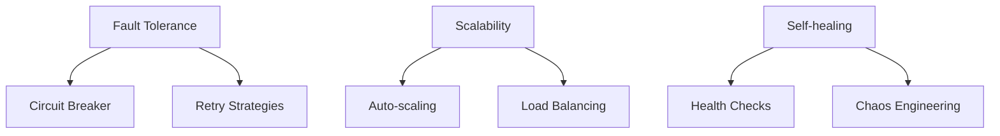
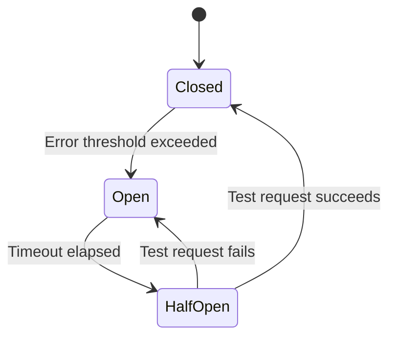
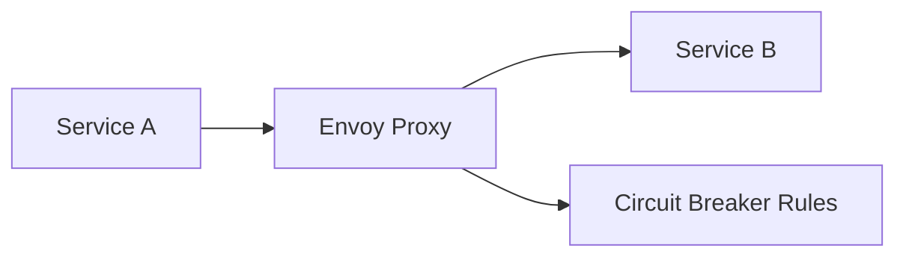
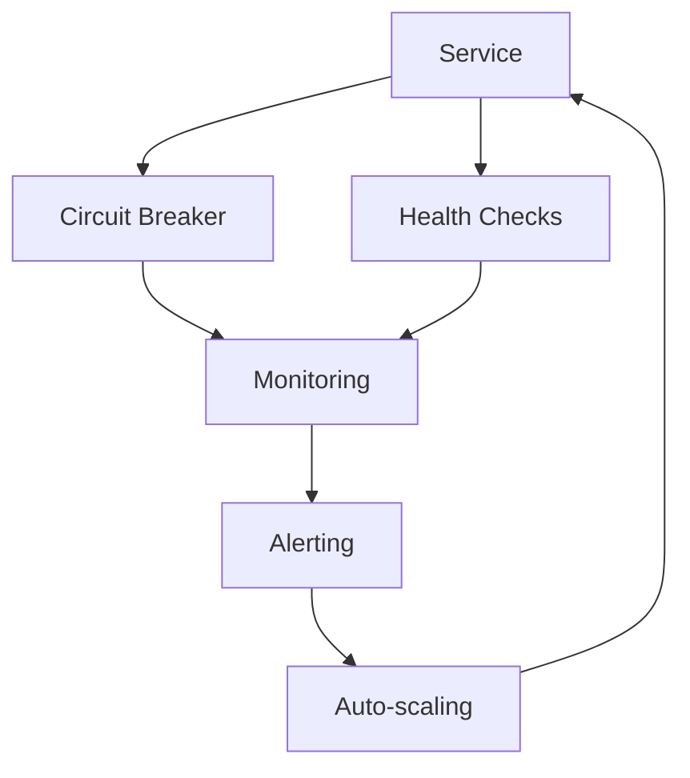
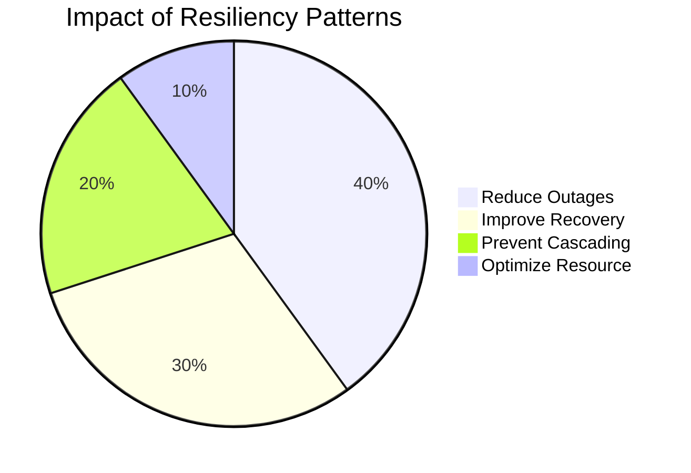

### **Operational Resiliency dalam Microservices**  


---

#### **I. Prinsip Dasar Resiliency**  
**Tantangan Utama**:  
- **Cascading Failures**: Kegagalan satu service menjalar ke service lain  
- **Thundering Herd**: Lonjakan traffic tiba-tiba setelah pemulihan  
- **Partial Outages**: Beberapa komponen gagal sementara lainnya berfungsi  

**Pilar Ketahanan**:  


---

#### **II. Circuit Breaker Pattern**  

### **Mekanisme Kerja**:  


### **1. Implementasi dengan Resilience4j (Aplikasi Level)**  
**Dependency**:  
```xml
<dependency>
    <groupId>io.github.resilience4j</groupId>
    <artifactId>resilience4j-spring-boot2</artifactId>
    <version>2.1.0</version>
</dependency>
```

**Konfigurasi**:  
```yaml
resilience4j.circuitbreaker:
  instances:
    paymentService:
      registerHealthIndicator: true
      slidingWindowType: COUNT_BASED
      slidingWindowSize: 10
      minimumNumberOfCalls: 5
      permittedNumberOfCallsInHalfOpenState: 3
      waitDurationInOpenState: 5s
      failureRateThreshold: 50
```

**Implementasi Code**:  
```java
@CircuitBreaker(name = "paymentService", fallbackMethod = "fallback")
public PaymentResponse processPayment(PaymentRequest request) {
  return paymentClient.charge(request); // Panggil service eksternal
}

public PaymentResponse fallback(PaymentRequest request, Exception ex) {
  // Logika fallback
  return PaymentResponse.error("Payment service unavailable");
}
```

**Monitoring**:  
- Expose metrics via Actuator: `/actuator/circuitbreakers`  
- Integrasi dengan Prometheus:  
  ```promql
  resilience4j_circuitbreaker_state{name="paymentService", state="open"}
  ```

### **2. Implementasi dengan Istio (Infrastruktur Level)**  
**Arsitektur Service Mesh**:  


**Konfigurasi DestinationRule**:  
```yaml
apiVersion: networking.istio.io/v1alpha3
kind: DestinationRule
metadata:
  name: payment-dr
spec:
  host: payment-service
  trafficPolicy:
    connectionPool:
      tcp:
        maxConnections: 100
      http:
        http1MaxPendingRequests: 50
        maxRequestsPerConnection: 10
    outlierDetection:
      consecutive5xxErrors: 5
      interval: 5s
      baseEjectionTime: 30s
      maxEjectionPercent: 50
```

**Parameter Kunci**:  
- `consecutive5xxErrors`: Jumlah error untuk trigger circuit breaker  
- `baseEjectionTime`: Waktu minimal ejection  
- `maxEjectionPercent`: Persentase maksimal instance yang di-eject  

---

#### **III. Auto-scaling & Health Checks**  

### **1. Health Checks (Kubernetes)**  
**Probe Types**:  
| **Tipe**       | **Fungsi**                              | **Contoh**                     |  
|----------------|-----------------------------------------|--------------------------------|  
| **Liveness**   | Deteksi aplikasi hang/mati              | HTTP GET `/health/live`        |  
| **Readiness**  | Tentukan kapan siap terima traffic      | HTTP GET `/health/ready`       |  
| **Startup**    | Beri waktu inisialisasi panjang         | HTTP GET `/health/start`       |  

**Implementasi di Deployment**:  
```yaml
apiVersion: apps/v1
kind: Deployment
spec:
  template:
    spec:
      containers:
      - name: order-service
        livenessProbe:
          httpGet:
            path: /actuator/health/liveness
            port: 8080
          initialDelaySeconds: 30
          periodSeconds: 10
        readinessProbe:
          httpGet:
            path: /actuator/health/readiness
            port: 8080
          initialDelaySeconds: 5
          periodSeconds: 5
        startupProbe:
          httpGet:
            path: /actuator/health/startup
            port: 8080
          failureThreshold: 30
          periodSeconds: 10
```

### **2. Auto-scaling Strategies**  
**a. Horizontal Pod Autoscaler (HPA)**:  
```yaml
apiVersion: autoscaling/v2
kind: HorizontalPodAutoscaler
metadata:
  name: order-service-hpa
spec:
  scaleTargetRef:
    apiVersion: apps/v1
    kind: Deployment
    name: order-service
  minReplicas: 2
  maxReplicas: 10
  metrics:
  - type: Resource
    resource:
      name: cpu
      target:
        type: Utilization
        averageUtilization: 70
```

**b. KEDA (Event-driven Scaling)**:  
```yaml
apiVersion: keda.sh/v1alpha1
kind: ScaledObject
metadata:
  name: payment-scaler
spec:
  scaleTargetRef:
    name: payment-service
  triggers:
  - type: kafka
    metadata:
      topic: payment-requests
      bootstrapServers: kafka-broker:9092
      consumerGroup: payment-group
      lagThreshold: "10"
```

**c. Multi-metric Scaling**:  
```yaml
metrics:
- type: Resource
  resource:
    name: cpu
    target:
      type: Utilization
      averageUtilization: 60
- type: Pods
  pods:
    metric:
      name: http_requests_per_second
    target:
      type: AverageValue
      averageValue: 500
```

---

#### **IV. Advanced Resiliency Patterns**  

### **1. Retry dengan Exponential Backoff**  
```java
@Retry(name = "paymentRetry", fallbackMethod = "fallback")
public PaymentResponse processPayment(PaymentRequest request) {
  return paymentClient.charge(request);
}

@Bean
public RetryConfig retryConfig() {
  return RetryConfig.custom()
    .maxAttempts(3)
    .intervalFunction(IntervalFunction.ofExponentialBackoff(1000, 2))
    .retryExceptions(TimeoutException.class)
    .build();
}
```

### **2. Bulkhead Isolation**  
```yaml
resilience4j.bulkhead:
  instances:
    inventoryService:
      maxConcurrentCalls: 20
      maxWaitDuration: 10ms
```

### **3. Rate Limiting Global**  
```yaml
apiVersion: networking.istio.io/v1alpha3
kind: EnvoyFilter
spec:
  configPatches:
  - applyTo: HTTP_FILTER
    patch:
      operation: INSERT_BEFORE
      value:
        name: envoy.filters.http.ratelimit
        config:
          domain: global
          failure_mode_deny: true
          rate_limit_service:
            grpc_service:
              envoy_grpc:
                cluster_name: rate_limit_service
```

---

#### **V. Best Practices**  

1. **Graceful Shutdown**:  
   ```java
   @PreDestroy
   public void onExit() {
     // Tolak traffic baru
     healthRegistry.down();
     // Tunggu 30s selesaikan request
     Thread.sleep(30000); 
   }
   ```

2. **Chaos Engineering**:  
   - Tools: Chaos Mesh, Gremlin  
   - Eksperimen:  
     - Pod kill acak  
     - Network latency injection  
     - CPU pressure  

3. **Load Testing Terus Menerus**:  
   ```mermaid
   graph LR
     A[Deploy] --> B[Load Test]
     B --> C{Error?}
     C -->|Ya| D[Tuning]
     C -->|Tidak| E[Release]
     D --> B
   ```

4. **Cross-Region Deployment**:  
   ```yaml
   # Argo Rollout dengan multi-cluster
   strategy:
     canary:
       trafficRouting:
         istio:
           virtualService:
             name: order-vs
           destinations:
           - cluster: primary
             weight: 95
           - cluster: secondary
             weight: 5
   ```

---

#### **VI. Tools Ecosystem**  
| **Kategori**         | **Tools**                                   |  
|-----------------------|---------------------------------------------|  
| **Circuit Breaker**   | Resilience4j, Istio, Hystrix (legacy)       |  
| **Auto-scaling**      | KEDA, HPA, VPA, Cluster Autoscaler          |  
| **Health Checks**     | Spring Actuator, Micrometer, K8s Probes     |  
| **Chaos Engineering** | Chaos Mesh, Gremlin, Chaos Toolkit           |  
| **Observability**     | Prometheus, Grafana, OpenTelemetry          |  

---

#### **VII. Kesimpulan**  

**Resiliency Checklist**:  
- [ ] Circuit breaker di aplikasi/service mesh  
- [ ] Liveness/readiness probe di semua service  
- [ ] Auto-scaling berbasis metrik kustom  
- [ ] Implementasi retry dengan exponential backoff  
- [ ] Simulasi kegagalan dengan chaos engineering  

**Arsitektur Resilien Modern**:  


**Prinsip Utama**:  
> "Resiliency is not about preventing failures, but about failing gracefully and recovering quickly."  

**Statistik Penting**:  

