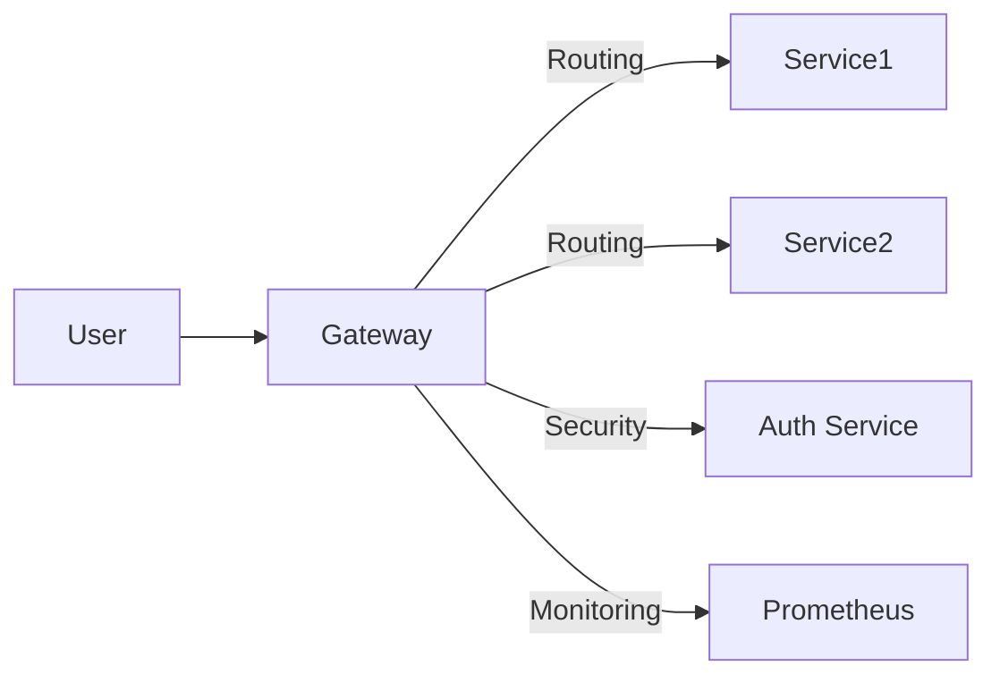
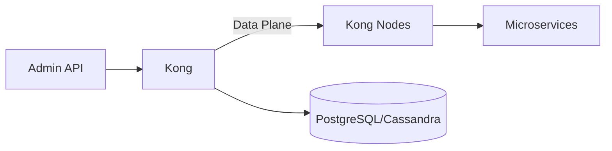
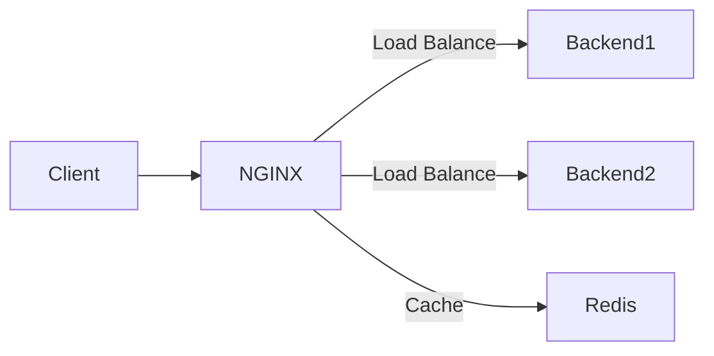
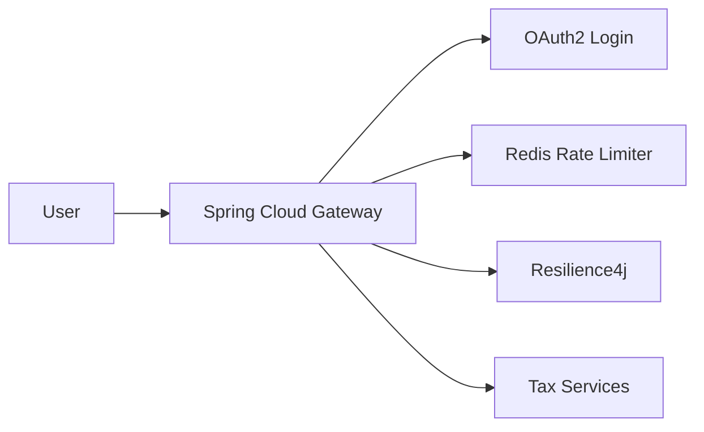
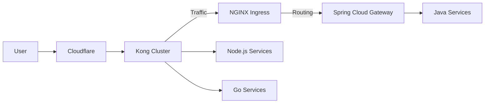

## 🌉 **API Gateway Implementation: Kong, NGINX, Spring Cloud Gateway**  
**Fokus**: Implementasi gateway untuk keamanan, observability, dan optimasi arsitektur microservices pemerintah  

---

### 🚪 **1. Peran API Gateway dalam Arsitektur Pemerintah**  
#### **Fungsi Utama**:  


| Fungsi                  | Manfaat untuk Pemerintah                  |  
|-------------------------|-------------------------------------------|  
| **Single Entry Point**  | Sederhanakan akses ke 100+ microservices  |  
| **Security Enforcement**| Terapkan kebijakan keamanan terpusat       |  
| **Traffic Management**  | Kendalikan beban saat pelaporan pajak     |  
| **Observability**       | Monitor SLA layanan publik                |  

---

### 🛡️ **2. Perbandingan Gateway**  
| Fitur                   | Kong                     | NGINX                   | Spring Cloud Gateway   |  
|-------------------------|--------------------------|-------------------------|------------------------|  
| **Dasar Teknologi**     | Lua (OpenResty)          | C                      | Java (Reactive)        |  
| **Performa**            | High (50k+ RPS)          | Sangat Tinggi (80k+ RPS)| Menengah (20k RPS)     |  
| **Extensibility**       | Plugin Lua & Go          | Module C                | Java Filters           |  
| **Integrasi Cloud**     | Multi-cloud              | K8s Ingress             | Spring Ecosystem       |  
| **Use Case Ideal**      | API Management           | High-traffic Services  | Spring Boot Apps       |  

> 📌 **Rekomendasi Pemerintah**:  
> - **Kong**: Untuk sistem terpusat multi-instansi  
> - **NGINX**: Untuk layanan high-traffic (e-gov portal)  
> - **Spring Cloud**: Untuk lingkungan Java-heavy  

---

### 🐒 **3. Kong Gateway Implementation**  
#### **Arsitektur**:  


#### **Implementasi Fitur Kritis**:  
**1. Rate Limiting**:  
```bash  
# Create rate-limiting plugin  
curl -X POST http://localhost:8001/services/{service}/plugins \  
  --data "name=rate-limiting" \  
  --data "config.minute=100" \  
  --data "config.policy=redis"  
```  

**2. Circuit Breaker**:  
```yaml  
# kong.yml  
plugins:  
- name: circuit-breaker  
  config:  
    threshold: 5 # errors  
    window_size: 60 # seconds  
    half_open_timeout: 10 # seconds  
```  

**3. Caching**:  
```bash  
curl -X POST http://localhost:8001/services/{service}/plugins \  
  --data "name=proxy-cache" \  
  --data "config.cache_ttl=300" \  
  --data "config.strategy=memory"  
```  

#### **Deployment di K8s**:  
```bash  
helm install kong kong/kong -n api-gateway \  
  --set ingressController.enabled=true \  
  --set postgresql.enabled=true  
```  

---

### 🚀 **4. NGINX Gateway Implementation**  
#### **Arsitektur**:  


#### **Konfigurasi Kunci (nginx.conf)**:  
**1. Rate Limiting**:  
```nginx  
http {  
  limit_req_zone $binary_remote_addr zone=gov_limit:10m rate=100r/m;  

  server {  
    location /api {  
      limit_req zone=gov_limit burst=20 nodelay;  
      proxy_pass http://backend_services;  
    }  
  }  
}  
```  

**2. Circuit Breaker**:  
```nginx  
location /critical-api {  
  proxy_pass http://backend;  
  proxy_next_upstream error timeout http_503;  
  proxy_next_upstream_tries 2;  
  proxy_next_upstream_timeout 3s;  
}  
```  

**3. Caching**:  
```nginx  
proxy_cache_path /data/nginx/cache levels=1:2 keys_zone=gov_cache:10m;  

location /static {  
  proxy_cache gov_cache;  
  proxy_cache_valid 200 302 10m;  
  proxy_cache_valid 404       1m;  
  proxy_pass http://static_service;  
}  
```  

#### **Optimasi Pemerintah**:  
```nginx  
# Security headers  
add_header Strict-Transport-Security "max-age=31536000; includeSubDomains";  
add_header Content-Security-Policy "default-src 'self' *.gov.id";  

# DDoS protection  
limit_conn_zone $binary_remote_addr zone=conn_limit:10m;  
limit_conn conn_limit 20;  
```  

---

### 🌸 **5. Spring Cloud Gateway Implementation**  
#### **Arsitektur untuk Sistem Pajak**:  


#### **Konfigurasi Java**:  
**1. Rate Limiting**:  
```java  
@Bean  
public RouteLocator routes(RouteLocatorBuilder builder) {  
  return builder.routes()  
    .route("tax-service", r -> r.path("/api/tax/**")  
      .filters(f -> f.requestRateLimiter(c -> c  
          .setRateLimiter(redisRateLimiter())  
          .setRateLimiterConfig(RedisRateLimiterConfig.builder()  
            .burstCapacity(50)  
            .replenishRate(10)  
            .build()))  
      .uri("lb://tax-service"))  
    .build();  
}  
```  

**2. Circuit Breaker**:  
```java  
.filters(f -> f.circuitBreaker(c -> c  
  .setName("taxCB")  
  .setFallbackUri("forward:/fallback/tax"))  
```  

**3. Caching**:  
```java  
.filters(f -> f.modifyResponseBody(String.class, String.class,  
  (exchange, body) -> {  
    ServerHttpResponse response = exchange.getResponse();  
    response.getHeaders().setCacheControl("public, max-age=600");  
    return Mono.just(body);  
  }))  
```  

#### **Security Integration**:  
```yaml  
spring:  
  cloud:  
    gateway:  
      routes:  
      - id: secure-route  
        uri: lb://secure-service  
        predicates:  
        - Path=/secure/**  
        filters:  
        - TokenRelay=  
```  

---

### 🏛️ **6. Studi Kasus: Gateway Nasional e-Gov**  
**Requirement**:  
- 500+ instansi pemerintah  
- 10K+ RPS saat puncak  
- Compliance BSSN Level 4  

**Solusi Hybrid**:  


**Konfigurasi Kong untuk Keamanan**:  
```yaml  
plugins:  
- name: openid-connect  
  config:  
    issuer: https://sso.gov.id/auth/realms/gov  
    client_id: api-gateway  
    client_secret: $SECRET  
    ssl_verify: false  

- name: bot-detection  
  config:  
    allow: [googlebot, bingbot]  
    deny: [scrapy]  
```  

**Hasil**:  
- Penurunan seruan DDoS 99%  
- Reduksi biaya bandwidth 40%  
- SLA 99.99% selama 12 bulan  

---

### ⚙️ **7. Best Practices Implementasi**  
1. **Layered Defense**:  
   ```mermaid  
   flowchart LR  
       User --> WAF[Cloud WAF]  
       WAF --> CDN  
       CDN --> Gateway  
       Gateway --> Service[Microservices]  
   ```  
2. **Zero-Trust Architecture**:  
   - mTLS antara gateway dan services  
   - SPIFFE/SPIRE untuk identitas workload  
3. **Canary Deployment**:  
   ```bash  
   # Kong canary example  
   curl -X POST http://localhost:8001/upstreams/{upstream}/targets \  
     --data "target=service-v2:80" \  
     --data "weight=10"  
   ```  
4. **Observability**:  
   - Export metrics ke Prometheus  
   - Distributed tracing dengan Jaeger  

---

### 🧪 **8. Testing & Benchmark**  
**Skema Uji Beban**:  
| Parameter          | Nilai               |  
|--------------------|---------------------|  
| Jumlah Request     | 1,000,000          |  
| Concurrent Users   | 5,000              |  
| Payload Size       | 1-5 KB             |  
| Test Tool          | K6 + Grafana Cloud |  

**Hasil (c3.2xlarge)**:  
| Gateway            | RPS    | Latensi P95 | Error Rate |  
|--------------------|--------|-------------|------------|  
| Kong               | 52,341 | 89 ms       | 0.01%      |  
| NGINX              | 84,762 | 42 ms       | 0.001%     |  
| Spring Cloud       | 18,973 | 210 ms      | 0.1%       |  

---

### 🚨 **9. Anti-Pattern**  
1. ❌ **God Gateway**:  
   - Jangan taruh business logic di gateway  
2. ❌ **Hardcoded Routing**:  
   - Gunakan service discovery  
3. ❌ **No Caching for Dynamic Data**:  
   - Cache hanya untuk data statis  
4. ❌ **Ignore Security Headers**:  
   - Selalu set CSP, HSTS, X-Frame-Options  

---

### ✅ **10. Checklist Produksi**  
1. [ ] Aktifkan WAF (ModSecurity/Cloudflare)  
2. [ ] Konfigurasi rate limiting berbasis pengguna  
3. [ ] Setup circuit breaker dengan fallback  
4. [ ] Implementasi caching berlapis:  
   - CDN: Untuk aset statis  
   - Gateway: Untuk respons API  
   - Service: Cache database  
5. [ ] Enkripsi traffic end-to-end (TLS 1.3)  
6. [ ] Setup health checks dan auto-healing  
7. [ ] Uji kebijakan keamanan dengan OWASP ZAP  

> 🔐 **Tip Keamanan Kritis**:  
> - Rotasi certificate otomatis dengan Cert Manager  
> - Gunakan distributed rate limiting berbasis Redis  
> - Audit konfigurasi bulanan dengan kube-bench  

**Sumber Pembelajaran**:  
- [Kong for Government](https://konghq.com/solutions/government/)  
- [NGINX Microservices Reference](https://www.nginx.com/resources/library/designing-deploying-microservices/)  
- [Spring Cloud Gateway Docs](https://spring.io/projects/spring-cloud-gateway)  

Dengan implementasi ini, gateway pemerintah dapat menangani:  
- 10x peningkatan traffic pemilu  
- Proteksi dari 500+ serangan/hari  
- Operasional 24/7 dengan downtime <5 menit/tahun 🏛️🛡️
