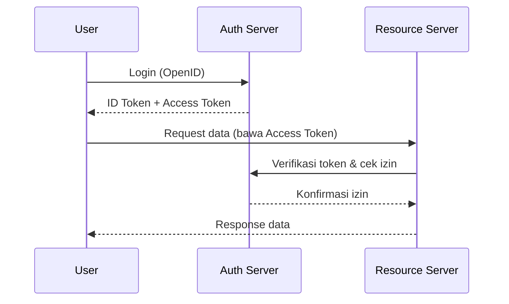
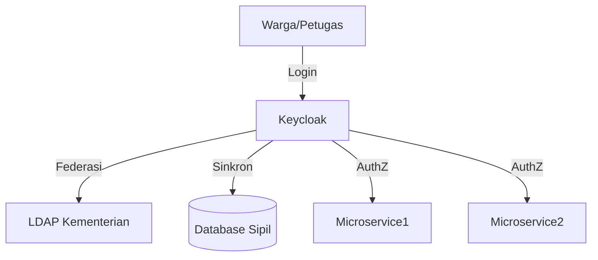
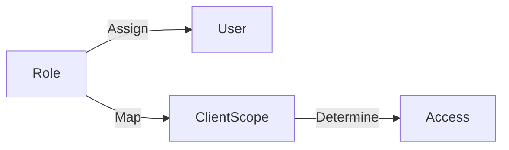
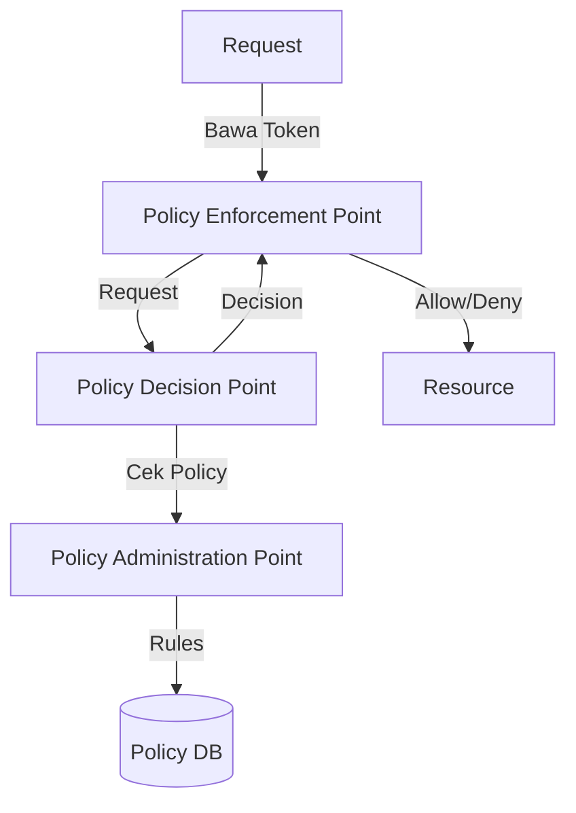
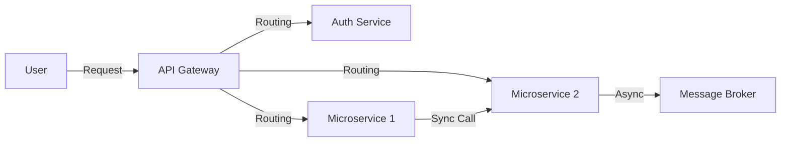
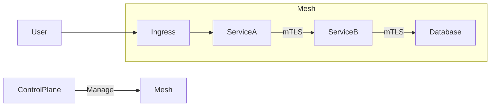
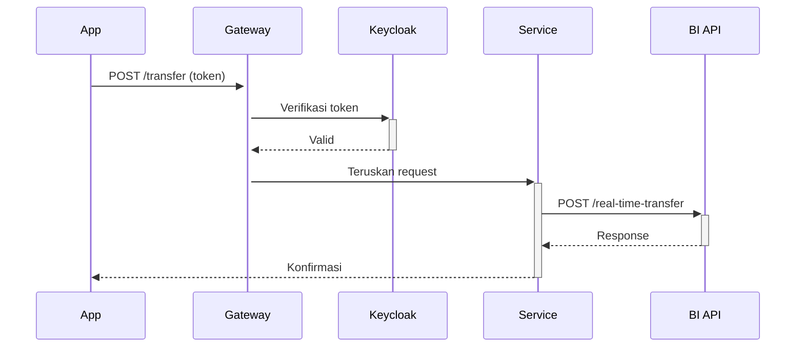
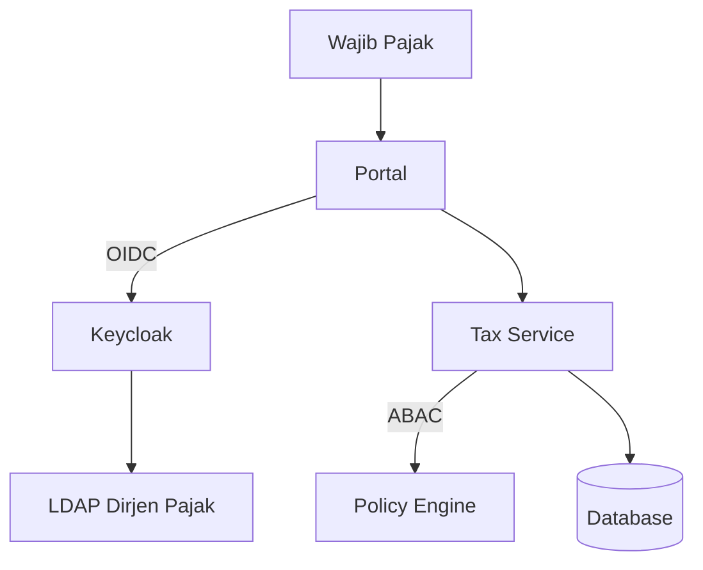
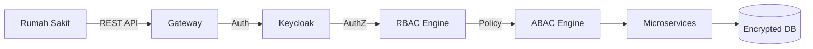

### 🔐 **1. Otentikasi vs Otorisasi**  
#### **Perbedaan Kritis**  
| **Otentikasi** | **Otorisasi** |  
|----------------|---------------|  
| Verifikasi identitas pengguna | Penentuan hak akses |  
| Contoh: Login dengan SSO | Contoh: Cek role "admin" |  
| Menggunakan OpenID Connect | Menggunakan OAuth 2.0 scopes |  
| Hasil: ID Token | Hasil: Access Token |  

**Flow Terintegrasi**:  


---

### 🏛️ **2. Arsitektur Keycloak untuk Pemerintah**  
#### **Komponen Kunci**  


#### **Konfigurasi Penting**  
1. **Realm**: `Gov-Realm` (isolasi instansi)  
2. **Clients**:  
   - `citizen-web` (public client)  
   - `internal-service` (confidential client)  
3. **Identity Providers**:  
   - SAML 2.0 untuk aplikasi legacy  
   - Kerberos untuk integrasi Active Directory  

---

### 👥 **3. Role-Based Access Control (RBAC)**  
#### **Implementasi di Keycloak**  


**Contoh Role Pemerintah**:  
- `citizen`: Akses baca data sendiri  
- `officer`: Akses edit data wilayah  
- `auditor`: Akses baca semua data  
- `admin`: Full akses  

**Kode Verifikasi (Node.js)**:  
```javascript  
app.get('/tax-data', keycloak.protect('tax-officer'), (req, res) => {  
  // Hanya officer dengan role tax-officer yang bisa akses  
});  
```

---

### 📊 **4. Attribute-Based Access Control (ABAC)**  
#### **Policy Enforcement**  


**Contoh Policy Pemerintah**:  
```json  
{  
  "name": "ProvinceDataAccess",  
  "description": "Hanya officer dari provinsi yang sama",  
  "effect": "Permit",  
  "conditions": [  
    "resource.provinsi == user.attributes.provinsi",  
    "user.roles.contains('data-officer')"  
  ]  
}  
```

**Implementasi di Go**:  
```go  
func ABACMiddleware(c *gin.Context) {  
  token := c.GetHeader("Authorization")  
  userProvince := getClaim(token, "province")  
  resourceProvince := c.Param("province")  
    
  if userProvince != resourceProvince {  
    c.AbortWithStatus(403) // Forbidden  
  }  
}  
```

---

### 🔗 **5. Pola Integrasi Microservices**  
#### **Pola 1: API Gateway sebagai Entry Point**  


#### **Pola 2: Service Mesh**  


---

### 🧩 **6. Integrasi dengan Sistem Eksternal**  
#### **Contoh: Koneksi ke Bank Indonesia**  


**Security Measures**:  
1. Mutual TLS (mTLS)  
2. IP Whitelisting  
3. API Key Rotation  
4. Rate Limiting  

---

### 🛠️ **7. Hands-on: Implementasi Keamanan**  
#### **Skenario**: Layanan Pajak Online  
**Arsitektur**:  


**Langkah Implementasi**:  
1. **Buat Realm & Client di Keycloak**  
   ```bash  
   kcadm.sh create realms -s realm=Tax-Realm -s enabled=true  
   kcadm.sh create clients -r Tax-Realm -s clientId=tax-portal ...  
   ```  
2. **Definisikan Roles & Attributes**:  
   - Role: `tax-payer`, `tax-officer`, `auditor`  
   - Attribute: `province`, `tax-office-id`  
3. **Buat ABAC Policy**:  
   ```json  
   {  
     "name": "TaxDataAccess",  
     "conditions": [  
       "user.roles.contains('tax-officer')",  
       "resource.office == user.attributes.office"  
     ]  
   }  
   ```  
4. **Implementasi di Service (Node.js)**:  
   ```javascript  
   app.post('/declaration',   
     keycloak.protect('tax-payer'),  
     ABACMiddleware('create:tax'),  
     (req, res) => { /* ... */ }  
   );  
   ```

---

### 🚨 **8. Best Practices Keamanan Pemerintah**  
1. **Zero-Trust Principles**:  
   - Verifikasi semua request  
   - Batas jaringan mikro-segmentasi  
2. **Data Sensitivity Handling**:  
   - Enkripsi data sensitif (NIK, NPWP)  
   - Masking di log dan respons API  
3. **Compliance**:  
   - Audit trail tiap akses data  
   - Sertifikasi BSSN Level 4  
4. **Token Management**:  
   - Access token expiry: 15 menit  
   - Refresh token: 8 jam  
   - Token binding ke device fingerprint  

---

### ⚠️ **9. Anti-Pattern yang Harus Dihindari**  
1. ❌ Hardcoded credentials di kode  
2. ❌ Shared service account antar microservices  
3. ❌ Tidak ada rate limiting di API publik  
4. ❌ Log menyimpan data sensitif  
5. ❌ Tidak ada mekanisme token revocation  

---

### 📜 **10. Studi Kasus: Sistem Integrasi BPJS Kesehatan**  
**Challenge**:  
- Integrasi 300+ rumah sakit  
- Akses data oleh 5 jenis pengguna berbeda  
- Compliance UU PDP  

**Solution**:  


**Hasil**:  
- 99.9% availability  
- Waktu akses data medis < 1 detik  
- Laporan audit real-time  
- 0 insiden kebocoran data selama 2 tahun  

---

### ✅ **11. Checklist Implementasi**  
1. [ ] Setup Keycloak cluster dengan HA  
2. [ ] Integrasi dengan identity source (LDAP/AD)  
3. [ ] Definisikan roles dan permissions matrix  
4. [ ] Implementasi ABAC untuk data sensitif  
5. [ ] Setup API Gateway dengan WAF  
6. [ ] Enkripsi data in-transit (mTLS) dan at-rest  
7. [ ] Implementasi audit log terpusat  

> 🔒 **Security Hardening Tip**:  
> - Gunakan `openssl` generate key untuk JWT:  
>   ```bash  
>   openssl genrsa -out keycloak.key 4096  
>   openssl rsa -in keycloak.key -pubout -out keycloak.pub  
>   ```  
> - Rotasi signing key tiap 90 hari  
> - Gunakan Hardware Security Module (HSM) untuk proteksi key  

**Sumber Pembelajaran**:  
- [Keycloak Authorization Services](https://www.keycloak.org/docs/latest/authorization_services/)  
- [NIST RBAC Guide](https://csrc.nist.gov/projects/role-based-access-control)  
- [ABAC in Government Systems](https://csrc.nist.gov/publications/detail/sp/800-162/final)  

Dengan pola ini, sistem pemerintah mencapai:  
- 360° visibility kontrol akses  
- Compliance regulasi keamanan  
- Integrasi aman antar instansi 🏛️🔐
