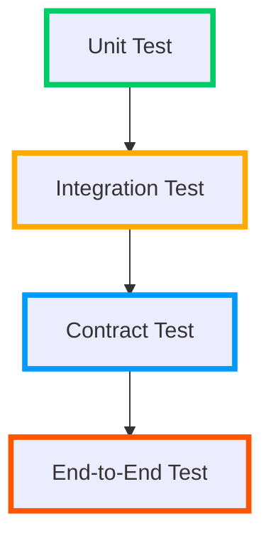
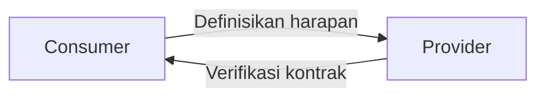
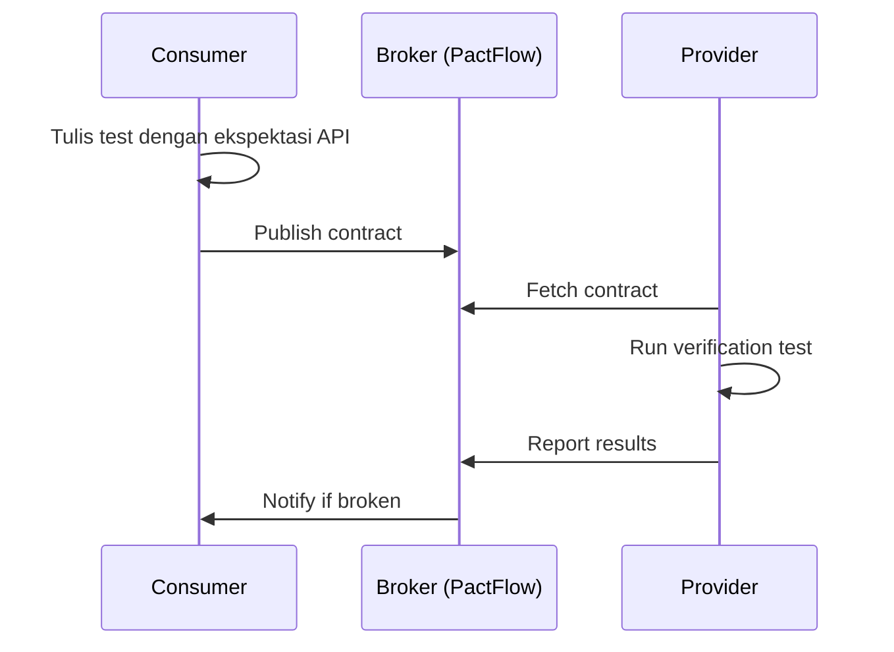
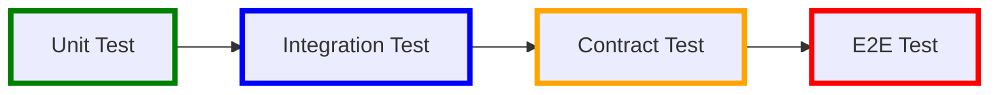

### **Pengujian Microservices**  
*(Materi Pelatihan Microservices - Quality Assurance)*  

---

#### **I. Tantangan Pengujian Microservices**  
1. **Kompleksitas Distribusi**:  
   - Interaksi antar service melalui jaringan  
   - Ketergantungan eksternal (DB, API pihak ketiga)  
2. **Masalah Spesifik**:  
   - Flaky tests (hasil tidak konsisten)  
   - Kesulitan mereplikasi lingkungan produksi  
   - Waktu eksekusi test yang panjang  

**Solusi Arsitektur**:  


---

#### **II. Unit Test**  

**Karakteristik**:  
- Menguji unit terkecil (fungsi/class) secara terisolasi  
- Mock semua dependency eksternal  
- Eksekusi sangat cepat (milidetik per test)  

**Best Practices**:  
1. **FIRST Principles**:  
   - **F**ast (cepat)  
   - **I**solated (terisolasi)  
   - **R**epeatable (dapat diulang)  
   - **S**elf-validating (validasi otomatis)  
   - **T**imely (ditulis sebelum/saat coding)  

2. **Contoh (Java - JUnit + Mockito)**:  
```java
// Service yang diuji
public class OrderService {
  private PaymentGateway paymentGateway;
  
  public OrderService(PaymentGateway paymentGateway) {
    this.paymentGateway = paymentGateway;
  }

  public boolean placeOrder(Order order) {
    if (order.isValid()) {
      return paymentGateway.charge(order.getAmount());
    }
    return false;
  }
}

// Unit test
public class OrderServiceTest {
  @Test
  public void testValidOrder() {
    // 1. Setup mock
    PaymentGateway mockGateway = mock(PaymentGateway.class);
    when(mockGateway.charge(anyDouble())).thenReturn(true);

    // 2. Invoke method
    OrderService service = new OrderService(mockGateway);
    Order validOrder = new Order(150000.0);
    boolean result = service.placeOrder(validOrder);

    // 3. Assert
    assertTrue(result);
    verify(mockGateway).charge(150000.0); // Verifikasi pemanggilan
  }
}
```

**Code Coverage**:  
- Target minimal 70-80% (terutama critical path)  
- Tools: JaCoCo (Java), pytest-cov (Python), Istanbul (JS)  

---

#### **III. Integration Test**  

**Definisi**:  
- Menguji interaksi antara komponen internal + dependency nyata  
- Scope:  
  - Database access  
  - HTTP client ke service lain  
  - Message broker  

**Strategi Implementasi**:  
1. **Testcontainers** (Database/Message Broker):  
   ```java
   @Testcontainers
   public class OrderRepositoryIT {
     @Container
     static PostgreSQLContainer<?> db = new PostgreSQLContainer<>("postgres:15");
     
     @Test
     public void testSaveOrder() {
       // Setup koneksi DB dengan db.getJdbcUrl()
       OrderRepository repo = new OrderRepository(dataSource);
       Order order = new Order(200000.0);
       
       Order saved = repo.save(order);
       assertNotNull(saved.getId());
     }
   }
   ```

2. **Service Virtualisasi** (API Eksternal):  
   - Gunakan WireMock untuk HTTP API:  
   ```java
   @Rule
   public WireMockRule wireMock = new WireMockRule(8089);
   
   @Test
   public void testPaymentIntegration() {
     // Setup stub
     stubFor(post("/payments")
        .willReturn(okJson("{\"status\":\"success\"}")));
     
     // Eksekusi test
     PaymentResult result = paymentClient.charge(100000.0);
     assertEquals("success", result.getStatus());
   }
   ```

**Best Practices**:  
- Grupkan test berdasarkan domain bisnis  
- Gunakan tag untuk kategori test (e.g., `@DatabaseTest`)  
- Reset state setelah setiap test  

---

#### **IV. Consumer-Driven Contract (CDC) Testing dengan Pact**  

**Masalah yang Dipecahkan**:  
- "Provider" mengubah API → "Consumer" rusak  
- Tidak ada cara otomatis validasi kompatibilitas  

**Konsep CDC**:  


**Workflow Pact**:  


### **Implementasi Langkah-demi-Langkah**  

**1. Consumer Side (Define Contract)**  
```javascript
// consumer.test.js (Pact JS)
const { Pact } = require('@pact-foundation/pact');

describe('Order Service', () => {
  const provider = new Pact({
    consumer: 'OrderService',
    provider: 'PaymentService',
  });

  before(() => provider.setup());
  after(() => provider.finalize());

  it('creates payment request', async () => {
    await provider.addInteraction({
      state: 'user has valid credit card',
      uponReceiving: 'request to create payment',
      withRequest: {
        method: 'POST',
        path: '/payments',
        body: { amount: 100.0, card: '4111111111111111' },
      },
      willRespondWith: {
        status: 201,
        body: { id: 'pay_123', status: 'success' },
      },
    });

    // Panggil client yang akan memanggil PaymentService
    const response = await paymentClient.charge(100.0, '4111111111111111');
    expect(response).toHaveProperty('id');
  });
});
```

**2. Provider Side (Verify Contract)**  
```java
// PaymentServiceProviderTest.java (Pact JVM)
@Provider("PaymentService")
@PactFolder("pacts")
public class PactVerificationTest {
  
  @TestTemplate
  @ExtendWith(PactVerificationInvocationContextProvider.class)
  void verifyPact(PactVerificationContext context) {
    context.verifyInteraction();
  }

  @State("user has valid credit card")
  public void setupValidUser() {
    // Setup state untuk test
    paymentRepository.saveCreditCard("user_123", "4111111111111111");
  }
}
```

**Manfaat CDC Testing**:  
- Deteksi breaking change sebelum deploy  
- Dokumentasi API hidup (living documentation)  
- Mengurangi kebutuhan end-to-end test  

---

#### **V. Best Practices Pengujian Microservices**  

1. **Test Pyramid**:  
   ```mermaid
   pie showData
     title Piramida Pengujian
       "70% Unit Test" : 70
       "20% Integration Test" : 20
       "5% Contract Test" : 5
       "5% End-to-End Test" : 5
   ```

2. **Test Containers untuk Ketergantungan**:  
   - Database, Kafka, Redis dalam Docker container  

3. **Contract Testing Prioritas**:  
   - Fokus pada service dengan coupling tinggi  

4. **Test Data Management**:  
   - Gunakan teknik seperti:  
     - Test Data Builders  
     - Randomized data (faker library)  

5. **Observability di Test**:  
   - Log setiap interaksi antar service  
   - Capture network traffic (mitmproxy)  

---

#### **VI. Tools Ecosystem**  
| **Jenis Test**       | **Tools**                                     |
|-----------------------|-----------------------------------------------|
| Unit Test             | JUnit, Mockito, pytest, Jest                  |
| Integration Test      | Testcontainers, WireMock, Mountebank         |
| Contract Test         | Pact, Spring Cloud Contract, Pactflow         |
| End-to-End Test       | Cypress, Selenium, Playwright                 |
| Performance Test      | Gatling, k6, Locust                          |

---

#### **VII. Kesimpulan**  
- **Unit Test**: Fondasi keandalan, fokus logika bisnis  
- **Integration Test**: Validasi interaksi dengan dunia luar  
- **Contract Test**: Jamin kompatibilitas antar service  
- **CDC dengan Pact**:  
  - Kolaborasi antara tim consumer-provider  
  - Deteksi dini breaking changes  
- **Prinsip Utama**:  
  > "Test smarter, not harder - fokus pada apa yang paling berisiko"  


