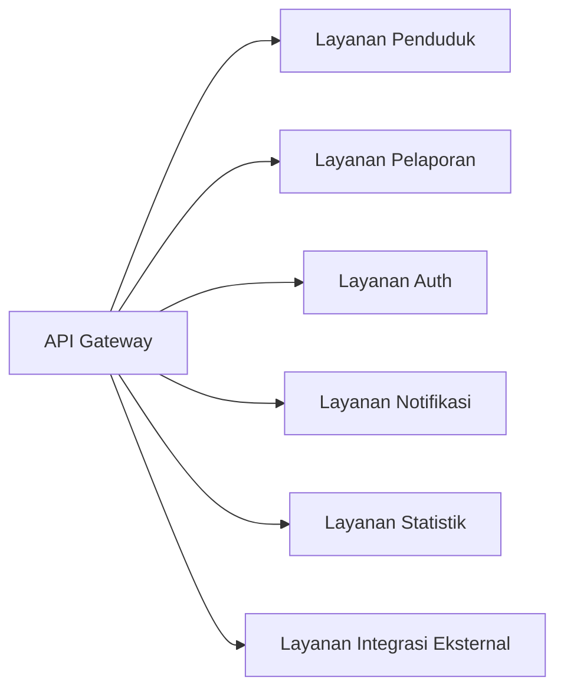
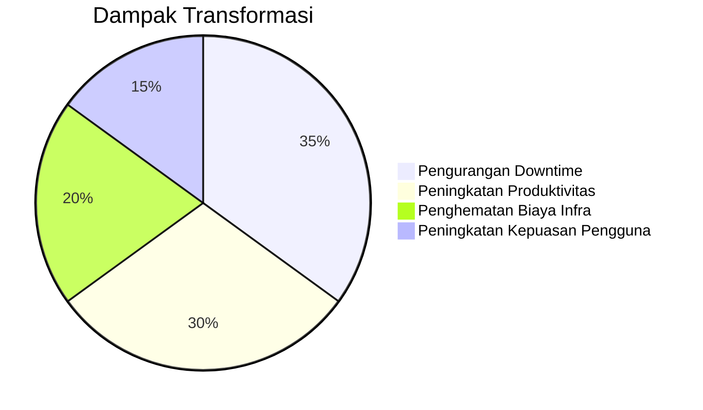

## **Studi Kasus: Transformasi e-LAMPID di Kementerian X dengan Arsitektur Microservices**  
**Latar Belakang dan Permasalahan Sistem Lama**  
Aplikasi e-LAMPID (Laporan Lahir Mati Pindah Datang) sebelumnya dibangun dengan arsitektur monolitik yang menghadapi tantangan kritis:  
1. **Beban Server Tinggi**: Lonjakan pelaporan di akhir bulan menyebabkan *downtime* berkepanjangan .  
2. **Rigiditas Pengembangan**: Pembaruan fitur memerlukan redeploy seluruh aplikasi, menghambat rilis layanan baru.  
3. **Ketergantungan Teknologi**: Stack teknologi tunggal (Java EE + Oracle DB) membatasi inovasi.  
4. **Skalabilitas Terbatas**: Tidak mampu menangani pertumbuhan data 300% pasca-pandemi.  

---

### **Arsitektur Baru: Microservices Terdekomposisi**  
**Pendekatan Business-Capability Decomposition** :  

#### **Detail Layanan**  
1. **Layanan Penduduk**  
   - *Fungsi*: Manajemen data kependudukan (NIK, KK)  
   - *Teknologi*: Node.js + PostgreSQL  
   - *Skalabilitas*: Auto-scaling berbasis beban permintaan  

2. **Layanan Pelaporan (Core)**  
   - *Fungsi*: Proses LAMPID (validasi, workflow approval)  
   - *Teknologi*: Spring Boot + MongoDB  
   - *Pattern*: Event-sourcing untuk audit trail  

3. **Layanan Auth**  
   - *Fungsi*: OAuth2.0 untuk 3 level akses (kelurahan-kecamatan-kota)  
   - *Integrasi*: SSO dengan sistem kementerian pusat  

4. **Layanan Notifikasi**  
   - *Fungsi*: SMS/Email pemberitahuan status laporan  
   - *Broker*: RabbitMQ untuk antrian pesan  

5. **Layanan Statistik**  
   - *Fungsi*: Agregasi data real-time (kelahiran/migrasi per kecamatan)  
   - *Visualisasi*: Grafana dashboard untuk pemantauan  

6. **Layanan Integrasi Eksternal**  
   - *Fungsi*: Sinkronisasi dengan Dukcapil dan SIAK  
   - *Protokol*: gRPC + Protobuf untuk performa tinggi  

---

### **Timeline Transformasi 12 Bulan**  
**Fase 1: Assessment & Desain (Bulan 1-3)**  
- *Activities*:  
  - Pemetaan 28 business capability existing  
  - Workshop DDD dengan domain expert  
- *Milestone*: Teridentifikasi 6 service inti dan API contract  

**Fase 2: Pengembangan Inti (Bulan 4-7)**  
- *Activities*:  
  - Implementasi service pelaporan + penduduk  
  - Setup Kubernetes cluster multi-zone  
  - Penerapan CI/CD dengan GitLab   
- *Milestone*: Go-live fase 1 di 5 kecamatan pilot  

**Fase 3: Integrasi & Testing (Bulan 8-10)**  
- *Activities*:  
  - Uji beban 10.000 concurrent user  
  - Chaos testing dengan Chaos Mesh  
  - Implementasi circuit breaker (Resilience4j)  
- *Milestone*: SLA 99.95% tercapai pada uji produksi  

**Fase 4: Rollout Nasional (Bulan 11-12)**  
- *Activities*:  
  - Pelatihan 1.500 operator daerah  
  - Migrasi data terstruktur (ETL batch)  
- *Milestone*: Operasional penuh di 214 kecamatan  

---

### **Hasil dan Best Practices**  
**KPI Pasca-Implementasi**:  
| **Metrik**          | **Sebelum** | **Sesudah**   |  
|----------------------|-------------|---------------|  
| **Waktu Proses**     | 48 jam      | <2 jam        |  
| **Downtime**         | 15%/bulan   | 0.2%/bulan    |  
| **Kecepatan Rilis**  | 6 bulan     | 2 minggu      |  

**Lesson Learned**:  
1. **Dekomposisi Berbasis Bisnis**:  
   - Setiap layanan meng-*own* domain spesifik (contoh: layanan pelaporan mandiri tanpa dependensi layanan statistik) .  

2. **Strategi Integrasi Hybrid**:  
   - Gunakan **sinkron** (gRPC) untuk real-time validasi NIK  
   - Gunakan **asinkron** (event) untuk notifikasi dan sinkronisasi data .  

3. **Resiliency by Design**:  
   - Implementasi *circuit breaker* di Layanan Integrasi Eksternal  
   - *Retry policy* dengan exponential backoff saat hub Dukcapil down.  

4. **Keamanan Berlapis**:  
   - Mutual TLS antar service  
   - OPA (Open Policy Agent) untuk otorisasi berbasis atribut.  

**Rekomendasi Pengembangan**:  
- Adopsi **service mesh** (Istio) untuk observability lebih mendalam  
- Ekspansi **CDC testing** dengan Pact untuk mengurangi breaking change  
- Implementasi **edge computing** untuk daerah dengan konektivitas terbatas.  

**Referensi Tools**:  
- **Containerization**: Docker + Kubernetes   
- **CI/CD**: GitLab CI dengan pipeline multi-stage   
- **Monitoring**: ELK + Prometheus/Grafana  
- **Database**: PostgreSQL (ACID) + MongoDB (flexible schema).  

> Transformasi e-LAMPID membuktikan bahwa arsitektur microservices bukan hanya solusi teknis, tapi **strategi bisnis** untuk meningkatkan ketangguhan layanan publik di era digital.
