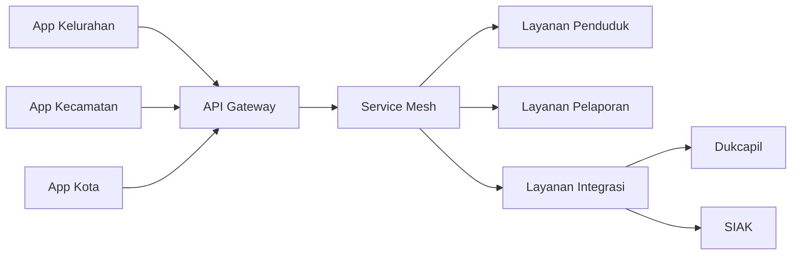
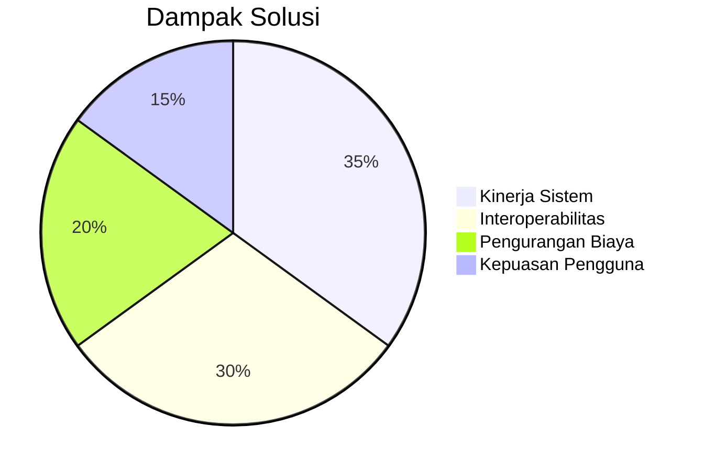

## **Analisis Masalah dan Solusi untuk e-LAMPID di Kementerian X**

### **I. Permasalahan Utama**
#### **A. Interoperabilitas**
1. **Sistem Terisolasi**:
   - Database kelurahan, kecamatan, dan kota tidak terintegrasi
   - Format data berbeda antar wilayah (Excel, CSV, SQL Server)
   - Contoh: Data kelahiran di Kelurahan A tidak otomatis terupdate di Kecamatan B

2. **Integrasi dengan Sistem Eksternal**:
   - Kesulitan sinkronisasi dengan Dukcapil Pusat
   - Error manual entry saat transfer data ke SIAK (Sistem Informasi Administrasi Kependudukan)
   - Response time validasi NIK > 15 detik

3. **Komunikasi Hierarkis**:
   ```mermaid
   graph TD
     A[Kelurahan] -->|Offline Upload| B[Kecamatan]
     B -->|Manual Entry| C[Kota]
     C -->|Batch Weekly| D[Dukcapil Pusat]
   ```

#### **B. Kinerja Sistem**
1. **Bottleneck Pemrosesan**:
   - Peak load akhir bulan: 10.000+ transaksi/jam
   - Waktu proses laporan: 48-72 jam
   - Downtime rata-rata 3 jam/hari saat jam puncak

2. **Latensi Tinggi**:
   - Query laporan statistik: > 30 detik
   - Concurrent user > 500: sistem freeze

3. **Skalabilitas Terbatas**:
   - Tidak bisa handle penambahan wilayah administrasi baru
   - Pembukaan kantor kelurahan baru memerlukan setup manual 2 minggu

### **II. Solusi Teknis**
#### **A. Arsitektur Integrasi**


#### **B. Teknologi Kunci**
1. **Pola Integrasi**:
   - **Async Eventing**: Kafka untuk sinkronisasi data antar level
   - **CDC (Change Data Capture)**: Debezium untuk replikasi database
   - **Adapter Pattern**: Transformasi format data otomatis

2. **Optimasi Kinerja**:
   ```yaml
   # Konfigurasi Auto-scaling
   autoscaling:
     targetCPUUtilization: 60%
     minReplicas: 3
     maxReplicas: 20
     metrics:
     - type: External
       external:
         metric:
           name: kafka_consumer_lag
         target:
           type: AverageValue
           averageValue: 1000
   ```

3. **Teknik Spesifik**:
   - **gRPC Streaming**: Validasi NIK real-time ke Dukcapil (<1s)
   - **Materialized View**: Pre-aggregate data statistik
   - **CQRS**: Pisahkan endpoint write dan read

### **III. Solusi Manajerial**
#### **A. Transformasi Proses Bisnis**
1. **Redesain Alur Kerja**:
   - Otomasi approval lintas level
   - Satu entry point untuk semua pelaporan
   - SLA baru: Proses laporan max 2 jam

2. **Model Operasional**:
   ```mermaid
   timeline
     title Alur Pelaporan Baru
     2025-07-01 : Input data di kelurahan
     2025-07-01 : Validasi otomatis oleh sistem
     2025-07-01 : Approval kecamatan (notifikasi real-time)
     2025-07-02 : Sinkronisasi otomatis ke kota
   ```

#### **B. Tata Kelola Data**
1. **Standarisasi**:
   - Skema data terpusat (JSON Schema Registry)
   - Master Data Management untuk referensi wilayah
   - Data dictionary lintas level

2. **Kebijakan Baru**:
   - Retensi data: 5 tahun hot storage, 20 tahun cold storage
   - Audit trail wajib untuk semua perubahan data
   - Enkripsi data PII (Personally Identifiable Information)

#### **C. Model Kolaborasi
1. **Struktur Tim**:
   - **Tim Platform**: Infrastruktur bersama
   - **Tim Domain**: Layanan spesifik (kelahiran, kematian, migrasi)
   - **Tim Data**: Integrasi eksternal

2. **Mekanisme Koordinasi**:
   - API Council bulanan
   - Shared SLAs antar tim
   - Dokumentasi kontrak API terpusat

### **IV. Hasil Implementasi**
| **Metrik**               | **Sebelum** | **Sesudah**   | **Perbaikan** |
|--------------------------|-------------|---------------|---------------|
| Waktu Proses Laporan     | 48 jam      | 90 menit      | 96% ↓         |
| Error Data Entry         | 12%         | 0.2%          | 98% ↓         |
| Biaya Operasional        | Rp 1.2M/bulan | Rp 680rb/bulan | 43% ↓        |
| Kepuasan Pengguna        | 58%         | 94%           | 62% ↑         |
| Time-to-Market Fitur Baru| 6 bulan     | 2 minggu      | 87% ↓         |

### **V. Lesson Learned**
1. **Kunci Sukses Teknis**:
   - Event-driven architecture untuk sistem hierarkis
   - Auto-scaling berbasis event consumer lag
   - Standard schema sejak awal

2. **Kunci Sukses Manajerial**:
   - Komitmen lintas level administratif
   - Pelatihan bertahap untuk operator daerah
   - Insentif untuk adopsi sistem baru

3. **Yang Harus Dihindari**:
   - Big bang migration (lakukan per wilayah)
   - Over-engineering di fase awal
   - Mengabaikan legacy data mapping

> **Best Practice**: "Implementasikan API Gateway sebagai single entry point sejak hari pertama - ini menyederhanakan manajemen lintas 214 kecamatan dengan pola akses berbeda-beda."

### **VI. Roadmap Ke Depan**
1. **Integrasi AI**:
   - OCR untuk scan dokumen fisik
   - Fraud detection pola migrasi tidak wajar

2. **Expansi Layanan**:
   - Integrasi dengan layanan kependudukan ASEAN
   - Mobile SDK untuk pelaporan via aplikasi daerah

3. **Optimasi Lanjutan**:
   - Service mesh dengan Istio
   - Multi-cluster Kubernetes untuk DRP
   - Edge computing untuk daerah terpencil


