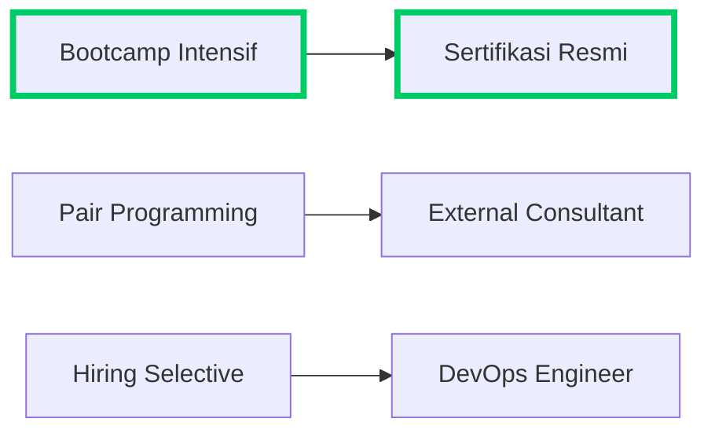
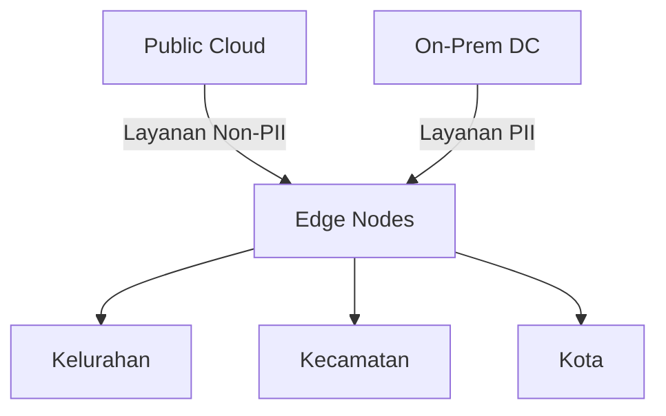
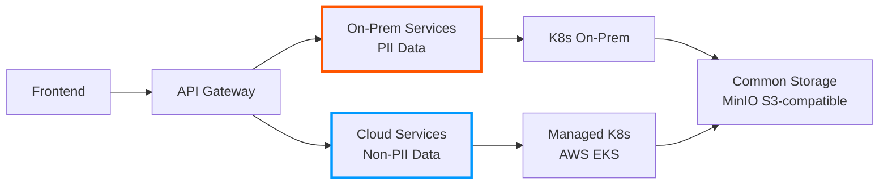
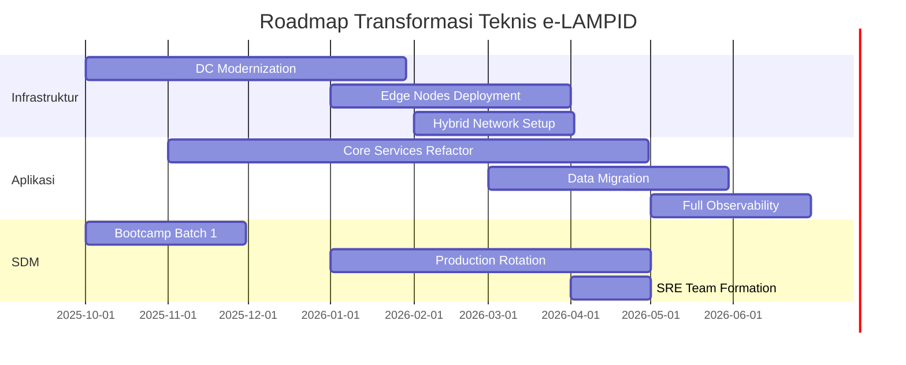
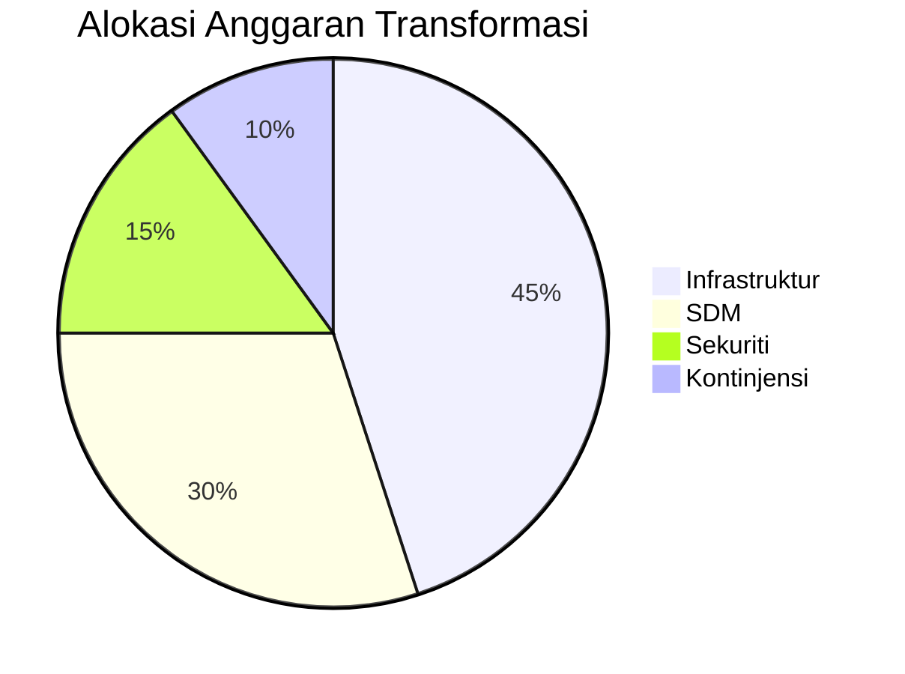

## **Diskusi Tantangan Teknologi Implementasi e-LAMPID**  
*(Studi Kasus Kementerian X)*  

---

### **I. Tantangan Utama dan Solusi**  
#### **A. Kesiapan SDM**  
**Permasalahan**:  
1. **Keterampilan Terbatas**:  
   - 85% staf IT hanya berpengalaman monolitik (Java EE)  
   - Minim pengalaman containerization (Docker/K8s)  
2. **Mindset Perubahan**:  
   - Resistensi terhadap agile development  
   - Kesenjangan generasi (rata-rata usia tim IT: 47 tahun)  

**Solusi**:  

- **Program Nyata**:  
  - Pelatihan 300 jam: Kubernetes, CI/CD, observability  
  - Sertifikasi CNCF (Cloud Native Computing Foundation)  
  - Rekrutmen 5 ahli SRE (Site Reliability Engineering)  

---

#### **B. Infrastruktur**  
**Permasalahan**:  
1. **Ketimpangan Wilayah**:  
   - 40% kecamatan dengan bandwidth < 5 Mbps  
   - Data center terpusat (single point of failure)  
2. **Kepatuhan Regulasi**:  
   - Kebijakan "Data Sensitif Wajib On-Premise"  
   - Restriksi penggunaan public cloud  

**Solusi Hybrid**:  

- **Model Implementasi**:  
  - **On-Premise**: Data kependudukan (NIK, KK) di data center pemerintah  
  - **Public Cloud**: Statistik agregat & dashboard di AWS Indonesia  
  - **Edge Computing**: Node lokal di kantor kecamatan untuk offline operation  

---

#### **C. Kebijakan Data**  
**Permasalahan Kritis**:  
1. **Fragmentasi Regulasi**:  
   - 5 peraturan berbeda tentang retensi data  
   - Standar enkripsi tidak konsisten  
2. **Audit Trail**:  
   - Pelacakan perubahan manual  
   - Tidak ada mekanisme immutable logging  

**Kerangka Solusi**:  
| **Aspek**         | **Kebijakan Baru**                  | **Teknologi Pendukung**       |  
|--------------------|-------------------------------------|-------------------------------|  
| **Klasifikasi**    | Tiered Data Sensitivity (PII/non-PII) | Vault dengan dynamic secrets  |  
| **Enkripsi**       | AES-256 at-rest, TLS 1.3 in-transit | Istio Service Mesh            |  
| **Audit**          | Wajib 90 hari hot storage           | ELK + Blockchain hashing      |  
| **Retensi**        | 5 tahun hot, 30 tahun cold          | S3 Glacier Deep Archive       |  

---

### **II. Cloud Native vs Hybrid: Analisis Keputusan**  
#### **Comparative Analysis**  
| **Parameter**       | **Cloud Native**                     | **Hybrid**                     | **Pilihan e-LAMPID** |  
|---------------------|--------------------------------------|--------------------------------|----------------------|  
| **Kecepatan**       | Deploy menit, auto-scaling otomatis  | Tergantung kapasitas on-prem   | Hybrid (prioritas critical path) |  
| **Biaya**           | OPEX tinggi, pay-as-you-go           | CAPEX besar, OPEX stabil       | Hybrid (optimasi TCO) |  
| **Kontrol Data**    | Terbatas (bergantung vendor)         | Penuh                          | Hybrid (PII on-prem) |  
| **Kepatuhan**       | Risiko gagal compliance              | Penuh sesuai regulasi          | Hybrid              |  
| **Resiliency**      | Multi-zone, high SLA                 | Tergantung infrastruktur lokal | Hybrid (DR di cloud) |  

#### **Arsitektur Final Hybrid**  


---

### **III. Mitigasi Risiko Utama**  
#### **Risiko 1: Gagal Adopsi Teknologi Baru**  
- **Mitigasi**:  
  - Fase transisi 6 bulan dengan hybrid operation  
  - Fallback ke monolitik jika error rate > 5%  
  ```python
  # Pseudocode fallback mechanism
  if microservice_error_rate > 0.05 and deployment_age < 180:
      revert_to_monolith()
  ```

#### **Risiko 2: Keamanan Data**  
- **Mitigasi**:  
  - Hardware Security Module (HSM) untuk enkripsi data PII  
  - Air-gapped backup bulanan  
  - Penetration test kuartalan oleh BSSN  

#### **Risiko 3: Ketergantungan Vendor**  
- **Strategi**:  
  - Multi-cloud readiness (AWS + GCP Indonesia)  
  - Kontrak exit strategy 30-hari  
  - Open-source core (Kubernetes, PostgreSQL)  

---

### **IV. Roadmap Teknis 18 Bulan**  


---

### **V. Kesimpulan dan Rekomendasi**  
**Pola Sukses Hybrid**:  
> "PII on-premise dengan kontrol ketat, non-PII di cloud untuk skalabilitas - kombinasikan dengan edge computing untuk jangkauan wilayah terpencil."  

**Critical Success Factors**:  
1. **SDM**:  
   - Investasi pelatihan 15% dari anggaran proyek  
   - Insentif sertifikasi cloud  
2. **Infrastruktur**:  
   - "Minimal Viable Cloud" untuk beban statis  
   - Kolokasi data center di 5 wilayah utama  
3. **Kebijakan**:  
   - Penunjukan DPO (Data Protection Officer)  
   - Standardisasi API pemerintah (mengacu NIST SP 800-204)  



**Peringatan Penting**:  
> "Hindari lift-and-shift mentah! Lakukan refactoring bertahap dengan strangler pattern, awali dengan layanan non-kritis seperti statistik dan notifikasi."  

**Tools Rekomendasi**:  
- **Hybrid Management**: Rancher, Anthos  
- **Security**: HashiCorp Vault, Istio  
- **Monitoring**: Grafana LGTM Stack (Loki, Grafana, Tempo, Mimir)  
- **CI/CD**: GitLab CI (self-hosted on-prem)
