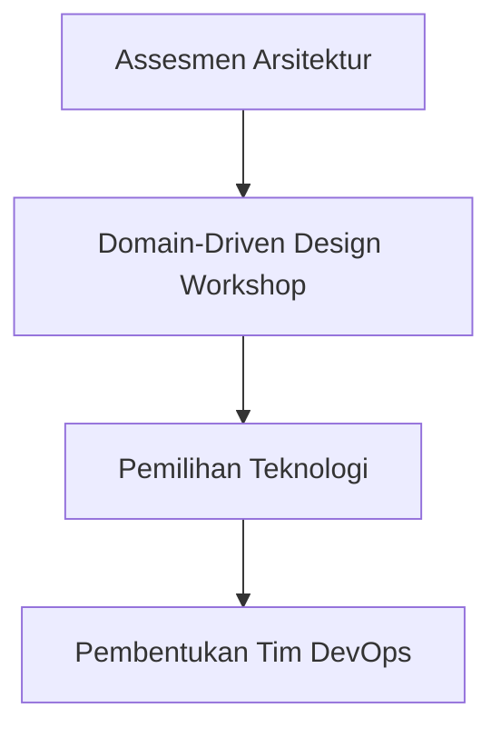
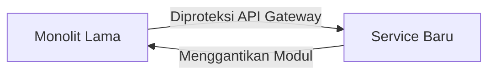
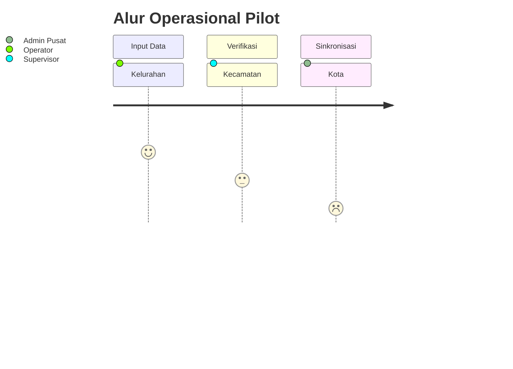
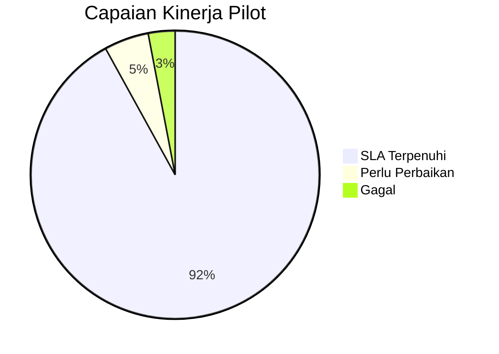
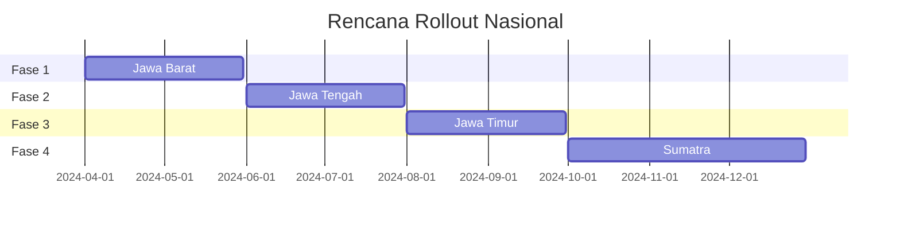
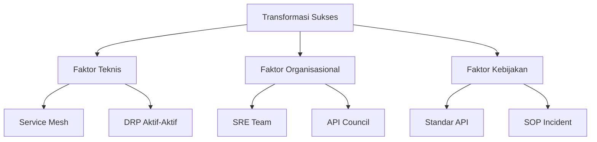

## **Roadmap Implementasi Microservices e-LAMPID**  
*(Kementerian X - Timeline 18 Bulan)*  

---

### **I. Tahap Perencanaan (Bulan 1-3)**  
**Fokus**: Persiapan teknis dan organisasional  


**Aktivitas Kritis**:  
1. **Assesmen Teknis**:  
   - Pemetaan 28 fungsi monolitik ke microservices potensial  
   - Analisis beban puncak: 10.000 transaksi/jam  
   - Audit infrastruktur existing  

2. **Desain Arsitektur**:  
   - Dekomposisi berbasis domain bisnis:  
     ```mermaid
     pie
        title Pemisahan Domain
        "Pelaporan" : 35
        "Data Kependudukan" : 25
        "Approval Workflow" : 20
        "Integrasi Eksternal" : 15
        "Notifikasi" : 5
     ```  
   - API Contract Design dengan OpenAPI 3.0  

3. **Penyiapan Platform**:  
   - Setup Kubernetes Cluster (On-prem + AWS EKS)  
   - Implementasi ArgoCD untuk GitOps  
   - Konfigurasi Vault + Istio Service Mesh  

**Deliverables**:  
- Dokumen "Target Architecture Blueprint"  
- Situs developer portal (Swagger Hub)  
- Minimum Viable Platform (MVP) Kubernetes  

---

### **II. Tahap Pengembangan (Bulan 4-9)**  
**Strategi**: Strangler Fig Pattern  


**Fase Bertahap**:  
1. **Fase 1: Layanan Non-Kritis (Bulan 4-5)**  
   - Notifikasi Service (SMS/Email)  
   - Statistik Service (Dashboard)  
   - Teknologi: Node.js + RabbitMQ  

2. **Fase 2: Layanan Inti (Bulan 6-7)**  
   - Pelaporan Service (Transaksi LAMPID)  
   - Approval Workflow Service  
   - Teknologi: Spring Boot + Camunda  

3. **Fase 3: Layanan Sensitif (Bulan 8-9)**  
   - Penduduk Service (NIK/KK Management)  
   - Auth Service (OAuth2.0 + RBAC)  
   - Teknologi: Java + Quarkus + PostgreSQL  

**Proses Pengembangan**:  
- **CI/CD Pipeline**:  
  ```mermaid
  graph TB
    Commit --> UnitTest --> Build --> ContainerScan --> DeployDev --> IntegrationTest --> DeployStaging
  ```  
- **Quality Gates**:  
  - Code Coverage > 80%  
  - Zero Critical Bug (SonarQube)  
  - Performance SLA: <500ms latency  

---

### **III. Tahap Pilot (Bulan 10-11)**  
**Scope**: 5 Kecamatan Percontohan  


**Metrik Evaluasi**:  
| **Indikator**         | **Target** | **Alat Ukur**          |  
|------------------------|------------|------------------------|  
| Waktu Proses           | <1 jam     | Prometheus + Grafana   |  
| Error Rate             | <0.5%      | ELK Log Analysis       |  
| Kepuasan Pengguna      | >90%       | Survey UI              |  
| Uptime                 | 99.9%      | Blackbox Monitoring    |  

**Mitigasi Risiko**:  
- Fallback Mechanism:  
  ```python
  if new_system_error_rate > 5%:
      traffic_switch(old_system)
      alert_team()
  ```

---

### **IV. Tahap Evaluasi (Bulan 12)**  
**Framework Assessment**:  
1. **Teknis**:  
   - K6 Load Test (10.000 virtual users)  
   - Chaos Engineering (Pod kill, network latency)  
   - Security PenTest oleh BSSN  

2. **Fungsional**:  
   - Uji kesesuaian dengan Permendagri No. 72/2022  
   - Validasi data lintas sistem (Dukcapil, SIAK)  

3. **Operasional**:  
   - Efisiensi resource vs monolitik  
   - Analisis biaya total kepemilikan (TCO)  

**Laporan Evaluasi**:  


---

### **V. Tahap Scale-Up (Bulan 13-18)**  
**Strategi Rollout**:  


**Aktivitas Kunci**:  
1. **Capacity Planning**:  
   - Penambahan node Kubernetes tiap region  
   - Auto-scaling berbasis prediksi beban  

2. **Data Migration**:  
   - ETL pipeline dengan Apache Airflow  
   - Validasi silang data migrasi:  
     ```sql
     SELECT COUNT(*) AS discrepancy 
     FROM old_data 
     FULL OUTER JOIN new_data 
     ON old_data.id != new_data.id;
     ```

3. **Pelatihan Massal**:  
   - Video tutorial interaktif  
   - Sertifikasi operator daerah  
   - Helpdesk 24/7 via chatbot  

---

### **VI. Critical Success Factors**  
1. **Teknis**:  
   - Service Mesh untuk observability  
   - Multi-cluster management  
   - Disaster Recovery Plan (DRP) aktif-aktif  

2. **Organisasional**:  
   - Dedicated SRE Team  
   - API Governance Council  
   - Reguler Tech Refresh (tiap 6 bulan)  

3. **Kebijakan**:  
   - Standar API Pemerintah (mengacu NIST)  
   - SOP Response Incident <15 menit  
   - Komitmen anggaran transformasi digital  



> **Peringatan Implementasi**: "Hindari premature optimization! Fase awal prioritaskan stabilitas, bukan fitur kompleks."

---

### **VII. Lesson Learned**  
**Dari Proyek Sejenis**:  
1. **Yang Berhasil**:  
   - Investasi di CI/CD awal mengurangi 40% bug produksi  
   - Dokumentasi API terpusat turunkan 70% on-boarding time  

2. **Yang Gagal**:  
   - Database per service tanpa CDC = data inconsistency  
   - Tanpa circuit breaker = cascading failure saat Dukcapil down  

**Best Practices**:  
- "Start with observability!" - instrumentasi metric/log/tracing sejak layanan pertama  
- "Decouple deployment from release" - gunakan feature flag untuk kontrol granular  

**Tools Final**:  
| **Kategori**       | **Pilihan**                          |  
|---------------------|--------------------------------------|  
| **Orchestration**   | Kubernetes + Rancher                 |  
| **Service Mesh**    | Istio                                |  
| **CI/CD**           | GitLab CI + ArgoCD                   |  
| **Monitoring**      | Grafana Stack (Loki/Mimir/Tempo)     |  
| **Database**        | PostgreSQL + MongoDB Atlas           |
