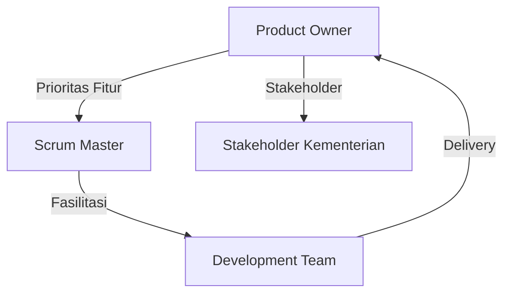
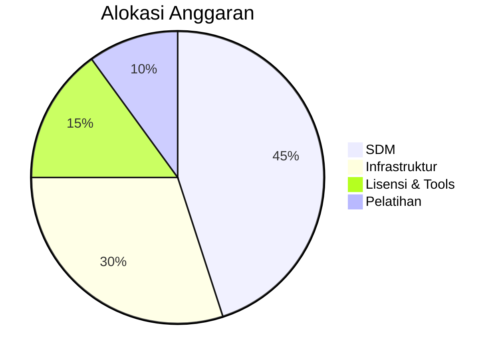
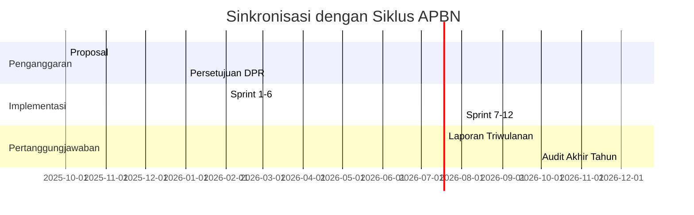
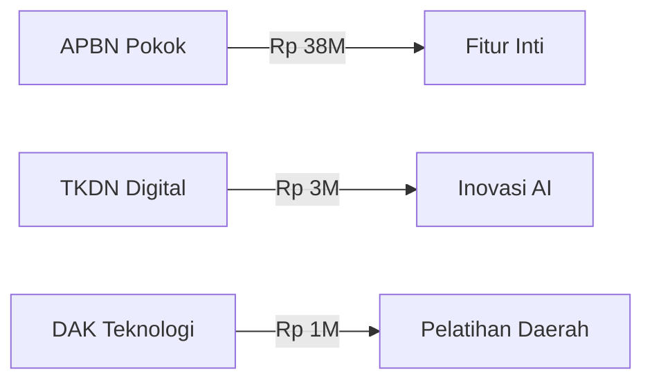

## **Manajemen Proyek dengan SCRUM & Perkiraan Anggaran untuk e-LAMPID**  
*(Implementasi Microservices di Kementerian X)*  

---

### **I. Penerapan Framework SCRUM**  
**Struktur Tim dan Peran**:  


#### **Siklus SCRUM (2-Mingguan)**:  
1. **Sprint Planning**:  
   - Prioritas berdasarkan *value* bisnis:  
     ```mermaid
     pie
        title Prioritas Backlog
        "Pelaporan Real-time" : 35
        "Integrasi Dukcapil" : 25
        "Notifikasi Otomatis" : 20
        "Dashboard Statistik" : 15
        "Mobile Responsive" : 5
     ```  
   - Kapasitas tim: 120 jam/developer per sprint

2. **Daily Stand-up (15 menit)**:  
   - Fokus: "Apa kemarin? Hari ini? Hambatan?"  
   - Contoh hambatan:  
     > "Validasi NIK via gRPC timeout, butuh bantuan tim infrastruktur"

3. **Sprint Review**:  
   - Demo fitur ke stakeholder daerah  
   - Kriteria penerimaan:  
     - Lolos UAT (User Acceptance Test)  
     - Latency <500ms (diukur dengan Locust)  

4. **Retrospective**:  
   - Template *Mad/Sad/Glad*:  
     ```mermaid
     journey
        title Retrospective Sprint 12
        section Glads
          Pair programming efektif : 5: Dev
          Deploy lebih cepat : 3: Ops
        section Sads
          Dokumentasi tertinggal : 4: QA
          Test environment flaky : 2: All
     ```

---

### **II. Adaptasi Khusus Proyek Pemerintah**  
**Modifikasi SCRUM**:  
| **Elemen Standar**      | **Adaptasi**                  | **Alasan**                     |  
|-------------------------|-------------------------------|--------------------------------|  
| Product Owner           | Tim gugus tugas (5 orang)     | Keputusan kolektif kementerian |  
| Sprint Duration         | 3 minggu (bukan 2)            | Siklus anggaran pemerintah     |  
| Definition of Done      | + Audit keamanan BSSN         | Regulasi data sensitif         |  
| Tools                   | Jira + Confluence On-Prem     | Kebijakan *data sovereignty*   |  

**Struktur Tim**:  
- **3 Tim SCRUM** (masing-masing 7 orang):  
  - *Tim Pelayanan*: Layanan penduduk & pelaporan  
  - *Tim Integrasi*: Koneksi eksternal & data pipeline  
  - *Tim Platform*: Infrastruktur & keamanan  
- **Tim Pendukung**:  
  - SRE (3 orang)  
  - DevOps (2 orang)  
  - UI/UX (2 orang)  

---

### **III. Perkiraan Anggaran Biaya (18 Bulan)**  
**Kategori Pengeluaran**:  


#### **Detail Biaya**:  
1. **SDM (Rp 18.9M)**  
   - *Tim Inti*:  
     | Peran               | Jumlah | Biaya/Bulan | Total     |  
     |---------------------|--------|-------------|-----------|  
     | Developer Senior    | 6      | Rp 35jt     | Rp 1.26M |  
     | Developer Mid       | 9      | Rp 25jt     | Rp 1.35M |  
     | SRE Engineer        | 3      | Rp 40jt     | Rp 0.72M |  
     | Product Owner       | 2      | Rp 45jt     | Rp 0.54M |  
     | Scrum Master        | 3      | Rp 35jt     | Rp 0.63M |  
   - *Kontinjensi*: Rp 300jt (overtime, tunjangan)  

2. **Infrastruktur (Rp 12.6M)**  
   - *On-Premise*:  
     - Server bare-metal (10 node): Rp 4.2M  
     - Storage SAN: Rp 1.8M  
   - *Cloud Hybrid*:  
     - AWS Indonesia (Non-PII): Rp 3.6M  
     - Bandwidth dedicated: Rp 1.2M  
   - *Edge Computing*:  
     - Mini DC 5 wilayah: Rp 1.8M  

3. **Lisensi & Tools (Rp 6.3M)**  
   - *Monitoring*: Grafana Enterprise (Rp 420jt/tahun)  
   - *Security*: HashiCorp Vault (Rp 350jt/tahun)  
   - *Container*: Rancher Enterprise (Rp 280jt/tahun)  
   - *CI/CD*: GitLab Premium (Rp 180jt/tahun)  

4. **Pelatihan & Sertifikasi (Rp 4.2M)**  
   - Bootcamp Kubernetes: 30 orang × Rp 15jt  
   - Sertifikasi CNCF: 10 orang × Rp 7.5jt  
   - Workshop DDD: 2 batch × Rp 60jt  

**Total Anggaran**: **Rp 42M** *(Flexibility ±10% berdasarkan realisasi sprint)*  

---

### **IV. Manajemen Risiko Keuangan**  
**Strategi Pengendalian Biaya**:  
1. **Biaya Variabel Berbasis Sprint**:  
   ```python
   # Pseudocode penyesuaian anggaran
   if sprint_velocity > 90%:
       allocate_bonus(team)
   elif sprint_velocity < 70%:
       review_resource_allocation()
   ```

2. **Mekanisme Kontinjensi**:  
   - Cadangan 15% untuk *scope change*  
   - Anggaran *rolling* per kuartal  

3. **Optimasi Tools**:  
   - Prioritas open-source (Istio, Prometheus)  
   - Lisensi enterprise hanya untuk komponen kritis  

**Indikator Efisiensi**:  
| **Metrik**             | Target  | Formula                      |  
|------------------------|---------|------------------------------|  
| **Burn Rate**          | <95%    | (Actual Cost / Planned)      |  
| **Velocity**           | 40 poin | ∑ Story Points per Sprint    |  
| **ROI per Fitur**      | >150%   | (Value / Cost) × 100%        |  

---

### **V. Integrasi dengan Proses Pemerintah**  
**Siklus Anggaran & Pelaporan**:  


**Mekanisme Approval**:  
1. **Setiap Sprint**:  
   - PO menyetujui *sprint backlog*  
   - Pejabat Pembuat Komitmen (PPK) tanda tangan kontrak  
2. **Setiap Tahap**:  
   - Verifikasi oleh Inspektorat  
   - Reviu oleh Komite Transformasi Digital  

---

### **VI. Lesson Learned Proyek Sejenis**  
**Kesuksesan Proyuk SIKD (Sistem Informasi Kependudukan)**:  
- **Faktor Kunci**:  
  - Kolaborasi erat Dukcapil-Kemendagri  
  - *Fixed-scope* untuk modul inti  
- **Anggaran**: Rp 35M (realisasi 92%)  

**Kegagalan Proyek SIMDA (Keuangan Daerah)**:  
- **Penyebab**:  
  - Perubahan *scope* terus menerus  
  - Ketergantungan vendor berlebihan  
- **Dampak**: Pembengkakan 120% dari anggaran awal  

**Best Practices e-LAMPID**:  
> "Gunakan hybrid funding model: Anggaran pokok dari APBN, inovasi tambahan dari skim dana khusus (TKDN, DAK Digital)"  



---

### **VII. Kesimpulan**  
**Critical Success Factors**:  
1. **Manajemen Proyek**:  
   - SCRUM dengan adaptasi budaya pemerintah  
   - Transparansi penuh anggaran per sprint  
2. **Pengendalian Biaya**:  
   - Rasio SDM vs infrastruktur = 60:40  
   - Biaya tools maks 15% total  
3. **Governance**:  
   - PPK sebagai *accounting officer*  
   - Audit independen tiap 3 sprint  

**Rekomendasi Tools**:  
- **Project Tracking**: Jira On-Prem  
- **Documentation**: Confluence + GitLab Wiki  
- **Budget Control**: Oracle Financials  
- **Collaboration**: Mattermost On-Prem  

> **Peringatan Implementasi**: "Hindari hero culture! Proyek pemerintah harus bertumpu pada proses, bukan individu."
